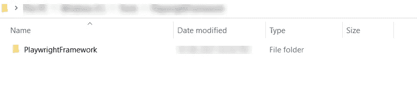
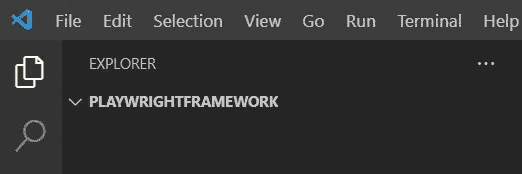
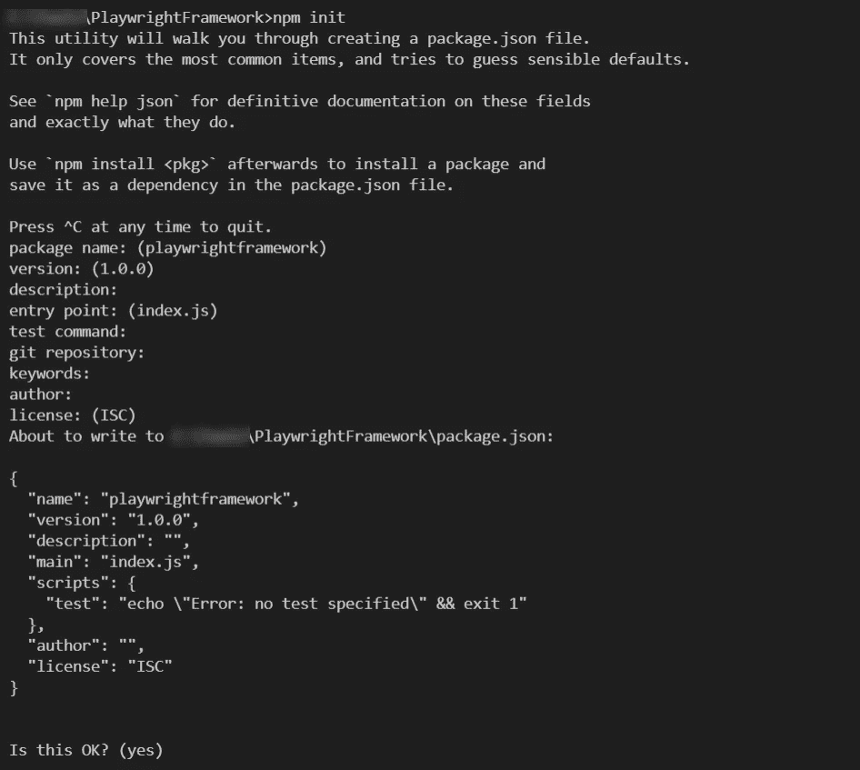
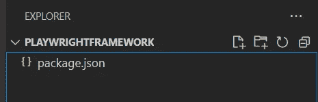
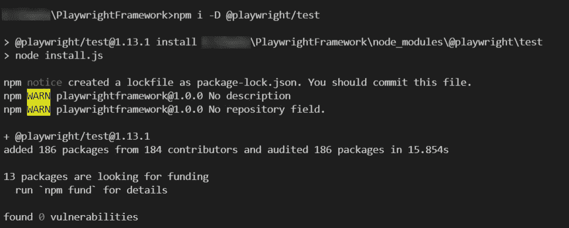
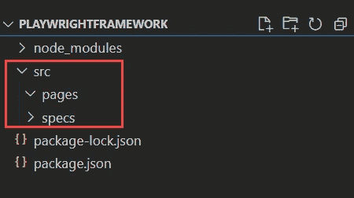
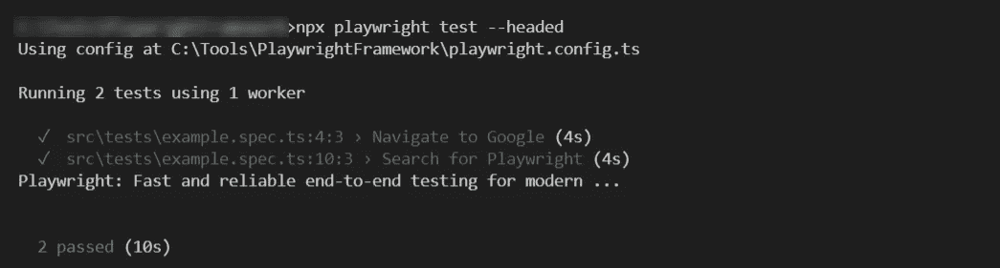

# 如何设置剧作家端到端测试自动化框架

> 原文：<https://medium.com/geekculture/how-to-setup-playwright-end-to-end-test-automation-framework-f09478d18267?source=collection_archive---------1----------------------->

这篇文章详细解释了如何用 NodeJS 创建一个剧作家。

# 使用页面对象模型从头开始设置剧作家端到端测试自动化框架的分步指南

**先决条件**

1.  [安装节点](https://nodejs.org/en/download/)
2.  [安装 Visual Studio 代码](https://code.visualstudio.com/download)

## 步骤 1:创建新文件夹

导航到你的电脑中想要的驱动器，为剧作家创建一个新的文件夹(例如:PlaywrightFramework)



## 步骤 2:在 Visual Studio 代码 IDE 中打开新创建的文件夹

从 Visual Studio 代码中，导航到文件>打开>选择新创建的文件夹(PlaywrightFramework)



## 步骤 3:创建 package.json 文件

json 文件有助于跟踪所有安装的节点模块，也有助于创建运行剧作家测试的快捷方式

从 Visual Studio 代码>打开终端

执行以下命令

```
**npm init**
```

一旦你执行了上面的命令，它会问你一系列的问题，只要回答它们或者按回车键，直到 package.json 被创建。



## 步骤 4:安装剧作家测试 npm 包

剧作家有自己的端到端测试运行器，我们称之为剧作家测试。

从 Visual Studio 代码>打开终端

执行以下命令

```
**npm i -D** [**@playwright/test**](http://twitter.com/playwright/test)
```



## 步骤 5:安装剧作家 npm 包

与剧作家库不同，剧作家测试默认情况下不捆绑浏览器，所以您需要显式安装它们

从 Visual Studio 代码>打开终端

执行以下命令

```
**npm install --save-dev playwright**
```

**步骤 6:在你的项目文件夹中创建 src 文件夹**

Src 文件夹保存了你所有的测试和页面对象，它帮助我们以一种简单的方式管理测试。

在项目文件夹中创建名为 **src** 的新文件夹(例如:PlaywrightFramework)


## 步骤 7:为**测试**和**页面对象**创建文件夹

在上面步骤中创建的 src 文件夹中，再创建两个文件夹，即 specs 和 pages

您的目录结构应该如下所示

```
PlaywrightFramework
-src
--tests
--pages
```

**tests** 文件夹包含了你所有的剧作家测试文件

**pages** 文件夹包含了你所有的剧作家页面对象文件



## 步骤 8:用剧作家创建首页对象文件

在你的 **pages** 文件夹中创建一个文件名为 **example.page.ts**

在本教程中，我们将编写两个简单的测试用例。

1.  导航到 google.com 并验证
2.  搜索关键字剧作家并验证搜索结果

将以下代码复制并粘贴到您新创建的文件 **example.page.ts**

```
**//example.page.ts**
import type { Page } from  '[@playwright/test](http://twitter.com/playwright/test)';
export class ExampleClass{
    readonly page: Page
    constructor(page:Page){
        this.page=page
    }
    async typeSearchText(){
       await this.page.type('input[name="q"]',"Playwright")
    }
    async pressEnter(){
       await this.page.keyboard.press('Enter');
    }
    async searchResult(){
       return this.page.innerText('//h3[contains(text(),"Playwright:")]')
    }
}
```

## 步骤 9:用剧作家创建第一个测试/规格文件

在你的 specs **文件夹中创建一个文件名为 **example.spec.ts****

**example.spec.ts** 包含您使用剧作家库创建的实际测试脚本或规格。

将下面的代码复制并粘贴到您新创建的**示例中**

```
//example.spec.ts
import { test, expect } from '[@playwright/test](http://twitter.com/playwright/test)';
import { ExampleClass } from '../pages/example.page';test('Navigate to Google', async ({ page }) => {
  await page.goto('[https://google.com/'](https://google.com/'));
  const url = await page.url();
  expect(url).toContain('google');
});test('Search for Playwright', async ({ page }) => {
  await page.goto('[https://google.com/'](https://google.com/'));
  let exampletest = new ExampleClass(page);
  await exampletest.typeSearchText();
  await exampletest.pressEnter();
  const text = await exampletest.searchResult();
  await console.log(text);
  expect(text).toContain('Playwright: Fast and reliable');
});
```

## 步骤 10:用剧作家执行或运行你的第一个测试

剧作家提供了在有头模式和无头模式下执行测试的选项。让我们试试 chrome 浏览器的头部模式执行

从 Visual Studio 代码终端执行以下命令

```
**npx playwright test --headed**
```

一旦你的测试被执行，剧作家在命令行或 Visual Studio 终端显示结果。



**赏金:**

## 使用剧作家全局配置文件配置 PlaywrightFramework 行为

剧作家提供了创建配置文件的选项，您可以在其中指定值，如浏览器名称、baseUrl、宽度、高度。

## 在您的**项目文件夹**(根级)中创建**剧作家.配置. ts 文件**

从您的 Visual Studio 代码中，创建一个新的文件名为**剧作家.配置. ts，**这个文件必须创建在您的项目文件夹(例如:PlaywrightFramework)的根级别

剧作家的示例配置文件如下所示

```
**//playwright.config.ts**
import { PlaywrightTestConfig } from '[@playwright/test](http://twitter.com/playwright/test)';
const config: PlaywrightTestConfig = {
  use: {
    baseURL: '[http://google.com/](http://google.com/)',
    browserName: 'chrome',
    headless: false,
  },
};
export default config;
```

以上是一个样本文件，有许多剧作家配置支持的选项。在此阅读[详情](https://playwright.dev/docs/test-configuration#global-configuration)

## 剧作家支持记者

目前，剧作家支持记者

1.  点报记者
2.  线路记者
3.  JUnit 记者
4.  JSON 记者
5.  列表记者

剧作家也允许我们配置多个报告者，剧作家报告者可以在执行测试时通过命令行提及，或者我们可以在全局配置文件中设置它们。

剧作家记者的全局配置文件示例

```
// playwright.config.ts
import { PlaywrightTestConfig } from '[@playwright/test](http://twitter.com/playwright/test)';const config: PlaywrightTestConfig = {
  reporter: [ ['junit', { outputFile: 'results.xml' }] ],
};
export default config;
```

## 用剧作家测试自动化工具生成 HTML 报告器

剧作家默认不支持测试的 HTML 报告，但它支持 JUnit XML 文件，然而，使用 JUnit reporter 和第三方 npm 包，如 [XUnit Viewer](https://www.npmjs.com/package/xunit-viewer) 我们可以生成 HTML reporter。

剧作家也支持《诱惑报告》,但截至目前，它还是一个实验性的功能。

参考:[https://playwright.dev/](https://playwright.dev/)

☕ [**请我喝杯咖啡**](https://www.buymeacoffee.com/ganeshhegde)

**如果您需要任何帮助、支持、指导，请联系我**[**LinkedIn**](https://www.linkedin.com/in/ganeshsirsi/)**|**[**https://www.linkedin.com/in/ganeshsirsi**](https://www.linkedin.com/in/ganeshsirsi/)