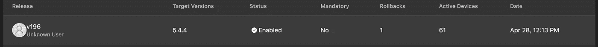
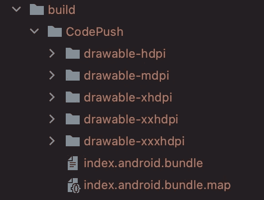
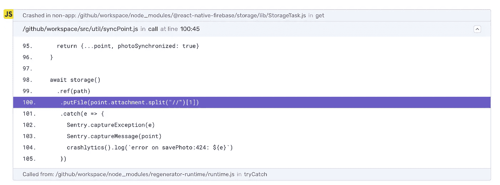

# 如何用 Sentry 平台设置 React-Native + Microsoft CodePush

> 原文：<https://medium.com/geekculture/how-to-setup-react-native-microsoft-codepush-with-sentry-platform-df1b717d6a7?source=collection_archive---------5----------------------->


Photo by [Karl Pawlowicz](https://unsplash.com/@karlp?utm_source=medium&utm_medium=referral) on [Unsplash](https://unsplash.com?utm_source=medium&utm_medium=referral)

在本文中，我将向您展示如何在 Sentry 平台上正确设置使用 Microsoft CodePush 的 react-native 应用程序，正确上传源代码地图以观察引发错误的正确行。

# 关于 react-native 代码

第一步是在您的 react-native 项目上安装 Sentry SDK，您可以通过运行上述命令来实现这一点。

安装后，考虑到您已经正确配置了 Microsoft CodePush，您必须更改您的`index.js`源文件，这是您必须要做的修改。

我将解释`release`属性中包含的内容:

`**BUNDLE_ID**` : `com.yourapp.bundleid` >你可以在`android > app > build.gradle`文件上找到。

`**NATIVE_VERSION**`:你的 build.gradle 上的原生版本是不是和`5.4.4`一样，你可以在`android > app > build.gradle`文件上找到这个信息。

`**CODEPUSH_DIST**`:这是你的代码推送信息版本，你可以在你的应用中心找到，在这个例子中是`v196`。



在这个配置之后，你现在必须上传你在 sentry 上发布的最后一个 codepush 版本的源代码，这样做更好，在 Sentry 配置上生成一个正确的新 codepush 版本。

为此，您必须将源地图导出到一个文件夹并上传到 Sentry，我使用以下命令导出 codepush 的源地图:

`release-react -a YourOrgOnAppCenter/your-project-on-app-center -d Production — output-dir “./build”`

这将生成一个`build`文件夹，其中包含 Sentry 平台正确处理您的代码所需的代码推送文件，该文件夹如下所示:



因此，考虑到您已经登录了`sentry-cli`，要将它上传到 Sentry，您将运行上面的命令:

```
sentry-cli react-native appcenter YourOrgOnAppCenter/your-project-on-app-center android "./build/CodePush" --bundle-id "$BUNDLE_ID" --version-name "$NATIVE_VERSION" --dist "$CODEPUSH_DIST"
```

请注意，它们是相同的变量，以前在 react 本机配置上使用，通常这种版本控制和上传过程是在一些 CI 服务上进行的，如 Github 操作。

但是此时，您的 react-native 代码推送应用程序的源映射被正确地更新到 Sentry，并且您的错误必须被正确地报告，准确地通知抛出错误的行，如上例，我建议在一个`Staging`代码推送包中检查这个抛出错误。



谢谢大家的关注！下一篇文章再见。