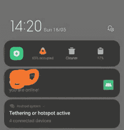
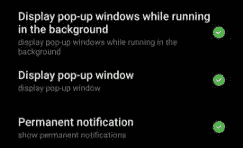
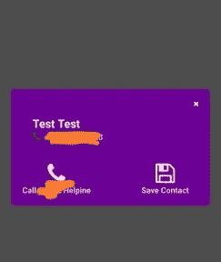

# 如何在 React Native 中像 Truecaller 一样显示来电弹出窗口？

> 原文：<https://medium.com/geekculture/how-to-show-incoming-call-popup-like-truecaller-in-react-native-c037daf76ba2?source=collection_archive---------6----------------------->

## 嘿伙计们！在这篇博客中，我们将研究如何在 React Native 中显示来电弹出窗口。

我在为虚拟赛伯龙私人有限公司
做一个项目。在开发过程中，我被分配了一个与 Truecaller 功能相同的任务，在接到电话时显示弹出窗口。最初，我不得不在互联网上进行数小时的研究和搜索，这有点困难，因为在 react native 中没有太多的支持或社区帮助。


我按照以下步骤完成了它。

1.  在 android 部分创建一个无头任务来了解 Phone _ State(extra _ State _ ringing | extra _ State _ off hook | extra _ State _ idle)。
2.  通过注册 Headless task 在 react-native 中实现这一点。
3.  将应用程序注册为前台服务，以便在前台运行应用程序。
4.  使用 react-native-invoke-app 打开接收来电的应用程序。
5.  导航用户至呼叫弹出屏幕并显示用户详细信息。
6.  **在 android 部分创建一个了解 Phone _ State(extra _ State _ ringing | extra _ State _ off hook | extra _ State _ idle)的无头任务。**

在开始之前，我们需要对无头任务有一个正确的理解

**Headless Task:**Headless Task 是 React Native 中的一种方式，当我们的应用程序在后台运行任务时。

检查应用程序状态

> *从“react-native”导入{ AppState}*
> 
> *use effect(()=>console . log(appstate . currentstate))；
> //输出为 backround 或 active，表示 App*

***如何创建无头任务？***

为了创建无头任务，首先我们必须创建一个服务来定义我们的任务。

因为我们想要检查电话状态，所以我们必须在 AndroidManifest.xml 中给 READ_PHONE_STATE 权限

> *<用途-权限 Android:name = " Android . permission . read _ PHONE _ STATE "/>*

在我的例子中，由于我正在处理一个来电弹出窗口，所以我将服务命名为 **CallService。**

> *打包 com . myapp . service；
> 导入 Android . content . intent；
> 导入 Android . OS . bundle；
> 导入 com . Facebook . react . headlessjstaskservice；
> 导入 com . Facebook . react . bridge . arguments；
> 导入 com . Facebook . react . jstasks . headlessjstaskconfig；
> 导入 javax . annotation . nullable；*
> 
> *公共类 CallService 扩展 HeadlessJsTaskService {*
> 
> [*@ Override*](http://twitter.com/Override) *protected*[*@ Nullable*](http://twitter.com/Nullable)*HeadlessJsTaskConfig getTaskConfig(Intent Intent){
> Bundle extras = Intent . get extras()；
> 如果(群众演员！= null){
> return new HeadlessJsTaskConfig(
> " Call "，
> arguments . from bundle(extras)，
> 5000，//任务超时
> false //可选:定义任务是否允许在前台运行。默认为假
> )；
> }
> 返回 null
> }
> }*

现在我们需要在 AndroidManifest.xml 中声明该服务

> *<服务 Android:name = " com . myapp . service . call service "/>*

在标记结束前添加此行。

我们最终创建了服务，下一步是创建接收者。

**呼叫接收器**

> *包 com . myapp . receiver；
> 导入 Android . content . broadcast receiver；
> 导入 Android . content . context；
> 导入 Android . content . intent；
> 导入 Android . telephony . telephony manager；
> 导入 Android . app . activity manager；
> 导入 Java . io . file；
> 导入 Java . util . *；
> 导入 com . myapp . service . call service；
> 导入 com . Facebook . react . headlessjstaskservice；*
> 
> *公共最终类 CallReceiver 扩展 BroadcastReceiver {*
> 
> *public final void on receive(Context Context，Intent Intent)
> {
> if(isAppOnForeground((Context))= = 0){
> Boolean incoming call = false；
> Intent rec Intent = new Intent(context，call service . class)；
> if (intent.getAction()。equals(" Android . intent . action . phone _ STATE "){
> reci ntent . putextra(" action "，" phone _ STATE ")；
> String phoneState = intent . getstring extra(" state ")；
> if(phonestate . equals(TelephonyManager。EXTRA _ STATE _ RINGING)){
> String phone number = intent . getstring EXTRA(" incoming _ number ")；
> incoming call = true；
> recIntent.putExtra("state "，" extra _ state _ ringing ")；
> reci ntent . putextra(" incoming _ call "，真)；
> recIntent.putExtra("number "，phone number)；
> } else if(phonestate . equals(TelephonyManager。EXTRA _ STATE _ off hook)){
> if(incoming call){
> incoming call = false；
> }
> reci ntent . putextra(" state "，" extra _ state _ off hook ")；
> reci ntent . putextra(" incoming _ call "，false)；
> } else if(phonestate . equals(TelephonyManager。EXTRA _ STATE _ IDLE)){
> if(incoming call){
> incoming call = false；
> }
> reci ntent . putextra(" state "，" extra _ state _ idle ")；
> reci ntent . putextra(" incoming _ call "，false)；
> }
> } else {
> reci ntent . putextra(" action "，" new _ outgoing _ call ")；
> }
> context . start service(rec intent)；
> headlessjstaskservice . acquire wakelocknow(上下文)；
> }
> }*
> 
> *//检查应用程序是否在前台，如果在前台，将会崩溃。*
> 
> *private int isapponforegroud(Context Context){
> activity manager activity manager =(activity manager)Context . getsystem service(Context。ACTIVITY _ SERVICE)；
> 列表< ActivityManager。RunningAppProcessInfo>app processes =
> activity manager . getrunningappprocesses()；
> if (appProcesses == null) {
> 返回 0；
> }
> 最终字符串 package name = context . get package name()；
> for (ActivityManager。RunningAppProcessInfo appProcess:app processes){
> if(app process . importance = =
> activity manager。runningapprocessinfo . IMPORTANCE _ FOREGROUND&&
> app process . process name . equals(package name)){
> return 1；
> }
> }
> 返回 0；
> }*
> 
> *recIntent.putExtra("action "，" new _ outgoing _ call ")；
> }
> context . start service(reci ntent)；
> headlessjstaskservice . acquire wakelocknow(上下文)；
> }
> }*

为了使用这个接收器，我们必须在 AndroidManifest.xml 中声明它

在我们已经声明的服务声明之后添加以下代码行。

> *<接收方 Android:name = " com . myapp . receiver . CALL receiver ">
> <意向过滤 Android:priority = " 0 ">
> <动作 Android:name = " Android . intent . action . phone _ STATE "/>
> <动作 Android:name = " Android . intent . action . new _ OUTGOING _ CALL "/></意向过滤>
> <*

这里，我们结束了创建一个无头任务的第一步。

**2。通过注册 Headless task** 在 react-native 中实现这一点。

由于我们在上一步中创建了一个无头任务来了解调用的状态，为了在 js 代码中使用它，我们将把它注册为一个无头任务。

打开 index.js 并添加以下代码。

> *const Call = async(data)=>{
> if(data . state = = = ' extra _ state _ Ringing '){
> Toast . show with gravity(" Ringing "，Toast。龙，干杯。BOTTOM)
> }
> else if(data . state = = = ' extra _ state _ off hook '){
> Toast . showwithgrality(" Call Started "，Toast。龙，干杯。BOTTOM)
> }
> else if(data . state = = = ' extra _ state _ idle '){
> Toast . showwithgrality("通话结束"，Toast。龙，干杯。下)
> }
> }
> appregistry . registerheadlesstask(' Call '，()= > Call )*

现在，我们可以测试应用程序，它会显示适当的通话祝酒词。

**3。将应用程序注册为前台服务，以便在前台运行应用程序。**

现在，为了保持我们的应用程序处于活动状态，我们可以使用这个包，这使它变得非常简单。
[https://www . npmjs . com/package/@ super Sami/rn-foreground-service](https://www.npmjs.com/package/@supersami/rn-foreground-service)。

现在，我们可以在应用程序栏中看到我们的应用程序运行状态。



**4。使用 react-native-invoke-app 打开接收来电的应用程序。**

对我来说，我们只想在接到电话时打开应用程序。

如果你需要它来接听和拨出电话，这将需要一些调整

为此，请安装以下软件包，并将以下代码添加到 index.js 中

***react-native-invoke-app***

> *从‘react-native-invoke-app’导入 invokeApp*
> 
> *const Call = async(data)=>{
> if(data . state = = = ' extra _ state _ Ringing '){
> Toast . showwithgrality(" Ringing "，Toast。龙，干杯。BOTTOM)
> invoke app({ data:{ number:data . number })；
> }
> else if(data . state = = = ' extra _ state _ off hook '){
> Toast . showwithgrality(" Call Started "，Toast。龙，干杯。BOTTOM)
> }
> else if(data . state = = = ' extra _ state _ idle '){
> Toast . showwithgrality("通话结束"，Toast。龙，干杯。下)
> }
> }*

它会为每个来电调用应用程序。

对于 MI 手机，我们必须给予一些额外的权限。



**5。导航用户至呼叫弹出屏幕并显示用户详细信息。**

现在，这是最后一步，在这一步中，当我们收到来电时，我们会将应用程序导航到特定的屏幕。

为此，我们将添加一个侦听器，它将在应用程序被调用时触发。
我们可以通过在 App.js 中编写以下代码来做到这一点

```
componentWillMount() {
        DeviceEventEmitter.addListener('appInvoked', (data) => {
	    const { number} = data;
	    this.props.navigation.navigate("NumberPopupScreen",{number:number});
	});
```

现在我们已经完成了大部分任务，只需要创建一个屏幕来显示数字。

在我的例子中，我创建了一个模态弹出窗口。

> *从‘React’导入 React，{ use state }；
> 从‘react-native’导入{Text，TouchableOpacity，View，Linking }；
> 从' react-native-modal '导入 Modal；
> 从' react-native-vector-icons/font awesome '导入图标；
> 从'导入联系人卡片。/Card/contact Card '；
> 从“react-native-contacts”导入联系人；
> 从‘react-native-minimize’导入 RNMinimizeApp
> 从‘react-native-simple-Toast’导入 Toast*
> 
> *函数 modal tester({ number }){
> const[isModalVisible，setModalVisible]= use state(true)；
> return(
> <Modal is visible = { isModalVisible }>
> <View
> style = { {
> flex:0.25，
> backgroundColor: '#6b0195 '，
> borderRadius: 5，
> padding: 20，
> } }>
> <touchable opacity
> on press = {()=>{
> setmodalvulv
> rnminimizeapp . minimize app()；
> } }>}
> <Icon
> name = " times "
> style = { { align self:' flex-end ' } }
> color = " white "></Icon>
> </touchable opacity>
> <contact card
> it = { {
> givenName:' Test Test '，
> phone numbers:[{ number:number margin top:20 } }>
> <View style = { { align items:' center ' } }>
> <touchable opacity on press = { Call Support }>
> <Icon name = " phone " size = { 40 } color = " white "></Icon>
> </touchable opacity
> <Text style = { { font weight:' color: 'lightgray'}} >
> 保存联系人
> </Text>
> </View>
> </View>
> </View>
> </Modal>
> )；
> }
> 导出默认的 ModalTester*

在这之后，你可以看到弹出的接收电话。



**结论:**在这篇博客中，我们学习了创建 Headless 任务，用 Js 代码实现它们，添加一个 app 作为前台服务，在特定事件上调用 app，以及处理 app Invoke 事件。

谢谢，请分享你对此的想法。