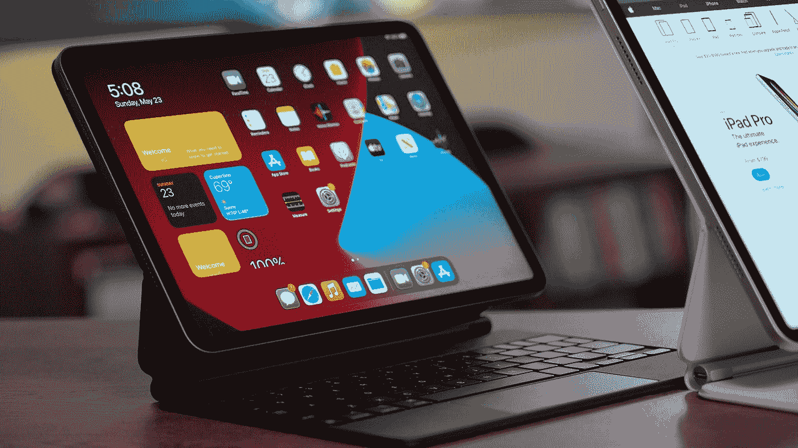
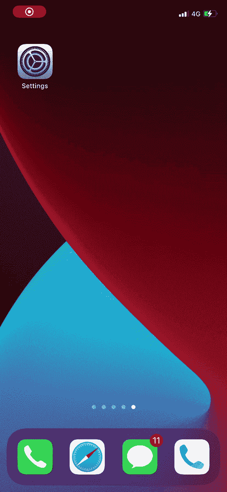
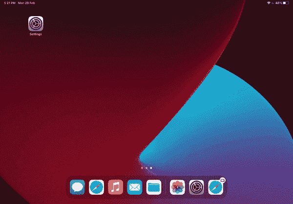

# 如何使用蓝牙鼠标在 iPhone 上显示点击

> 原文：<https://medium.com/geekculture/how-to-show-taps-on-the-iphone-using-a-bluetooth-mouse-f220b63fe9e?source=collection_archive---------11----------------------->

在录制视频或向客户端远程演示应用程序时，您必须确保点击/轻拍是可见的，以便客户端可以跟随并在您移动光标时看到您在屏幕上点击的位置。

Photo by [Daniel Romero](https://unsplash.com/@rmrdnl?utm_source=medium&utm_medium=referral) on [Unsplash](https://unsplash.com?utm_source=medium&utm_medium=referral)

在上一篇文章中，我们学习了如何使用自定义手势在 iOS 模拟器或 iOS 设备上显示触摸。

 [## 如何在 iOS 设备上显示触摸

### 有时你想在你的 iOS 设备(iPhone 或模拟器)上启用一个点击指示器，比如一个小圆圈，用于触摸…

medium.com](/macoclock/how-to-show-touches-on-ios-device-e0d9f00cc6f5) 

辅助功能已经有了一定的限制。例如， [Justin Lake](https://medium.com/u/6711be773610?source=post_page-----f220b63fe9e--------------------------------) [在](/@juicelake/thanks-for-this-super-helpful-4c9979c78f8f)[文章](https://milanpanchal24.medium.com/how-to-show-touches-on-ios-device-e0d9f00cc6f5)上评论，称他无法滚动页面，并且在一段时间后辅助功能将被禁用。

在这篇文章中，我们将学习如何通过连接蓝牙鼠标在 iPhone/iPad 上显示点击。

# 将蓝牙鼠标连接到 iPhone

首先，请确定 iPhone 上的蓝牙已启用，并且蓝牙鼠标已打开且可被发现。

1.  打开 iPhone 上的**设置**应用。
2.  转到**辅助功能** ➞ **触摸** ➞ **辅助触摸**
3.  通过顶部的开关打开**辅助触摸**。它会变成绿色，浮动的 AssistiveTouch 按钮会出现。
4.  接下来，向下滚动到**指针设备**部分并点击**设备**。
5.  然后点击“**蓝牙设备…** ”按钮

现在 iPhone 将开始搜索可用的蓝牙设备。点击您想要使用的鼠标的名称。如果在配对鼠标时要求您输入 PIN，请键入“0000”(四个零)。输入号码后，轻按“配对”。

> 大多数蓝牙设备都有一个默认的 PIN 码“0000”，但是如果需要的话，您应该向您的制造商咨询。

一旦你将蓝牙鼠标连接到你的 iPhone 上，你现在就可以用你的鼠标点击屏幕，并向你的观众显示你点击的确切位置。

Connect Bluetooth mouse to an iPhone

# 将蓝牙鼠标连接到 iPad

在 **iPadOS 13.4** 之前，你必须使用辅助功能菜单来配对蓝牙鼠标。但是现在你可以选择直接使用蓝牙接口。

首先，请确定 iPad 上的蓝牙已启用，并且蓝牙鼠标已打开且可被发现。

1.  打开 iPad 上的**设置**应用。
2.  按下**蓝牙**选项并开启。
3.  在那个屏幕上，你应该会在一个叫做**其他设备**的部分看到你鼠标的名字。
4.  点击您想要使用的鼠标的名称。
5.  您可能会收到“蓝牙配对请求”如果有，按下*对*。

当你看到新的圆形指针在屏幕上移动时，你就知道它在工作。如果它不动，再试一次。

> **注:**鼠标设备单独提供。并非所有鼠标设备都与所有型号的 iPad 完全兼容。

**专业提示:**按照相同的步骤，如果您有正确的配件，您也可以将现有的鼠标连接到 iPad。

# 自定义设置

将蓝牙鼠标连接到 iPhone/iPad 后，就可以通过调整跟踪速度、二次点击和自然滚动来自定义它了。

## 在 iPad 上调整颜色、大小或自动隐藏时间

1.  转到设置➞辅助功能。
2.  选择指针控制。

当您移动输入设备时，指针也会移动。

Adjust the color, size, or Auto-Hide time — On iPad

## 在 iPhone 上调整颜色、大小或自动隐藏时间

1.  转到设置➞辅助功能➞触摸。
2.  选择辅助触摸，然后选择指针样式。

当您移动输入设备时，指针也会移动。

## 调整触控板或鼠标的速度

1.  转到设置➞综合医院。
2.  选择触控板与鼠标。
3.  调整跟踪速度。

Adjust the speed for the trackpad or mouse

## 更改按钮分配

1.  转到设置➞辅助功能➞触摸。
2.  选择辅助触摸➞设备。
3.  选择您正在使用的设备的名称。
4.  选择按钮，然后使用下拉菜单为每个按钮选择您喜欢的操作。

Change the button assignments

 [## 通过我的推荐链接加入媒体-米兰·潘查尔

### 作为一个媒体会员，你的会员费的一部分会给你阅读的作家，你可以完全接触到每一个故事…

medium.com](/@milanpanchal24/membership) 

# 了解更多信息

了解更多关于苹果设备上的[辅助功能](https://support.apple.com/accessibility)。

# 有问题吗？

如有疑问，欢迎在下方评论，**。**

如果你喜欢这篇文章，请分享给你的朋友，并给我留下评论。此外，点击鼓掌按钮(👏)下面来表示你有多喜欢这篇文章。

感谢阅读！👨🏼‍💻

# 您可以在以下网址找到我:

[Twitter](https://twitter.com/milan_panchal24)|[LinkedIn](https://www.linkedin.com/in/milanpanchal/)|[GitHub](https://github.com/milanpanchal)|[Medium](/@milanpanchal24)|[hacker rank](https://www.hackerrank.com/milanpanchal)|[leet code](https://leetcode.com/milanpanchal/)|[堆栈溢出](https://stackoverflow.com/users/1748956/milanpanchal)