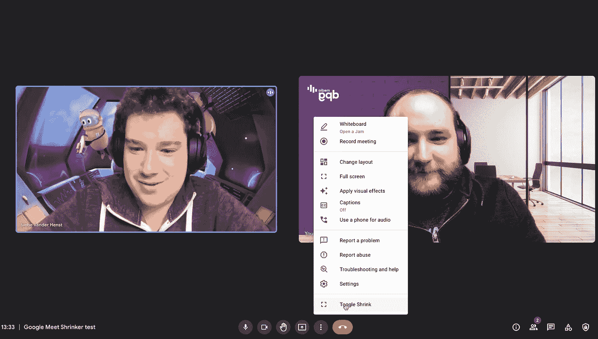

# 如何缩小 Google Meet 中的人

> 原文：<https://medium.com/geekculture/how-to-shrink-people-in-google-meet-13ae48a00495?source=collection_archive---------3----------------------->

## 你说的时间越长，你就变得越小

*由前端开发人员 Jaro Vanderheijden 撰写*

**荷兰专栏作家兼办公室亚马逊 Japke-d. Bouma 写了一本书** [**《你永远不应该和同事做的 19 件事》**](https://www.bol.com/nl/nl/p/de-19-dingen-die-je-nooit-met-collega-s-moet-doen/9300000041454241/?bltgh=sCJrn2ZxFbDHrcP-VIVMgQ.4_12.13.ProductTitle) **。它包含了关于在线会议的七个事实。# 6:**“**我想要一个缩放或团队功能，让人们说话越长越小。”好吧，Japke-d，你问；我们送货上门！**

当一位同事分享了关于在线会议的七个事实的片段时，我想:“我也许可以做到。”于是我开始了[博德](https://www.youtube.com/watch?v=lIFE7h3m40U) …🤔

# 在 Google Meet 中缩减视频通话

我们主要在 DPG 媒体上使用 Google Meet，所以我决定专注于此。没多久我就发现，我可以检查麦克风图标的活动，并使用它来缩小或扩大人们说话时的视频。

经过一些修补之后，瞧:一个工作的、缩小的视频电话。

尽管它远非完美；当有人加入时，它缩小了演示和错误的人。我修复了这些边缘情况，添加了一个切换按钮，并认为它足够好了。😎

# 获取您的 Google Meet 缩减代码

有兴趣的可以在这里找到代码: [GitHub](https://github.com/JaroVDH/shrink-as-you-talk/blob/main/index.js) 。

您可以使用 Greasemonkey (Firefox)或 Tampermonkey (Chrome)等工具将脚本加载到您的 Google Meet 页面上。

声明:正如我所提到的，这是一项繁重的工作。它一点也不优雅，而且只有在有人盯着它的时候，它才有可能继续工作。所以使用它要自担风险！

也就是说，你可以随意重用和修改它。

