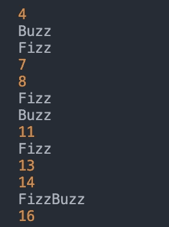

# 如何解决 FizzBuzz 算法问题

> 原文：<https://medium.com/geekculture/how-to-solve-a-fizzbuzz-algorithm-problem-3f91cdd83841?source=collection_archive---------18----------------------->


[https://www.ezrahill.co.uk/2019/04/14/the-fizzbuzz-question/](https://www.ezrahill.co.uk/2019/04/14/the-fizzbuzz-question/)

# FizzBuzz 是什么？

FizzBuzz 是一个简单而流行的编程问题，有时会在软件开发人员编码面试中给出，以测试编程能力。问题是这样设置的:

## 创建一个函数(我们称之为 **fizzBuzz)** 来打印从 1 到 100 的数字，当然也有例外:

1.  如果数字是 3 的**倍数，**打印“Fizz”**代替数字。**
2.  如果数字是 5 的倍数**，则**打印“Buzz”**而不是数字。**
3.  如果数字是 3 *和* 5 的**倍数，则**打印“FizzBuzz”**代替数字。**

## fizzBuzz 函数输出的部分示例



Partial Example of fizzBuzz Function Output

## 带有伪代码的 fizzBuzz 函数👇🏾

```
function fizzBuzz(){
  // multiple of 3 ***and*** 5, print “FizzBuzz”
  // multiple of 3, print “Fizz”
  // multiple of 5, print “Buzz”
}
```

## 现在让我们开始解决！

# 步骤 1:创建一个 For 循环

For 循环用于将一段代码重复 n 次。for 循环非常适合我们的目的，因为我们希望打印从 1 到 100 的数字，但有一些例外。

```
for (let i=1; i<=100; i++) {}
```

# **第二步:创建 *IF…ELSE* 语句**

## 步骤 2.1:为 3 和 5 的倍数创建一个 IF 语句

在 if 语句中，我们检查一个给定的数(I)除以 3 和 5 后是否还有余数 0，这将使它成为倍数，因此我们将打印“FizzBuzz”:

```
// multiple of 3 ***and*** 5, print “FizzBuzz”
if (i % 3 === 0 && i % 5 === 0){
  console.log("FizzBuzz")
}
```

## 步骤 2.2:为 3 的倍数创建一个 ELSE IF 语句

现在，我们将创建 else if 语句，该语句将考虑 3 的倍数并打印“Fizz”:

```
// multiple of 3, print “Fizz”
else if (i % 3 === 0){
  console.log("Fizz")
}
```

## 步骤 2.3:为 5 的倍数创建一个 ELSE IF 语句

我们将创建另一个 else if 语句，该语句将考虑 5 的倍数并打印“Buzz”:

```
// multiple of 5, print “Buzz”
else if (i % 5=== 0){
  console.log("Buzz")
}
```

## 步骤 2.4:为 3 或 5 的倍数创建一个 ELSE 语句

我们不能忘记不是 3 或 5 的倍数的数字，我们将只打印这些数字:

```
// multiple of neither 3 nor 5, print number
else{
  console.log(i)
}
```

# 最终产品

如果您觉得这很有帮助，请继续关注更多的文章，在那里我将解决常见的算法问题！😊🎉