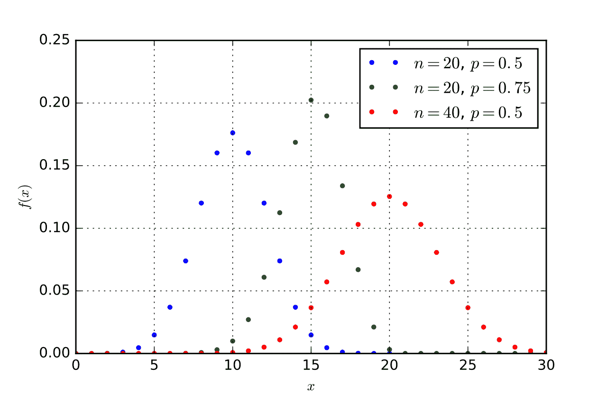

# 如何在 R 和 Python 中同时求解二项分布问题

> 原文：<https://medium.com/geekculture/how-to-solve-binomial-distributions-problems-in-both-r-and-python-f9e3b31b2bcb?source=collection_archive---------8----------------------->

在概率论和统计学中，是一种离散的概率分布，在实验中只给出两种可能的结果，成功或失败。

二项分布有四个特征，即

1.  观察次数 n 是固定的。
2.  每个观察都是独立的。