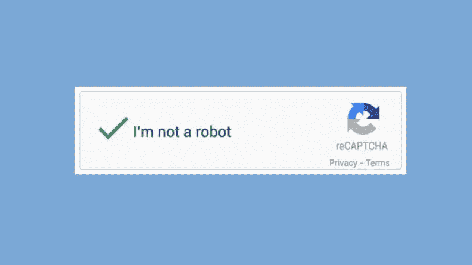

# 如何用 Python 求解 Captcha？

> 原文：<https://medium.com/geekculture/how-to-solve-captcha-with-python-80959653dba2?source=collection_archive---------4----------------------->

# 抓取动态网站，第五部分:处理验证码

当我们试图废弃一些真正安全的网站时，验证码是一个很大的障碍。

I’m not a robot

据说可以通过实现“网络驱动等待”和减少共享频率来避免验证码。但在我的情况下，它从来没有工作。

## 我当时是怎么解验证码的！

这里有一些选项，我可以实施，以解决验证码；
1-放置等待并设置更少的轮询频率(从未对我有效)
2-使用机器学习模型(一种昂贵且占用资源的方法)
3-使用语音到文本或文本到语音选项(简单的一种，但并不总是可用)
4-使用一些验证码解决服务(我发现这是一个最佳选择。它是成本+资源有效的。)

所以，我选择了选项 4。这是它的工作原理。

## 求解验证码

按照步骤来。

1-在 https://anti-captcha.com/[创建一个帐户，并获得您的访问令牌。
2-下载适用于您的浏览器(如 chrome、firefox 等)的“anticaptcha”插件。从](https://anti-captcha.com/)[到这里](https://antcpt.com/eng/download/google-chrome-options/manual-crx.html)。将这个插件保存在你的工作目录中，以防止访问问题。
3-将此添加到您的脚本中

在你开始写剧本之前把这个放进去。

仅此而已。对我很有效。我希望这对你也有用。

让我澄清一下，这不是为“anti-captcha.com”撰写的赞助文章。我写这个是因为觉得有用。

问候