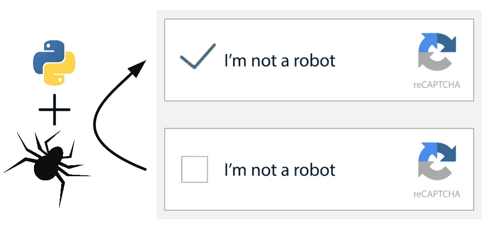

# 如何用 Python 解决 Google — reCAPTCHA v3

> 原文：<https://medium.com/geekculture/how-to-solve-google-recaptcha-v3-with-python-9f92bb0212bf?source=collection_archive---------1----------------------->

当创建网络机器人或网络爬虫时，你经常会遇到各种各样的障碍，而且，随着时间的推移，它们变得越来越有创意、困难和复杂。

众所周知的 **Google — reCAPTCHA v3** 是一个非常熟悉的问题，对许多人来说是一个很大的障碍。
当然有一些提供者通过提供的 API 为你解决这样的 **reCAPTCHA v3**