# 如何用 GTM 服务器端标签解决 GDPR 问题

> 原文：<https://medium.com/geekculture/how-to-solve-the-gdpr-problem-with-a-gtm-server-side-tag-c24b0508d869?source=collection_archive---------4----------------------->


Source: [Depositphotos](https://ru.depositphotos.com/174176714/stock-photo-padlock-over-eu-map-gdpr.html)

## 如何保护敏感用户数据并遵守欧盟的 GDPR

在通用数据保护条例( [GDPR](https://gdpr-info.eu/) )生效后，欧洲的谷歌分析用户面临一个问题。由于欧洲数据保护机构的决定，谷歌分析在一些国家被网站运营商视为非法，因为它不符合 GDPR。

好消息是这个问题有了解决方案。如果你喜欢 Google Analytics 4 的数据结构，你不必放弃它。相反，您可以在 Google Tag Manager 中使用服务器端跟踪，并使用 OWOX 中的一个特殊标记将数据从您的网站直接传输到 Google BigQuery，而无需发送到 Google Analytics 服务器。

# 谷歌分析和 GDPR——有什么问题？

2020 年，非营利组织 [NOYB](https://noyb.eu/) 对在欧洲经济区(EEA)运营的应用谷歌分析或脸书连接的网站提起 [101 起投诉](https://noyb.eu/en/eu-us-transfers-complaint-overview)。在此之后， [EEA 数据保护当局](https://edpb.europa.eu/edpb_en)开始发布裁决，强制 EEA 网站运营商停止使用这些服务，理由是它们不符合通用数据保护条例( [GDPR](https://gdpr-info.eu/) )。

问题在于在欧洲应用谷歌分析的方法，因为谷歌将收集的关于欧盟居民的数据(用户行为数据)存储在美国的云服务上。关键点是——现在仍然是——谷歌采取的安全措施不足以阻止美国情报机构获取欧盟居民的个人数据。根据欧洲数据保护机构的说法，这些海外数据传输违反了 GDPR。

# 如何解决 GTM 服务器端跟踪和 Google BigQuery 的问题

GTM 服务器端跟踪是传统客户端跟踪方法的替代方法，解决了敏感数据传输、广告拦截器和页面加载速度的问题。

为了处理在服务器端收集的数据(服务器端跟踪)，添加了一个中间目的地(在 Google Tag Manager 的情况下，这是一个云服务器)。从客户端来说，请求先去云服务器，然后云服务器处理这个请求，发送给第三方系统。也就是说，不是客户端浏览器向第三方系统发出请求，而是由云服务器发出请求。

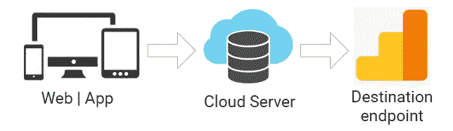

Image by Author

## GTM 服务器端跟踪的优势

1.  服务器端跟踪允许您通过将站点移动到后端来隐藏站点如何与第三方应用程序交互的业务逻辑。也就是说，用户将无法使用您传输的数据和用于传输数据的逻辑。
2.  向第三方系统发送数据不依赖于用户的浏览器，因为所有请求都在服务器端处理和发送，不受广告拦截器的影响，因为这种方法通过识别发送请求的域消除了检测脚本的可能性。
3.  这种跟踪方法更加安全，这意味着您可以用必要的信息补充在客户端收集的用户数据，而没有泄露的风险。
4.  您可以完全控制将发送到第三方系统的数据，使您能够遵守现有的 GDPR、CCPA 和 CSP 要求。
5.  通过在设置服务器容器时使用子域，您可以设置第一方 cookies，从而延长它们的生存期。这有助于消除 Safari、Chrome 和 Firefox 内置的跟踪预防工具的影响。

为了不向 Google Analytics 发送数据，您可以使用[Google Analytics 4 raw data to big query Tag](https://tagmanager.google.com/gallery/#/owners/OWOX/templates/ga4-rawdata-to-bigquery)，这允许您自动将 Google Analytics 4 事件重定向到 Google BigQuery 表。

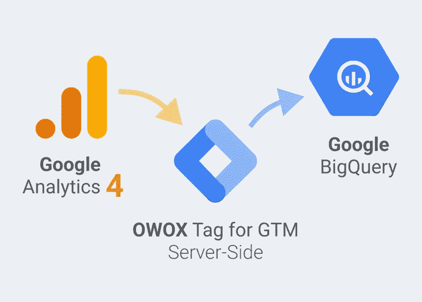

Image by Author

## OWOX 标签对于服务器端 GTM 的优势

谷歌分析 4 RawData 到 BigQuery 标签是免费的。任何使用服务器端 GTM 的人都可以安装它，并获得以下好处:

1.  **GDPR 顺从。**使用我们的标签，您可以配置 GTM 服务器端，这样数据根本不会进入美国的 Google Analytics 服务器，而是直接进入您在 Google BigQuery 中指定位置的数据集。也就是说，数据根本没有超出业务的第一方轮廓。因此，业务本身保证了 100%的 GDPR 合规性。
2.  **一次性设置。**标签只需要配置一次。每次在站点标记中添加新的 GA4 事件/参数时，无需进入设置并更改 GBQ 中的表结构。
3.  **实时数据。**数据实时发送到 GBQ，无需等待预定的导出。
4.  **没有限制。例如，你不会遇到已知的每天 100 万次点击的限制，该限制适用于从免费版本 GA 4 到 GBQ 的原生上传。**
5.  **标签是免费的**，任何使用 GTM 服务器端跟踪的人都可以使用。

# 如何使用 Google Analytics 4 raw data to BigQuery 标签设置从 Google Analytics 4 到 big query 的原始数据收集

如果您启用了 Google Analytics 4 并将 GTM 配置为 GA 4 事件的服务器端标签管理器，则可以使用[Google Analytics 4 raw data to big query Tag](https://tagmanager.google.com/gallery/#/owners/OWOX/templates/ga4-rawdata-to-bigquery)。有了这个标签，每次在站点标记中添加新事件后，您将获得原始的 Google Analytics 4 数据，而无需首先在 BigQuery 中设置模式。

# 如何将 Google Analytics 4 原始数据添加到 BigQuery 标签中

## 第一步。在您的 Google BigQuery 中创建一个适当的表

1.  在 GBQ 项目中创建数据集:

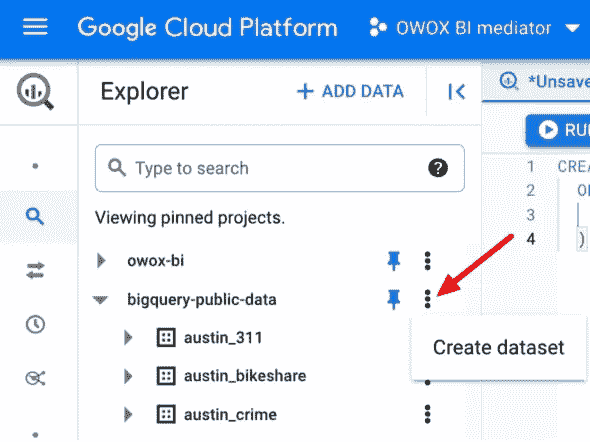

Image by Author

2.选择数据位置:

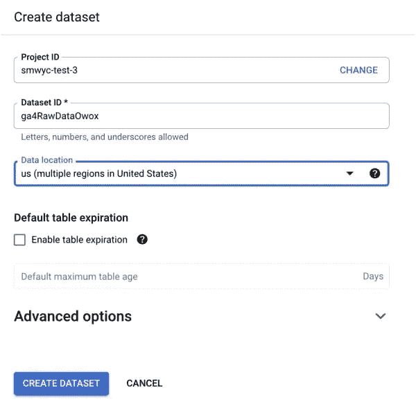

Image by Author

3.使用以下模式创建一个表:

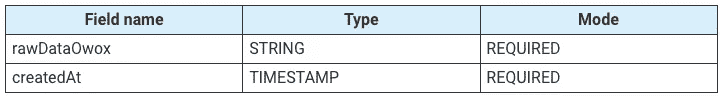

最快的方法是在 GBQ 中运行下面的 SQL 代码:

> 如果[项目名称]不存在，则创建表格。[dataset _ name]. ga 4 rawDataOwox(rawDataOwox STRING NOT NULL，createdAt TIMESTAMP NOT NULL)选项(description="GA4 使用 Owox 标记将原始数据从我的服务器端 GTM 直接传输到 GBQ "

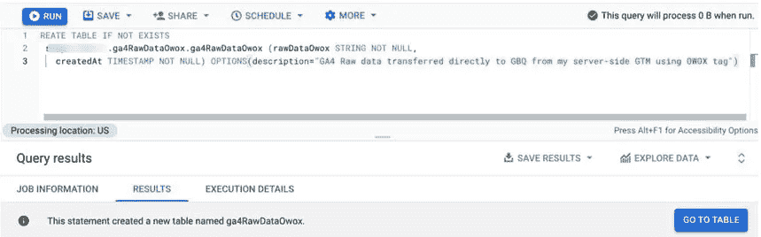

Image by Author

**注意！**在这个 SQL 代码示例中，您需要替换[project_name]。具有实际项目和数据集名称的[数据集名称]。

## 第二步。将模板中的标签添加到您的工作区

1.  转到服务器端 GTM 容器中的**模板→标签模板→搜索库**:

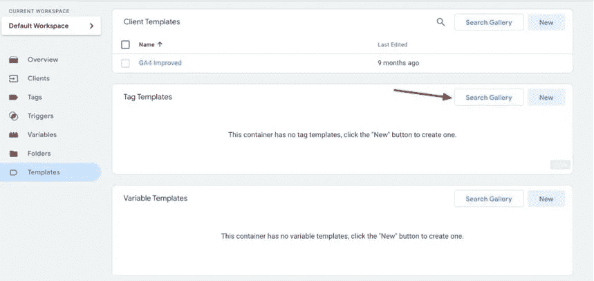

Image by Author

2.找到并选择标签:

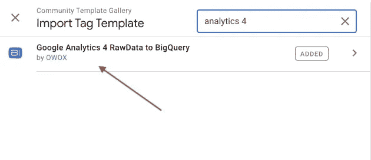

Image by Author

3.将其添加到您的工作区:

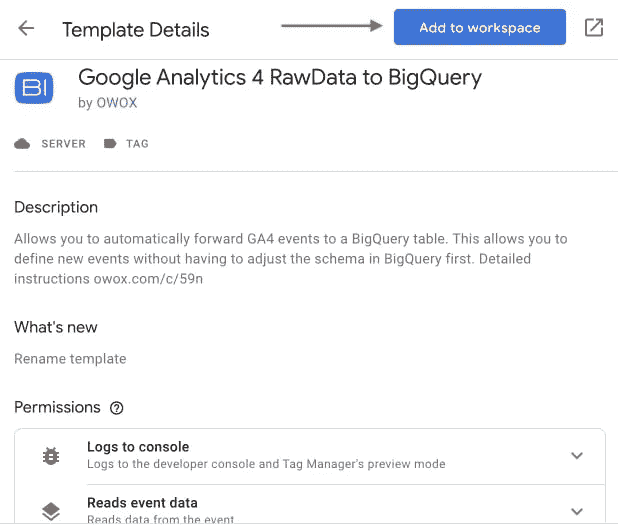

Image by Author

## 第三步。添加标签

转到标签并添加此标签。选择一个触发器，并在 GBQ 中设置表的路径。

**注意！**选中“启用日志记录”复选框，仅用于调试。


Image by Author

只要您的服务器容器与 BigQuery 表运行在同一个 GCP 项目中，就万事俱备了。在身份验证方面，您不需要做任何事情，因为 App Engine 的默认服务帐户可以完全访问添加到项目中的任何 BigQuery 表。

## 第四步。发布带有新标签的容器

**提交**和**发布**变更，然后在预览模式下测试流程。如果一切都正确，您将在 Tags Fired 下看到*Google Analytics 4 raw data to big query Tag*:

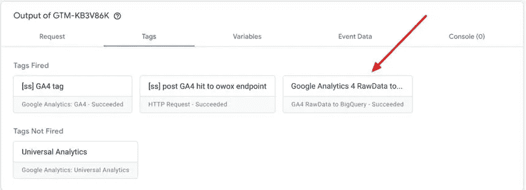

Image by Author

您将看到 Google BigQuery 表中的数据:

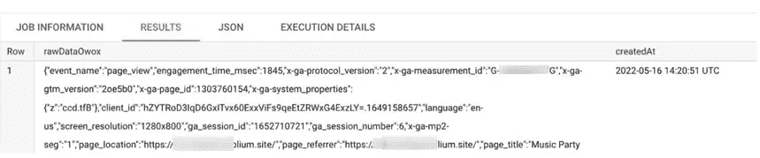

Image by Author

# 如何使用这些数据

编写 SQL 代码，以便在报告中以方便的结构使用这些数据。示例:

```
SELECT JSON_EXTRACT_SCALAR(rawDataOwox, '$.page_referrer') AS page_referrer, JSON_EXTRACT_SCALAR(rawDataOwox, '$.page_title') AS page_title, JSON_EXTRACT_SCALAR(rawDataOwox, '$.event_name') AS event_name, JSON_EXTRACT_SCALAR(rawDataOwox, '$.user_agent') AS user_agent FROM `[project_name].[dataset_name].ga4RawDataOwox`
```

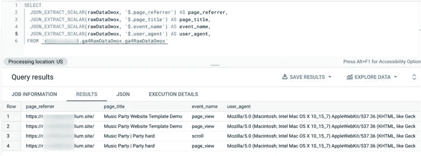

Image by Author

因此，现在您可以使用 Google Analytics 4，将成本数据导入 Google BigQuery，并构建您需要的任何跨渠道报告。