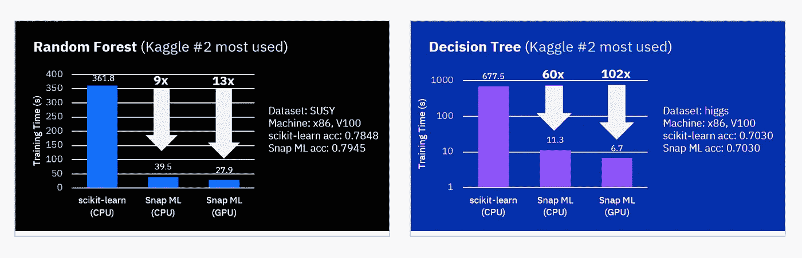
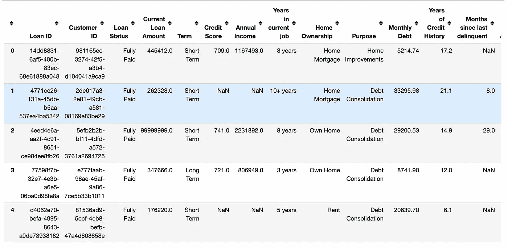

# 如何用 Snapml 加速模型训练

> 原文：<https://medium.com/geekculture/how-to-speed-up-model-training-with-snapml-b2e24b546fe5?source=collection_archive---------8----------------------->

## 用更少的时间训练机器学习模型


[Photo by Taras Makarenko from Pexels:](https://www.pexels.com/photo/cars-ahead-on-road-593172/)

机器学习对解决各种行业的业务问题有着巨大的影响，包括卫生、金融和交通。你可以收集每天创建的大量数据，并为产品推荐和情感分析等特定任务训练机器学习模型。

建议您在大型数据集上训练和执行几个机器学习实验，以便拥有有效的机器学习模型。这有其自身的困难，例如需要很长时间来训练模型以达到预期的结果。

在本文中，您将了解如何使用 snapml python 包在短时间内加快训练机器学习模型的过程。

我们开始吧！🚀

# Snapml 是什么？

这是 IBM 开发的一个 python 包，用于在 CPU 和 GPU 计算环境中提供机器学习模型的高速训练。 [Snampl](https://snapml.readthedocs.io/en/latest/) 可以帮助你在机器学习项目中完成以下任务:-

*   在线对新数据进行训练和再训练。
*   做大[参数调谐](https://davis-david.medium.com/alternative-hyperparameter-optimization-techniques-you-need-to-know-part-1-3f68d0448fcd?source=user_profile---------35----------------------------)。
*   做出准确的决策和预测。
*   用较少的资源在所有可用的数据上训练模型。
*   高效处理大数据。

它还支持不同类型的机器学习模型，如:

*   广义线性模型(如线性回归)。
*   基于树的模型(例如决策树和随机森林)。
*   梯度增压模型(例如增压机)。

当在云环境中训练模型时，Snapml 可以通过加快训练过程在短时间内完成来帮助您降低成本。



screenshot from [https://www.zurich.ibm.com/snapml/](https://www.zurich.ibm.com/snapml/)

# 如何安装 Snapml

要安装 snapml，请在终端中运行以下命令。

```
pip install snapml
```

**注意:** Snapml 目前支持 Python 3.7，3.8，3.9。对于 macOS 用户，目前支持 intel(x86_64)架构。

# 不带 Snapml 的训练 ML 模型

在这一部分中，您将首先使用来自 [scikit-learn 库](/geekculture/scikit-learn-1-0-new-features-in-python-machine-learning-library-d6ffea7b88dc)的机器学习算法在大型数据集上训练机器学习模型，并评估在数据集上训练模型所用的总时间。

## 导入包

第一步是导入我们将要用来加载数据集、准备数据集和训练机器学习模型的各种重要 python 包。

```
*#import libraris**import* numpy *as* np
*import* pandas *as* pd*from* sklearn.preprocessing *import* LabelEncoder
*from* sklearn.preprocessing *import* MinMaxScaler
*from* sklearn.ensemble *import* RandomForestClassifier
*from* sklearn.model_selection *import* cross_val_score*import* time
*import* warningswarnings.filterwarnings("ignore")
np.random.seed(123)
```

## 加载数据集

我们将使用银行贷款状态数据集来训练可以对未来贷款状态进行分类的模型。

从[kaggle.com](https://www.kaggle.com/datasets/zaurbegiev/my-dataset)下载数据集。

要加载数据集，请使用 pandas 库中的 read_csv 函数

```
*#load data*Bank_Dataset = pd.read_csv("../data/credit_train.csv")
```

检查数据集的前几行。

```
*#show the first five rows*Bank_Dataset.head()
```



Pandas Dataframe

该数据集有许多显示每个客户获得的贷款详细信息的功能。

让我们检查数据集的形状，以确定其大小。

```
# show shape
Bank_Dataset.shape
```

(100514,19)

银行贷款状态数据集有超过 100，000 行数据和 19 列。这个数据集足够大，可以评估在使用和不使用 Snapml 的情况下训练模型时的时间差。

## 准备数据集

您需要通过移除不需要的要素、处理缺失值并将所有要素转换为数值来准备数据集。

**(一)移除特征**

在这一步中，您将删除贷款 ID 和客户 ID。

```
#remove ID columns
Bank_Dataset.drop(["Loan ID", "Customer ID"], axis=1, inplace=True)
```

我们现在剩下了 16 个特性和目标列(“贷款状态”)。

**(b)处理缺失值**

通常，数据集可能会有缺失值，您需要在训练机器学习模型之前处理这些缺失值。下面是检查数据集中每列缺失值数量的代码。

```
#check missing values
Bank_Dataset.isnull().sum()
```


Features with the total number of missing values

我们的数据集在所有特性中都有缺失值，包括目标列(“贷款状态”)。

下面的代码块将首先使用每个分类列中最常见的值来填充分类列中缺少的值。然后通过使用每个数字列的平均值来填充数字列中缺少的值。

```
# fill missing values for categorical features
Bank_Dataset["Loan Status"].fillna("Fully Paid", inplace=True)
Bank_Dataset["Term"].fillna("Short Term", inplace=True)
Bank_Dataset["Years in current job"].fillna("10+ years", inplace=True)
Bank_Dataset["Home Ownership"].fillna("Home Mortgage", inplace=True)
Bank_Dataset["Purpose"].fillna("Debt Consolidation", inplace=True)# fill missing values for integers features
intergers_columns = list(
    Bank_Dataset.select_dtypes(include=['floating']).columns)
for column in intergers_columns:
    Bank_Dataset[column].fillna(Bank_Dataset[column].mean(), inplace=True)
```

**(c)变换数据集**

处理完数据集中的缺失值后，您需要将数据集转换成数值。

转换的第一步是使用 scikit-learn 库中的 LabelEncoder 方法预处理两个二进制分类列(Term 和 Loan Status)。

```
# preprocess binary categorical columnsle = LabelEncoder()
binary_columns = ["Loan Status", "Term"]
for column in binary_columns:
    Bank_Dataset[column] = le.fit_transform(Bank_Dataset[column])
```

然后，使用 pandas 库中的 **get_dummies** 函数转换多个分类列。此函数将转换数据集中的以下各列。

*   房屋所有权
*   目的
*   目前工作年限

```
# preprocess multiple categorical columns
Bank_Dataset = pd.get_dummies(
 Bank_Dataset,
 columns=[“Home Ownership”, “Purpose”,“Years in current job”])
```

**(d)分割特征和目标**

将数据集拆分为其要素列和目标列。

```
# split data into target and features
target = Bank_Dataset["Loan Status"].values
features = Bank_Dataset.drop("Loan Status", axis=1)
```

**(e)缩放特征**

变换后的要素具有不同的值范围。您需要通过使用 scikit-learn 中的 MimMaxScaler 方法将所有特性归一化到给定的范围 0 和 1。

```
# scaling the datasetscaler = MinMaxScaler()
features = scaler.fit_transform(features)
```

## 训练一个机器学习模型

要在没有 snapml 的情况下训练模型，需要使用以下代码从 scikit-learn 库中实例化 RandomForestclassifer。

```
#create a classifier
sklearn_classifier = RandomForestClassifier()
```

最后，在转换后的数据集上训练 RandomForestClassifier。我们还会找到训练模型前后的时差。

```
# training classifierstart_time = time.time()scores = cross_val_score(sklearn_classifier, features, target, cv=3)print("Training Time: {}".format(time.time() - start_time))
print("Scores: {}".format(scores))
```

**训练时间:** 55.80186605453491
**分数:**【0.82122071】0.818827 0.82106614】

总的来说，模型性能的准确度约为 82%，训练时间为 **55.80 秒**(几乎 1 分钟)。

让我们看看如何使用 Snapml 来加速模型训练。

# 用 Snapml 训练 ML 模型

第一步是从 snapml 包中导入名为 RandomForest 分类器的监督算法。

```
# add RandomForestClassifier from snapmlfrom snapml import RandomForestClassifier
```

然后实例化分类器。

```
snampl_classifier = RandomForestClassifier()
```

最后从 snapml 训练分类器，评估训练模型前后的时间差。

```
start_time = time.time()scores = cross_val_score(snampl_classifier, features, target, cv=3)print("Training Time with snapml: {}".format(time.time() - start_time))
print("Scores: {}".format(scores))
```

用 snapml 训练时间:14.426469421387
分数:[0.8106513 0.80947 0.8109181]

正如你所看到的，使用 snapml 时的训练时间是 **14.45 秒**，这比使用 scikit-learn 库训练机器学习模型几乎快 **4 倍**。

在云环境中训练大规模数据集时，Snapml 有很大的潜力，可以节省您的时间和成本。

Snapml 支持其他分类模型，您可以在自己的数据集中尝试这些模型，例如:-

*   物流回归
*   决策树
*   支持向量机
*   增压机
*   成批的树集合。

# 结论

在本文中，您了解了使用大型数据集训练机器学习模型的一些挑战，以及如何使用 snampl 在短时间内加快训练模型的过程。

正如我之前所说的，如果您在云环境中训练您的模型，snapml 不仅会节省您的时间，还会节省您的金钱。该库将让你有机会执行各种机器学习实验，而不必担心时间不够用。

如果你学到了新的东西或者喜欢阅读这篇文章，请与他人分享。在此之前，敬请关注下一篇帖子！

你也可以在 Twitter 上找到我 [@Davis_McDavid](https://twitter.com/Davis_McDavid?ref=hackernoon.com) 。

最后一件事:在以下链接中阅读更多类似的文章。

[](/geekculture/top-5-cloud-migration-strategies-you-need-to-know-fb1d92ed3c8a) [## 您需要知道的五大云迁移策略

### 如何将您的数据和系统平稳地迁移到云中

medium.com](/geekculture/top-5-cloud-migration-strategies-you-need-to-know-fb1d92ed3c8a) [](https://python.plainenglish.io/how-is-web-crawling-used-in-data-science-a116d883419d) [## 数据科学中如何使用 Web 爬行

### 为您的数据科学项目收集数据的无代码工具

python .平原英语. io](https://python.plainenglish.io/how-is-web-crawling-used-in-data-science-a116d883419d) [](/geekculture/top-5-reasons-why-companies-are-moving-to-the-cloud-c3a609332125) [## 公司迁移到云的五大原因

### 为什么企业对云的采用增加到了 90%

medium.com](/geekculture/top-5-reasons-why-companies-are-moving-to-the-cloud-c3a609332125)