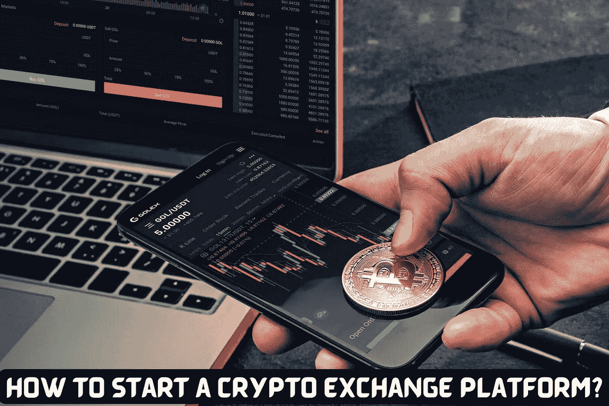

# 如何启动一个加密交换平台？

> 原文：<https://medium.com/geekculture/how-to-start-a-crypto-exchange-platform-458340665ca4?source=collection_archive---------9----------------------->

**Crypto Exchange Platform**

2022 年的秘密空间令人兴奋:从被大众欢呼的阶段到看到他们的价值暴跌到从未见过的低点。尽管如此，密码市场仍然相当强劲，因为不可抗拒的事实，他们将是未来生活的一个重要组成部分。这可以从著名的加密交换平台周围的流量中看出来。尽管不可替代令牌的流行在这种拥挤程度上有发言权，但密码是 Web3 世界的基本组成部分，不容忽视。让我们在这个博客中看看如何启动一个加密交换平台。

## 什么是加密交换平台？

一个 [**密码交易平台**](https://bit.ly/3NspraY) 是一个人们可以购买密码来换取法定货币以及在密码之间进行交易的平台。人们应该知道，这些平台是加密货币的第一个有形用例；它们起到了平面密码交换平台的作用。这些平台可以是集中式的、分散式的或混合式的，所有这些平台在功能上都有所不同。拥有超过 21，000 个加密令牌，在当前环境下，加密交换平台的必要性是无与伦比的。币安、比特币基地、北海巨妖、Uniswap、PancakeSwap、KuCoin、FTX 和 SushiSwap 是 2022 年流行的加密交换平台。

Crypto Exchange Platform

## 密码交换平台风险投资的必要性

✪与货币价值的加密交换平台的商业模式交易，可以说，一个企业可以很容易地通过征收交易，上市等多种费用来获取利润。

✪平台的金融性质也使风险企业能够利用该模式进行其他操作，如赌注、贷款、借款、支付、收益农业、保险、衍生品、期权交易、综合交易和储蓄以赚取利息。

✪ A 加密交换平台也将作为一个长期的商业前景，因为 Web3 只是在增长，预计在未来十年将有大量用户涌入。

# 创建加密交换平台:过程

**♛**

**♛** **获得准确的法律建议:**特别注意与加密交易所许可相关的每一个法律细节。验证该国的政治和经济稳定性以及市场的开放性，然后在那里推出您的加密交换平台。

**♛** **决定你的预算:**如果你想开发一个加密交换平台，你必须决定你的预算。应该包括建设和维护加密货币交易所的前期成本。

**♛** **选择开发方式:**您必须选择一种平台开发方式，才能建立一个密码交换平台。要么从头开始，要么选择一个 [**白标加密货币兑换解决方案**](https://bit.ly/3sFNvgZ) 。两者各有利弊。所以，明智的选择就看你自己了。

**♛** **选择密码交换平台开发公司:**您现在可以从合格的个人那里获得技术帮助。通过与经验丰富的加密交换平台开发公司合作，您可以以合理的价格获得功能丰富的加密货币交换平台。

**♛集成最佳安全预防措施:**实施最佳安全措施，如双因素认证、数据加密、SSL 集成、SSRF 保护等，让您的创业平台安全无虞。

**♛测试并启动平台:**不要忘记进行多项测试，如漏洞测试、KYC 验证测试、存款和取款测试等。在最终启动之前，请验证您的平台运行正常。

**♛** 最后，在提供客户服务时要格外小心。

## 总结想法

从今以后，我们可以说，鉴于这些硬币的不稳定性和 Web3 的不断发展，经营一个成功的加密交换平台企业需要付出非凡的努力。此外，由于加密货币交易所是任何新的 Web3 用户的切入点，他们的需求将永远存在，这强调了他们在 Web3 生命链中的地位。

如果你想建立一个基于加密交易平台模式的企业，这可能是你的最佳时机。尽管如此，选择与一家已建立的 [**密码交换平台开发公司**](https://bit.ly/3NspraY) 合作会给你加分，因为你可以自由选择使用成熟的活动或预制的解决方案来启动你的企业。