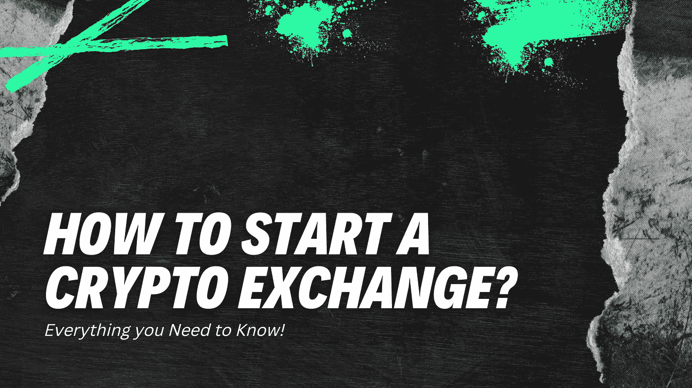

# 如何开办加密货币交易所？

> 原文：<https://medium.com/geekculture/how-to-start-a-cryptocurrency-exchange-b420c494c2f0?source=collection_archive---------15----------------------->

## 在开始加密交换之前，你还需要知道什么？这个博客描述了一切。

如果你想在密码交易平台上创业，你来对地方了。在开展加密交易业务之前，你需要了解整个业务流程。我会帮你做一个企业家在开始秘密交易之前应该知道的所有事情。加密货币的显著繁荣改变了许多崭露头角的企业家和初创公司。它为那些想出独特创意来解决用户现有问题的人提供了赚钱的机会。

加密货币交易所也称为数字货币交易所(DCE)，这是一种用数字货币/加密货币交换另一种资产的业务，如数字货币或传统的法定货币。想要创建加密货币交换平台的企业家应该更喜欢在当今市场上有突出需求的白标交换脚本。交易者使用无 bug 的 exchange 克隆脚本来构建自己的安全平台。这是一个现成的克隆脚本软件，具有即时启动便利设施。在其 exchange 克隆脚本中，它具有所有必需的功能和安全功能。

让我给你简单介绍一下外汇业务。

## **加密货币兑换业务的种类**

为您的业务选择合适的加密交换类型。根据你的商业模式决定合适的交易平台是必须的。加密货币交易平台有三种类型

**i)集中交易**

(CEX)集中式加密交易所被称为传统交易所，在这里用户可以无风险地交易不同的数字货币，但每笔交易都涉及一名管理员或中间人。他们将对每笔交易收取佣金，从而产生收入。用户将无法控制他们的资金，加密钱包的交易和余额将由 exchange 管理员监控。二元交易期权、用户管理和订单交换是 CEX 的一部分。

**ii)分散交换**

分散式交换被称为 P2P(点对点)交换平台。在这种情况下，加密功能的交换不涉及任何第三方或管理员的干预。用户将完全控制他们的资金，他们的隐私将得到保护。因此，大多数密码交易者会更喜欢分散的平台，而不是集中的平台。相比较而言，它拥有比 CEX 平台更强的安全系统。

**iii)混合交换**

混合加密交换是分散式和集中式加密交换的结合。这种加密交换类型具有 CEX 和 DEX 的特征和安全系统。

## **加密交换平台的特点**

启用引人注目的功能，这将有助于在您的交换平台上吸引更多的加密用户。下面陈述的是一些装备的特点，将导致利润，你的密码交易业务。

*   用户登录和管理控制面板
*   用户认证
*   订单系统
*   加密钱包和加密支付网关集成
*   资金存取
*   KYC/反洗钱
*   保证金交易/高级交易图表和堆叠
*   双因素认证
*   高端证券

# **如何创建/开始加密货币兑换业务？**

说到赚钱的加密业务，你可以选择一个加密交换平台。如果你是一个密码爱好者，你可能知道密码交换。要开始一项加密交易业务，你需要了解以下内容

1.  对其密码领域的密码交易业务进行市场调查，了解密码交易类型和价格波动的原因。了解当前的加密趋势。
2.  分析你的业务需求。将需求记录为(BRS)业务需求规格。并找出推出您的加密交换平台的最佳地点。
3.  审查您的加密交换业务的合规性和法律是必须的。整个加密货币还没有到达许多国家，所以检查你要开展业务的国家的法律手续。
4.  联系最好的加密货币交换脚本提供商，他们可以帮助您为加密交换提供白标脚本。选择加密交换脚本将节省时间和投资，您可以获得一个预先开发的无错误脚本，随时可以启动。

## **开办加密交易业务的成本**

建立交易所业务最重要的是成本。开发一个满足你需求的加密交易业务并不困难，你必须选择正确的开发方法。

对于开发，你需要大量的区块链开发人员和能够计算风险和设计的分析师。这包括延长的时间消耗和投资。要开始一个加密交换业务，获得一个加密交换克隆脚本将是有成本效益的，他们有一个预先测试的无缺陷的脚本，具有所有的安全功能。这些克隆脚本可以根据业务的需要和要求进行定制。成本将基于软件发现阶段和设计、网站开发、API 集成、区块链和测试。找到正确的加密交换克隆提供商，立即启动并取得成功。

## **结论**

crypto domain 的受欢迎程度及其独特的功能为企业家进入去中心化的加密货币交换平台铺平了道路。这为每一个密码爱好者创造了大量的商业和投资机会。如今，加密货币被认为是数字商务的未来，尽管目前取得了巨大的成功，但它正在达到顶峰。普遍认为基于加密货币的业务将是释放数字经济潜在利益的关键。最重要的是选择正确的 [**加密交换克隆提供商**](https://coinsqueens.com/?utm_source=startacryptoexchange&utm_medium=medium&utm_campaign=kartz) ，他们拥有经验丰富的区块链开发人员和可定制的功能，他们将帮助您完成整个过程，直到您推出，并肯定会为您的业务带来成功。