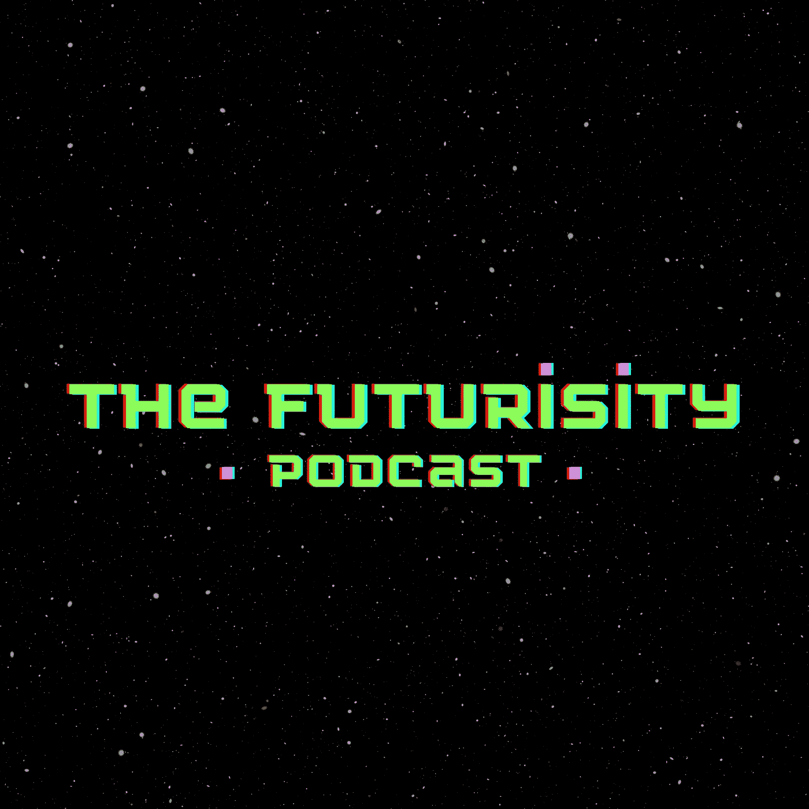

# 如何开始一个数据科学播客？

> 原文：<https://medium.com/geekculture/how-to-start-a-data-science-podcast-113bbfb96c66?source=collection_archive---------9----------------------->

这比你想象的要容易得多…

这篇文章应该是关于如何开始技术数据科学和人工智能播客的终极指南。在这篇文章中，你会发现你需要的一切(从录制硬件到编辑软件)来开始你自己的数据秀！

我们将讨论由我主持的未来播客[**；)**](https://thefuturisitypodcast.buzzsprout.com/)

Logo of the Futurisity Podcast by Vlad Yashin

# 介绍