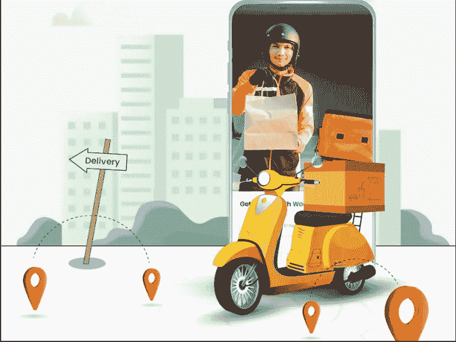

# 如何开始一个有利可图的杂货店送货业务？

> 原文：<https://medium.com/geekculture/how-to-start-a-profitable-grocery-delivery-business-1c24d99578e7?source=collection_archive---------12----------------------->

## 杂货递送业务

在疫情时期之后，杂货递送业务变得流行起来。由于繁忙的日程安排，人们很少有时间去逛杂货店。此外，他们更喜欢网上杂货店，而不是线下商店，这是你涉足杂货配送业务的最佳时机。根据 Statista 的数据，从 2022 年到 2030 年，在线杂货市场将占 CAGR 的 28%。

你是一个想开始一项有利可图的杂货递送业务的人吗？如果是，那么这个博客是给你的。

Grocery delivery business

**分析你的竞争对手**

在启动你的杂货交付应用程序之前，你必须分析并了解竞争情况，然后你需要制定一个适当的计划，提供比竞争对手更好的用户体验。

**敲定商业模式**

每个在线杂货交付平台的主要功能是从供应商那里拿起一件商品，并将其送到客户的门口。网上杂货市场的运作有几种方式。如果你有自己的杂货店，你可以通过与线下供应商合作来启动在线杂货服务，或者你可以启动一个 [**在线杂货交付平台**](https://www.rentallscript.com/grocery-delivery-script/) 。

**开发一个杂货 app 所涉及的流程:**

为你的杂货店开发一个应用程序的过程包括两种方法。

第一个是从头开始开发一个应用程序，既昂贵又耗时。此外，你需要一个专业团队来获得最佳结果。

第二个是你可以从已经开发好的市场上买到现成的剧本。通过这样做，你的应用程序的启动时间将大大减少。

如果你要选择第二个选项，那么你应该选择具有突出内置功能的完美的现成解决方案。

*现在是时候让你知道那些突出的特征了*

**每个杂货 app 都应该具备的关键特性:**

1.  产品类别:

一个完美的杂货应用程序应该有一个规划良好的清晰的类别列表，以提高效率。

2.全面管理

管理员应该有一个优雅和信息丰富的仪表板来管理应用程序中执行的每个操作。

3.多种付款方式

支持多种支付方式提供了多种支付方式，如信用卡、借记卡和货到付款。

4.自动支付

管理员可以自动访问支付给店主和交货合作伙伴。如果你既是店主又是管理员，那么你可以处理支出。

5.多语言支持

当您的应用程序支持多种语言时，您的应用程序就有很大机会在全球范围内获得更广泛的受众。

6.实时跟踪

实时跟踪是改善用户体验的一项重要功能。它使用户和交货伙伴都能跟踪他们的订单。

**确保你的应用可扩展:**

确保你的应用程序在开发时是可伸缩的，无论你有六个用户还是六百万用户，如果你希望有一个大的用户群和大量的数据集，你都应该考虑可伸缩性。当你的应用可扩展时，你可以根据用户的反馈做出新的调整。当你的应用程序获得更多的用户和下载量时，这自动让你赚更多的钱。

**适合您杂货业务的解决方案:**

网上杂货店送货业务正在蓬勃发展，这是正确的时间来开始你的杂货业务。为你的业务选择一个现成的杂货脚本仍然是一个更明智的想法，它具有成本效益，并消除了像时间消耗这样的主要挑战。为了让您的工作更轻松，我们设计了 WooberlyGrocery，它是您的杂货配送业务的完美现成解决方案。

WooberlyGrocery 是一个 100%可定制和可扩展的解决方案，帮助您构建一个具有更大影响力的应用程序。

如果你有 [**Whatsapp**](https://wa.me/919626360033) ，和我们聊聊吧。