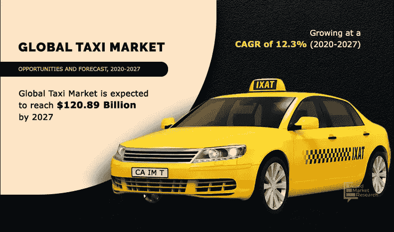

# 如何在澳大利亚、英国和美国开展出租车业务

> 原文：<https://medium.com/geekculture/how-to-start-a-taxi-business-in-australia-uk-usa-3924dd6c3d28?source=collection_archive---------19----------------------->

婴儿潮时期出生的人或初露头角的企业家有很多选择来开始在商业领域取得成功。毫无疑问，对他们来说，决定最好的是一项相当乏味的任务。

谈到目前的情况，出租车行业非常受欢迎。通过为用户出行提供便利，出租车已经成为每个人的选择。因此，全球企业家都在考虑如何在 2022 年开展出租车业务，以获得竞争优势。不可否认，这是开始一项成功的出租车业务的最佳时机。

请阅读下面这篇文章，这篇文章是专门为帮助你了解出租车行业对你来说是否是一个很好的选择而准备的。这篇文章涵盖了所有迷人的事物和吸引人的想法，将使你的出租车业务前所未有的增长。

准备，出发，出发！

# 你的出租车生意有机会成功吗？这是答案

Source: [https://www.alliedmarketresearch.com/taxi-market-A10565](https://www.alliedmarketresearch.com/taxi-market-A10565)

在 2022 年，开始做出租车生意并不是一个坏主意。像优步、Lyft 和 Ola 这样的顶级玩家在业内处于领先地位。世界各地的人们不再需要等待很长时间才能登车前往目的地。在这种情况下，开创自己的出租车业务是一个很好的补充。如果你在思考这个问题？这里有几个问题得到答案，可以证明成功的出租车业务的想法。

1.  你的桶里有足够的资金开始进场吗，还是持续的操作太多了？
2.  出租车行业融资难吗？是否存在阻碍有效营销的因素？
3.  一个自我分析创业需要一定的个人特质是必须的。
4.  你能连续工作一周来维持你的商业运作吗？
5.  你能像专业人士一样投入那么多精力、耐心和智慧来处理你的出租车业务吗？
6.  你有能力克服出租车行业的挑战吗？
7.  你准备放弃你的投资去开始一个成功的出租车生意吗？

得到所有问题的答案将帮助你应对创业前所未有的压力。联系合适的应用程序开发合作伙伴将有助于您获得白标出租车应用程序。这种应用程序是让您的企业走在前列的最佳方式。

# 开出租车:需要一个小时

[**据统计**](https://www.statista.com/outlook/mmo/mobility-services/ride-hailing-taxi/worldwide?currency=usd) 显示，出租车行业正在扶摇直上，收入从 2019 年的 691.8 亿美元增加到 2027 年的 1208.9 亿美元。CAGR 增长了 12 %,使其成为利润丰厚的部分。因此，很明显，对于初出茅庐的企业主来说，享受利润并成为自己企业的老板是一个很好的选择。他们正在开展出租车业务，以帮助全球各地的人们轻松预订和旅行。此外，通过节省用户的时间和精力，它成为他们的首选。随后，如果你发动你的出租车，成功的机会很大。休息，由于技术进步使出租车业务更容易生存和繁荣。

# 一步一步的指南，开始一个成功的出租车业务

为了开始出租车业务，了解它的可能性是很重要的。有了这个，你就可以猜测你的经营策略到底行不行。根据下面给出的分步指南，仔细看看每个方面。这本指南将对企业开展成功的出租车业务有很大帮助。我们开始吧！

**了解你的市场**

进行广泛的市场调查对于了解任何企业的成功率都是非常重要的。同样，对于出租车行业，找出市场趋势的差距。利用互联网作为优势，获得对市场的宝贵洞察力。相反，这将有助于你的出租车业务大幅增长到顶峰。此外，市场调查让你了解竞争对手在做什么。这不是很好吗？嗯，确实是。这就是为什么人们不能不做竞争对手的研究。

## 这里有几个问题，你需要在研究市场时找到答案:

*   出租车业务每年产生多少收入？
*   了解选择出租车出行的受众
*   在你开展出租车业务的地区，有多少用户过剩？
*   市场内的竞争有多激烈？
*   检查出租车行业的市场定价、乘客概况和偏袒情况。

**设定商业理念**

创建一个有效的商业计划对开创一个成功的出租车行业很重要。确定你的想法，知道实现它所需要的东西，检查规格，分析一切，然后开始。记住，你的商业理念必须集中在同时带来利润和满足顾客。任何事情都不能想当然。此外，确保正确对齐它，以便顺利完成所有工作。此外，你的商业理念会让你脱颖而出。

**了解法律手续**

现在，如果你已经下定决心要把你梦想的出租车生意变成现实，那就去找合法的手续吧。检查所有的法律文件和流程以顺利运行是很重要的。按时做文书工作可以减轻压力。除此之外，让你免于不必要的罚款和案件。以下是避免法律手续中常见陷阱的清单:

*   确保你准备好每一份文件
*   一定要看你需要的执照
*   归档文件时不要匆忙
*   确保你提供的每一个信息都是正确的

**继续注册**

注册是出租车业务的重要步骤之一。让你的出租车公司通过所有的合法机构注册。注册对于将企业推向前台非常重要。在这种情况下，检查雇主 ID 号、必要的执照、许可证，以及继续注册所需的许可等。此外，要确保在注册过程中没有不合法的行为，因为这可能会导致你的业务被拒。

**驾照是必须的**

如果你还在考虑如何开展出租车业务，驾照是成功开展出租车业务的先决条件。想知道如何开一家有牌照的出租车公司？然后，还需要申请出租车经营许可证。有了执照，运营商也可以在街上轻松提供出租车服务。如果一个经营者无照驾驶车辆，那么陷入法律纠纷的几率会比以前更大。

**保险出租车业务**

保险是出租车行业的下一件大事。当你在美国、英国或全球任何一个国家开展出租车业务时，保险是必须的。车辆和司机保险防止你将来的问题。此外，保险有助于方便车辆和其他业务的注册。此外，如果发生事故或司机方面的失误，医疗和车辆服务都是保险涵盖的费用。所以，找一个好的保险代理人，上保险很重要。

**出租车行业的现状:事实和数据**

出租车行业正在高速发展。因此，了解当前的市场对于那些想开出租车生意并希望在其中生存的新人来说是很重要的。对最新统计数据的有价值的洞察会让你预见到你的出租车行业是否有机会成功。

**探索出租车行业市场的最新动态！**

*   到 2020 年，出租车市场价值将达到 1596 亿美元。到 2026 年达到 3275.4 亿美元。在预测期内(2021 年至 2026 年)，CAGR 为 8.95%，显示了巨大的全球增长。
*   2021 年，使用出租车的用户渗透率约为 19.7%，预计到 2026 年将达到 21.1%。这说明通过打车业务获得用户的几率会很高。
*   像美国、英国、中国这样的国家正在引领全球出租车行业。因此，那些计划在这些国家中的任何一个开办出租车业务的人都走上了一条很好的道路。

# 开办出租车业务所涉及的成本细分

成本是创业的一个重要因素。毫无疑问，在大规模规划时，你需要比预期更多的成本来启动出租车业务。因此，当计划开始一项出租车业务时，为了让出租车业务一切顺利，了解成本明细是很重要的。这是出租车行业的成本明细。

**车辆和设备费用**

无论你是从 2 辆出租车开始创业，还是扩展到 7 到 8 辆出租车，都要了解每辆出租车的成本。出租车费用因不同的车辆供应商而异。因此，寻找一个能以你预算内的价格为你提供好出租车的公司。此外，设备是另一个与车辆相关的东西。无论是油漆、仪表安装、车队跟踪系统，还是其他任何东西，都需要考虑每一件额外设备的成本。简而言之，了解车辆和设备的总成本对于获得所需投资的准确成本非常重要。

**保险费用**

毫无疑问，车辆和司机的保险很重要。因此，为了给你的车辆和设备投保，一开始就需要一定的费用。其余，保险费用取决于你采取同样的政策类型。请记住，您选择的政策成本越高，对您的出租车业务越有利。在你购买保险之前，随身携带足够的费用来对抗这些费用。

**注册/许可费用**

执照费用是出租车行业的另一项重要费用。为了获得执照，你需要支付一定的费用。颁发执照的费用因州和城市而异。根据当地要求和组织，您需要相应的成本。

**营销费用**

良好的营销对促进你的出租车业务很重要。很可能你需要投资几种广告和营销方法。营销所涉及的成本取决于营销中的策略和促销活动。然而，你可以从小广告策略开始，让他们的生意成为众人瞩目的焦点。

# 使用打车应用程序推动您的出租车业务

因为这个时代是数字化的，在出租车行业获得优势非常重要。考虑到这两个因素，从打车应用开始可能效果最好。一个集成了强大特性和一流功能的应用程序可以为您创造一个双赢的局面。该应用程序将客户和企业主连接在一个平台上。它为双方提供了一个便捷的途径，以互动和顺利进行出租车服务。

除此之外，该应用程序还为司机找到客户和用户找到骑手提供了一种简单的方法。因此，在计划开展出租车业务时，一定要考虑最新的应用程序开发。紧跟潮流能让你开发出一款能让利润翻倍的应用。

# 出租车应用程序中包含的功能

通过应用程序开始出租车业务可能是一个很好的选择。但要获得你的大多数打车应用，你必须付出额外的努力。想知道什么？嗯，正是下一代功能让一款应用成为最优秀的应用。

查看打车应用程序必须具备的功能，以获得想要的利润！

*   实时跟踪
*   管理仪表板
*   用户仪表板
*   驾驶员仪表板
*   审查和反馈
*   投诉组
*   聊天机器人便于交流
*   多个支付网关
*   [路线优化](https://www.suffescom.com/blog/best-food-delivery-route-optimization-planner-app/)
*   票价计算器
*   乘车预订功能
*   优惠和折扣
*   [忠诚计划](https://en.wikipedia.org/wiki/Loyalty_program)
*   管理和查看个人资料
*   推送通知
*   多语言支持
*   全天候客户支持
*   游乐设备取消功能

喜欢你读的书吗？现在就开始！

我们现在结束了，希望这篇文章能让你清楚地了解如何像专业人士一样成功地开展出租车业务。了解市场，保持足够的投资，考虑每一个方面，并让你的游戏开始一个成功的出租车业务。此外，从打车应用开始对你很有帮助。

现在，如果你对出租车行业了如指掌，并想让它活起来，那就联系合适的应用程序开发公司吧。这样的公司给你带来了一个应用程序，让你可以毫不费力地向广大受众推广你的业务。有一个应用程序是一个伟大的方式来启动一个在线出租车企业。那么，你还在等什么？开创自己的事业，在出租车行业获得优势。