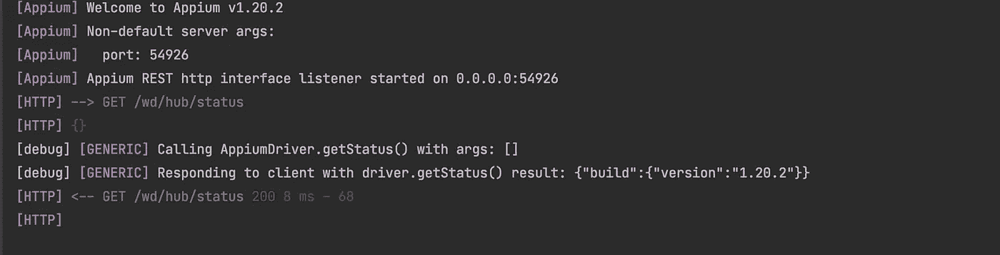
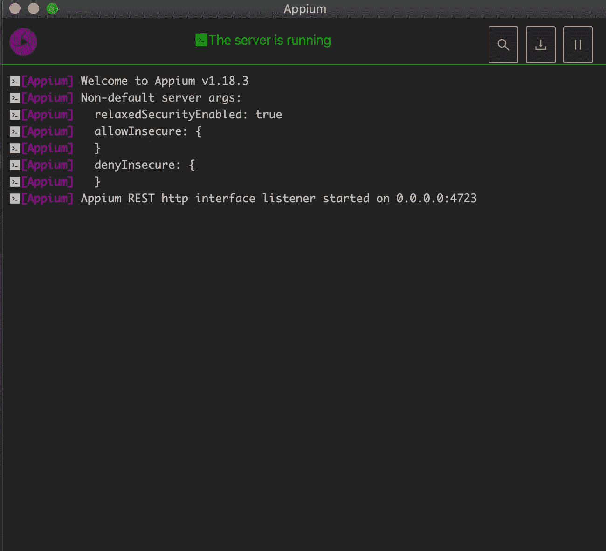

# 如何在 Java 中以编程方式启动 Appium 服务器

> 原文：<https://medium.com/geekculture/how-to-start-appium-server-programmatically-in-java-2ae2265cde10?source=collection_archive---------5----------------------->



通常，这是刚开始使用 appium 探索移动测试自动化的人的正常工作流程。首先，他们打开 appium 桌面，如果你有一台相当硬核的电脑，你足够幸运，但我的电脑通常需要一分多钟才能启动 appium 桌面。


然后，他们通过设置主机、端口来配置服务器，并通过点击编辑配置来设置 ANDROID_HOME 和 JAVA_HOME。大多数时候，因为测试只是在本地机器上运行，默认配置就足够了。设置完成后，他们只需单击“启动服务器”按钮，然后“砰”的一声，appium 服务器就启动并运行了。



这样做其实没什么错。事实上，当我打开 appium 检查器来定位我的元素时，我就是这么做的。我也是从这个工作流程开始的，因为大多数教程只会显示这个步骤。

问题是我们正在自动化我们的测试，因为我们想要有效率并且避免一次又一次地做同样的任务。这同样适用于启动我们的服务器。在我们的测试执行中，我们应该尽可能地避免人工干预。我们不希望在每次测试开始和结束时手动启动和停止服务器。我们不希望您在下班时间被打扰，只是为了启动服务器，以便可以执行预定的测试。

因此，解决方案是以编程方式启动服务器。这并不难做到。你需要的只是***io . appium . Java _ client . service . local***包中可用的这两个类***AppiumServiceBuilder***和***AppiumDriverLocalService***。

***AppiumServiceBuilder***，顾名思义，就是一个构建器。它有用于设置或配置 Appium 服务器的公共方法。在我们的例子中，我们不会对我们的服务器做任何花哨的事情。我们将只需要这个类中可用的 ***usingPort()*** 方法。(如需完整文档，请查看此[链接](https://javadoc.io/doc/io.appium/java-client/latest/io/appium/java_client/service/local/AppiumServiceBuilder.html))

***AppiumDriverLocalService***，我们将使用它来启动和停止我们的服务器，并将我们的日志重定向到一个外部文件。(如需完整的文档，请查看此[链接](https://javadoc.io/doc/io.appium/java-client/latest/io/appium/java_client/service/local/AppiumDriverLocalService.html))

下面是我的简单 AppiumServer 类

```
public class AppiumServer { private final AppiumServiceBuilder serviceBuilder = new AppiumServiceBuilder(); private AppiumDriverLocalService server;
    private int port;
    private final String appiumLogsLoc = "appium-logs";
    private final String logFileName = "logs";
public AppiumServer() {
        this.port = Utilities.*getAvailablePort*();
        this.serviceBuilder.usingPort(port); this.server = AppiumDriverLocalService.*buildService*(serviceBuilder); this.server.start();
    }

    public void stop() {
        this.server.stop();
    }

    public AppiumDriverLocalService get(){
        return this.server;
    }
public void redirectLog() {
        this.server.clearOutPutStreams(); File directory = new File(Utilities.*getProjectDirectory*() + this.appiumLogsLoc);

        Utilities.*makeDirIfItDoNotExist*(directory);

        try { this.server.addOutPutStream(new FileOutputStream(Utilities.*getProjectDirectory*() + this.appiumLogsLoc + Utilities.*generateFileName*(logFileName))); } catch (FileNotFoundException e) {
            e.printStackTrace();
        }
    }
```

一切都发生在构造函数中。首先，我们自动获得一个空闲端口供 Appium 服务器使用，这样我们就不必担心使用哪个端口了。这也将确保 appium 服务器的每个实例都运行在不同的端口上。***getAvailablePort()***将在后面讨论。如前所述，我们将只使用来自***AppiumServiceBuilder***的一个方法，即 ***usingPort()。*** 我们将获得的端口号作为参数传递给这个方法，告诉服务器应该在哪个端口上运行。接下来是构建服务。这里我们使用静态方法***buildService()***可通过***AppiumDriverLocalService***访问，并传递***AppiumServiceBuilder***对象作为参数。现在，我们已经设置好了服务器，我们需要做的最后一件事是启动服务器。为此，只需调用***AppiumDriverLocalService 的 **start()** 方法。***

我们在 AppiumServer 类中还有其他方法。

1.  get() →这将返回 AppiumDriverLocalService 对象。
2.  stop() →这将停止服务器。
3.  redirectLog() →这将把应用程序日志重定向到外部文件。

现在我们来看看我们是如何自动确定自由端口号的。下面是我们使用的方法的代码。

```
public static int getAvailablePort() {
    int port = 4723;

    try {
        ServerSocket serverSocket = new ServerSocket(0);
        port = serverSocket.getLocalPort();
        serverSocket.close();

    } catch (IOException e) {
        e.printStackTrace();
    }
    return port;}
```

不知道这是不是一个好主意，但这对我很有用。我使用了 [ServerSocket](https://docs.oracle.com/javase/7/docs/api/java/net/ServerSocket.html) 类来创建一个服务器套接字。将“0”传递给它的构造函数，它将创建一个到随机可用端口号的服务器套接字。然后，我们使用 getLocalPort()方法获取它正在使用的端口，然后关闭服务器套接字。至此，我们知道 appium 可以免费使用所获得的端口。给你一个提示，当我们试图使用一个已经在使用的端口时，appium 会给出这个错误。

```
Could not start REST http interface listener. The requested port may already be in use. Please make sure there is no other instance of this server running already.
Fatal Error: listen EADDRINUSE
```

一旦服务器启动，现在可以将 AppiumDriverLocalService 对象传递给 appium 驱动程序构造函数。要获取 AppiumDriverLocalService ojbect，只需调用 AppiumServer 类中可用的 get 方法。

```
AppiumDriver driver = new AppiumDriver<>(*AppiumDriverLocalService* *object*, *your desired capabilities*)
```

现在，这只能在假设除了 appium 桌面之外，appium 也通过 npm 安装的情况下才能工作。如果您还没有，您可以查看我的另一篇文章[如何为测试自动化设置 Appium](/swlh/how-to-set-up-appium-for-test-automation-1d2a4fab1f6a?source=friends_link&sk=6e104be9324f2e7127322a14bfeb5039)。

仅此而已。希望下次执行测试时，启动 appium 服务器将成为测试执行设置的一部分。

🍻 🍻 🍻