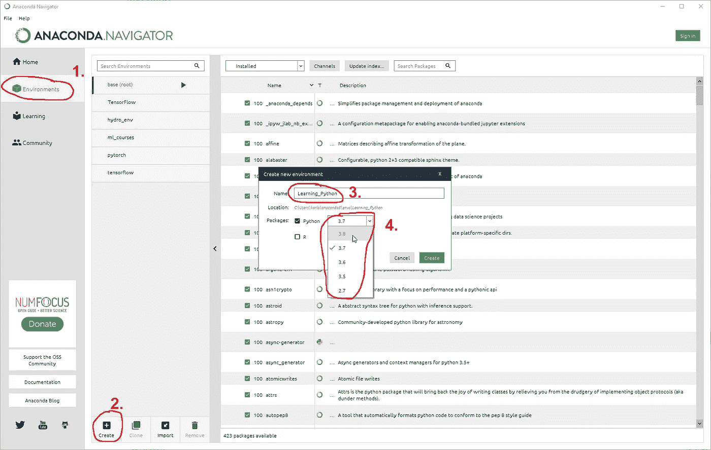
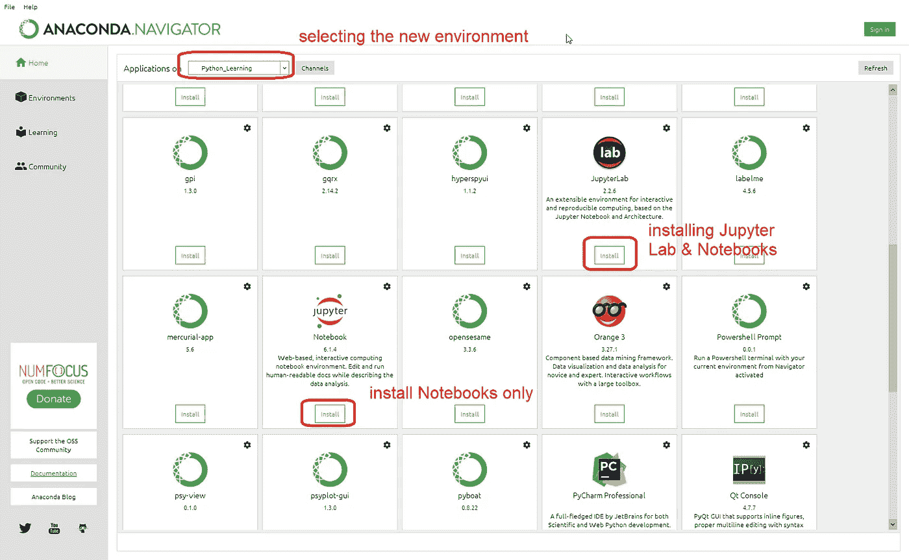
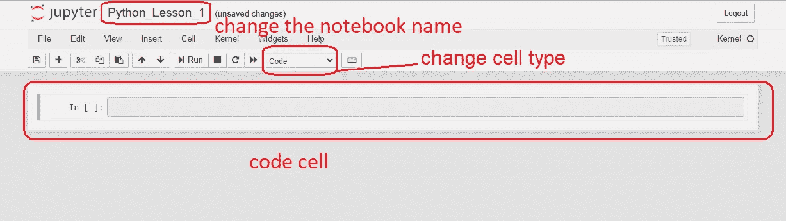
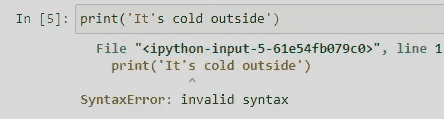
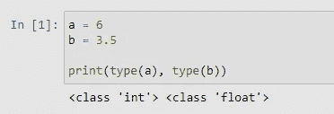
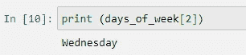
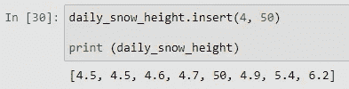
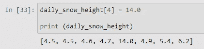
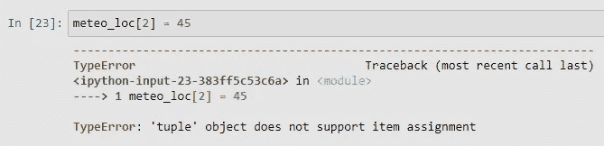

# 如何开始用 Python 编码？

> 原文：<https://medium.com/geekculture/how-to-start-coding-with-python-aa84534305d9?source=collection_archive---------4----------------------->

## 你想学习编码，但不知道从哪里开始，如何开始？那么这本初学者指南正是为你准备的！

通过这篇文章，我想帮助绝对的初学者踏上他们的编码之旅。我的目标是使它尽可能有趣，因此我将使用一些气象术语和现象。我的想法是，如果你能把一些概念形象化，那就更容易理解。还有什么比天气更好的例子呢？我们每天上班或遛狗时都会遇到天气。🙂

Photo by [Annie Spratt](https://unsplash.com/@anniespratt?utm_source=medium&utm_medium=referral) on [Unsplash](https://unsplash.com?utm_source=medium&utm_medium=referral)

**文章结构**:

*   介绍
*   创造环境
*   Jupyter 笔记本
*   数据类型
*   数据结构
*   结论

享受阅读吧！🙂

# 介绍

Python 是什么？根据它的创造者吉多·范·罗苏姆的说法:

> *“高级编程语言，其核心设计理念是关于代码可读性和语法，这使得程序员可以用几行代码表达概念。*

首先，我们将看看为 Python 编码建立一个环境有多容易，然后是一些基本概念，从哪里以及如何开始。一、什么是 ***环境*** ？

根据 Quora 的一个问题[，“*环境实际上是安装在您机器上的所有东西，它会影响您应用程序的开发和/或测试*”，它包括:](https://www.quora.com/What-is-the-programming-environment)

*   编辑器/ide(可以编写和/或运行代码的软件)
*   编译器/解释器
*   机器上安装的操作系统
*   机器上设置的环境变量
*   在你的机器上安装额外的库等。

在理想情况下，环境应该尽可能简单，只安装所需的库，并且只安装您正在使用的编译器/解释器的版本。

那么，我们如何建立一个环境呢？嗯，在我看来，最好是下载 [Anaconda](https://www.anaconda.com/) (或者 [Miniconda](https://docs.conda.io/en/latest/miniconda.html) 如果你的硬盘空间有限或者是旧电脑的话)。只需遵循网站上的指南，您就可以获得一切(甚至更多😉)比你需要开始编码。基本上，下载 Anaconda 后，我们像安装其他应用程序一样安装它。安装完成后，我们得到了 Anaconda Navigator 应用程序。这是一个易于使用的界面，我们可以在其中管理我们的编程环境，安装库，启动 IDE 等。

# 创造环境

在开始编码之前，我们将创建一个环境。我们可以通过两种方式做到这一点:通过导航器或通过 Anaconda 提示符。

image by author

第一种方式是通过 ***导航仪*** 。当我们启动左栏中的应用程序时，我们选择“*环境*”选项卡。因为我已经有了一些环境，所以我的列表不是空的。在全新安装时，您只有基本环境。第二，你选择“创建”，我们键入一个我们喜欢的名字，即“学习 _Python”，我们选择我们想要的 Python 版本，这里我们选择了 Python 3.8。

另一种方式是通过 ***Anaconda 提示*** 。

首先我们运行一个 Anaconda 提示符，我们可以在开始菜单中搜索它。出现提示后，我们需要输入以下命令:

> conda create-n Python _ Learning Python = 3.8

Conda create 是创建新环境的命令，在-n 之后我们指定名称，如果需要，我们可以选择 python 版本，这里我选择了版本 3.8。出现提示时，我们键入 y 继续。然后，我们通过键入以下命令来激活新环境:

> 康达激活 Python_Learning

我们现在已经成功激活了新的 python 环境。

我的拙见是，您不应该太在意您将要使用的编辑器(或 IDE ),因为在这一点上，它几乎是不相关的。每个人都遇到过这种情况，当你需要开始一些新的东西时，我犯了一个错误，那就是过多地思考和研究使用什么 IDE，而不是仅仅开始键入代码。相信我，当你到了不同的 IDE 很重要的程度时，你会自己决定使用哪一个，你当然不需要我告诉你使用哪一个。🙂

首先，让我们坚持使用 **Jupyter 笔记本**。

# Jupyter 笔记本

要学习基本的东西，我建议你从 Jupyter 笔记本开始。它基本上是一个 web 应用程序，允许从所谓的代码单元编写和运行代码。首先我们将运行 Jupyter 笔记本。为此，我们有两种方法:

***导航器***

image by author

首先我们选择新的*环境*，然后我们安装 Jupyter，或者是实验室和笔记本，或者只是笔记本。u 可以放心的打*笔记本*。(左下角选项)安装完成后，我们只需点击 *Jupyter 笔记本*下的*发射*。我们的浏览器中会打开一个新标签。要开始一个新的笔记本，我们只需选择右上角的“新建”，和“Python 3”。这将在下一个浏览器选项卡中打开一个新笔记本。

***提示***

要通过提示符安装笔记本，在创建并激活环境后，我们键入以下命令:

> 康达安装-康达锻造笔记本

我们按 enter 键，Y 接受并完成。🙂

我们输入:

> jupyter 笔记本

我们的浏览器中会打开一个新标签。要开始一个新的笔记本，我们只需选择右上角的“新建”，然后选择“Python 3”。这将在下一个浏览器选项卡中打开一个新笔记本。

image by author

现在我们可以开始学习用 Python 编码了🙂

我们将学习的第一个命令叫做 print。顾名思义，它是用来打印的，比如一个句子或者一个变量。我们来试试吧！在第一个单元格中键入以下内容:

> print("今天是个冷天！")

我们通过点击 **Shift+Enter** 来运行单元格，或者通过点击工具栏中的“**播放**按钮，或者在菜单栏中运行单元格。这里重要的是，如果我们想打印出一个句子(字符串),我们需要使用引号。他们标记了绳子的起点和终点。

最后但同样重要的是，值得一提的是，在 Jupyter Notebook 中，您可以更改每个单元格的类型。它非常适合使用解释，或者将你的代码分成块。为此你选择 ***markdown*** 选项，单元格在纯文本编辑器中转动，像 *notepad++* 或 *MS Word* 。我们可以在笔记本上键入这部分的解释或副标题，并按下 **Shift+Enter** 。

image by author

# 数据类型

## 用线串

在继续之前，我们必须了解在 Python 中可以遇到哪些类型的数据。上面我已经提到过*字符串*，它基本上是一个字符序列。我们可以使用单引号→**“word”**或双引号→**“word”**来指定一个字符串。在长字符串的情况下，超过两行或更多行时，我们使用三重引号→ **“很多单词”" " " "**。

让我们看一些例子。

在第二个例子中，我们可以看到为什么我们使用双引号。如果我们使用单引号," it's "中的'结束了我们的字符串，我们有一个错误。

image by author

这是我们的第一个错误，以后还会有更多的错误。🙂

## 数字

Python 中有三种类型的数字:整数、浮点数和复数。
在 Python 中，不需要预先定义变量类型，甚至可以在程序的后期根据需要更改数据类型。
这里我们介绍如何打印多个变量，以及*类型的*函数，它用来返回一个变量的类型。

image by author

整数用于索引数组(向量，矩阵)，计数等等。 **FLOAT** s(浮点)是十进制数。

## **变量**

那么什么是变量呢？嗯，它是一个存储数据值(整数、字符串等)的容器。它是在你第一次给它赋值的时候创建的。类似的就像在基础数学中，当我们说: ***X 等于 10***

> x = 10
> 天气= "晴朗"

我们声明变量 **x** 等于 10。在 Python 中，我们也可以声明一个变量等于一个单词(字符串)。上面我们声明了变量**天气**包含字符串**晴天**。

定义变量时，必须遵循一些“不成文”的规则。选择一个有意义的名称，并记录这个变量的用途，这是一个很好的做法。

名称可以是任意长度，应该以字母开头，也可以包含数字。如果我们使用包含多个单词的变量名，我们使用**下划线 _** 。你可以在 ***下看到一个例子，列出*** 。

另外，有些关键字是 Python 保留的，即 ***class*** ， ***def*** ， ***dict，*** 或一些预定义的函数，如 ***print*** 或 ***sum*** 等，使用它们应该而且必须避免。

# 数据结构

数据结构是可以容纳多个数据项的对象。Python 中的一些例子有:**列表**、**元组**、**字典**和**集合**。

## 列表

**列表**用于保存较大的数据集合。列表项是有序的、可变的，并且允许重复值。例如字符串列表、工作日或浮动列表(以厘米为单位的雪深度)、一周内每日雪深度的测量，因此这意味着七个条目。

为了在 Python 中声明一个列表，我们使用方括号 **[]** ，并用逗号分隔条目。列表也是动态的，这意味着我们可以在以后添加条目。
为了访问列表中的项目，我们使用索引。Python 中的索引从 0 开始。因此，为了访问列表中的第三个条目，我们使用编号 **2** 作为*索引*。索引放在**方括号**内:

image by author

我们也可以从最后一个到第一个向后访问*索引*。在这种情况下，我们从 **-1** 开始，访问最后一项， **-2** 倒数第二项，以此类推。我们使用**将一个项目添加到列表中。append()** 方法，如下:

> daily_snow_depth.append(7.5)

正如该方法所建议的，它将新项添加到列表的最后一个位置。
但是，如果我们想在特定的地方添加一个项目，我们需要使用 ***。*插入()**方法。首先我们指定*索引*，然后是我们想要添加的*值*:

image by author

但是，当向后插入时，索引从-1 开始，这意味着将新值插入倒数第二位。如果我们想要添加到最后一个位置，我们使用上面显示的**。append()** 方法。
为了替换列表中的一个项目，我们指定所需的*索引*，并声明新值如下:

image by author

替换也是反向进行的，这里的 **-1** *索引*表示最后一个位置，就像访问列表中的项目一样。

## 字典

字典类似于列表，它们有索引，但是它们可以是任何类型的。元组是可变的，但是无序的，并且不允许重复。也就是说，以后可以更改它们，可以添加或删除数据。这里有一个例子:

通常这些关键字被用作名称，例如，字典可以用来存储某一天的积雪深度。在这里，我创建了一个名为**snow _ depth**的*字典*，它用于存储一周内每天测得的积雪深度。为了声明一个字典，我们使用了花括号。首先我们输入 ***键*** ，后面是 ***分号:*** 然后是其 ***值*** 。

例: ***【周一】:4.5***

这里，星期一是一个*字符串*，所以我们需要使用**引号" "**。
为了打印出周三的积雪深度，我们输入*键*(周三)，函数打印出*值*。

## 元组

元组是不可变的(不可改变的)有序的值序列。这意味着当创建(定义)时，我们不能更改值，也不能向元组添加新的值。使用元组的常见情况是气象测量站的地理坐标。

这里我们定义了一个元组，它包含了一个测量站的地理纬度和经度。
如上所述，向元组添加新项目是不可能的。

image by author

当试图从元组中移除一个项目时，会显示类似的结果。

# 结论

在事情变得复杂之前，我们最好今天就结束。这里介绍 Python 编程。我们做得很好，不仅安装了易于使用的 IDE，还涵盖了 Python 中最常见的数据类型和结构。我选择了气象学中的术语，因为这是我们每天都会遇到的事情。

当然还有其他好的开始方式。这是一个基于我的经验和我开始使用 Python 时的挣扎的方法。

在接下来的几个教程中，我们将一起探讨一些更高级的主题，如运算符、表达式、循环、函数等。

但稍后会详细介绍。希望你喜欢读我的文章。

对于这篇文章或我在[媒体](/@Karlo_Leskovar)上的其他文章有任何问题或建议，欢迎通过 [LinkedIn](https://www.linkedin.com/mwlite/in/karlo-leskovar-a8612b105) 联系我。

感谢您抽出时间，干杯！🙂