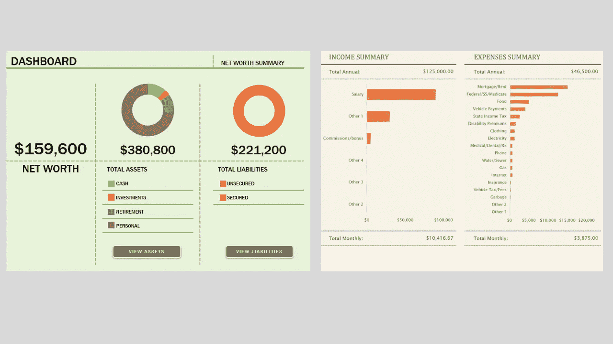

# 即使你现在还没有计划，如何开始管理你的个人财务

> 原文：<https://medium.com/geekculture/how-to-start-managing-your-personal-finances-even-if-you-dont-have-a-plan-right-now-b750b6323fcb?source=collection_archive---------23----------------------->

管理你的财务并不总是容易的。与其他人相比，有些人可能更难做到。然而，管理你的财务是至关重要的，尤其是如果你想有一个舒适的生活，享受生活提供的东西。

# 为什么要理财？有什么好处？