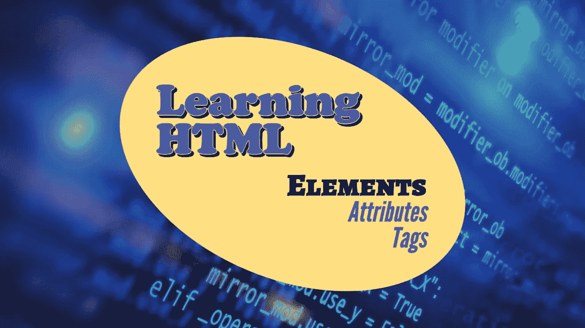

# 如何用 HTML 启动 web 应用成为 web 开发人员——初学者指南

> 原文：<https://medium.com/geekculture/how-to-start-web-application-with-html-to-become-web-developer-beginner-guide-213107ff9fb7?source=collection_archive---------11----------------------->

# 在这篇文章中，我将讨论如何在 web 应用程序开发中对 HTML 的一些标签有基本的了解。

**在我们开始之前，请找出一些重要的 HTML 定义/术语**

> ***用户如何访问 web —*** …