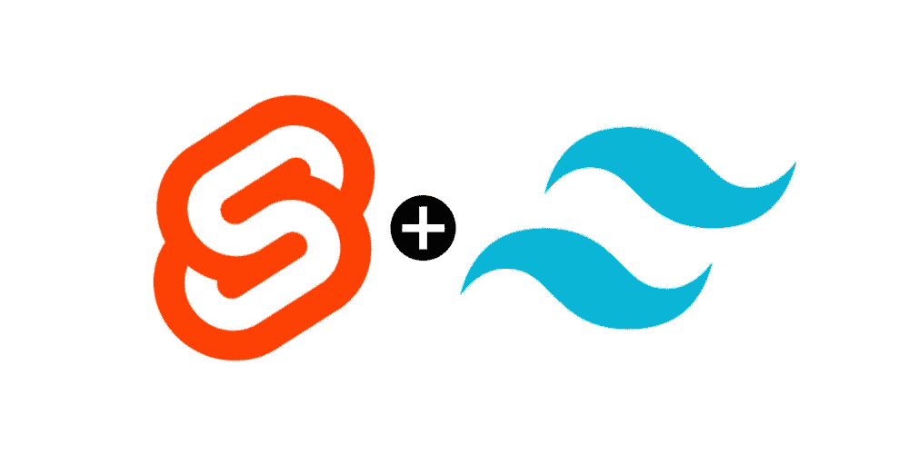
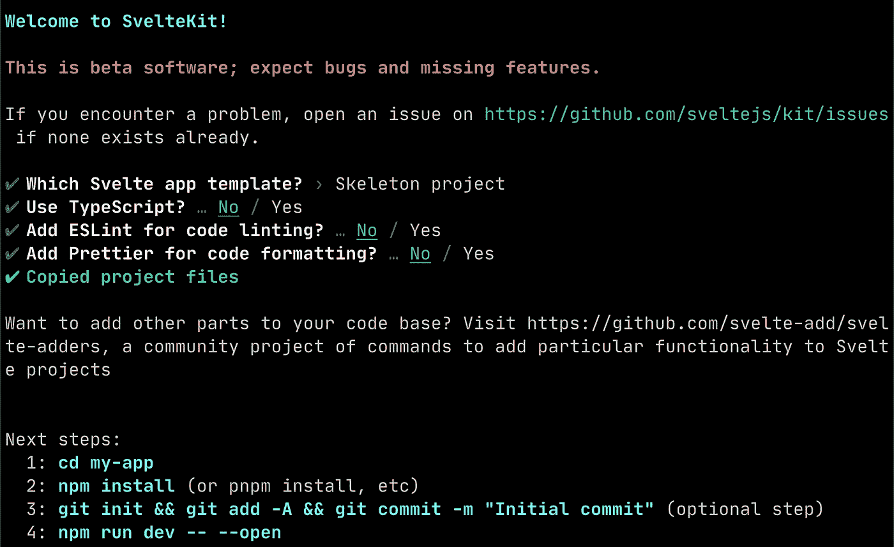
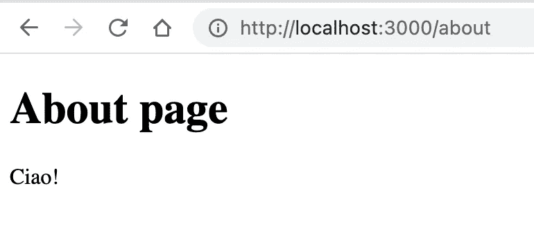

# 如何从苗条和顺风 CSS 开始

> 原文：<https://medium.com/geekculture/how-to-start-with-svelte-and-tailwind-css-5df7e084af03?source=collection_archive---------12----------------------->



在这篇文章中，我想与你分享我开始建立一个新的静态网站的过程，以启动我的下一个开源项目。

我的目标是建立一个只有几页的网站，一个主页和一些解释项目的页面。

为此，我想使用:

*   帮助我构建页面/模块/布局的工具包(共享一些模块的页面，如页眉、页脚、导航条等)。);
*   通过本机 ESM 提供按需文件服务；
*   快速热模块更换；
*   优化构建；
*   提供静态预渲染文件(无服务器端逻辑/语言)；
*   用于造型的顺风 CSS
*   遵循相同的旧的和无聊的搜索引擎优化指南。

我决定使用苗条开发前端部分，我开始使用苗条模板 Vite Js。但我看到苗条船舶苗条套件，基于 Vite Js，更为苗条的功能优化。所以我决定用苗条套装。

这篇文章的目的是向你展示创建网页环境的所有基本步骤，而不是关注 HTML，CSS，JS 的开发。所以我要:

*   安装苗条工具包；
*   创建索引和关于页面；
*   以“苗条套件”的方式添加顺风；
*   正确设置流程，以便拥有一个静态构建，准备好部署到服务中，没有服务器端语言。

# 安装超薄套件

通常我使用 NPM 来管理包和节点模块:

```
npm init svelte@next my-app
cd my-app
npm install
npm run dev
```



npm init 命令将建立一个空白的瘦项目。在 ***src/routes*** 你会找到你的主页( ***index.svelte*** )。

# 创建关于页面

如果你想创建一个 URL 为 ***/about*** 的新页面，你需要在 ***src/routes*** 目录下创建一个名为 ***about.svelte*** 的文件。有一个隐含的约定是 ***src/routes*** 结构决定 URL。

例如:

*   URL ***/*** 为***src/routes/index . svelte***
*   URL***/about***for***src/routes/about . svelte***

所以现在你可以创建***src/routes/about . svelte***

对于 ***about.svelte*** 文件，您可以简单地复制并粘贴以下代码片段:

```
<h1>About page</h1>
<div>Ciao!</div>
```

如果您已经安装了" ***npm run dev*** "并正在运行，您可以访问[***http://localhost:3000/about***](http://localhost:3000/about)



The about page powered by Svelte

# 添加顺风 CSS

现在，我们可以专注于样式，包括 Tailwind CSS(带有 Just In Time 选项)。为此，我将使用“***svelet-add***”而不是手动安装 tailwind 和 PostCSS 包。
不过，我看到你需要手动添加*苗条预处理*。所以命令是:

```
npx svelte-add tailwindcss --jit
npm install --save svelte-preprocess
```

现在，您可以使用新的 Tailwind CSS 样式了。

为此，更新您的***src/routes/about . svelte***文件，使用一些带有以下内容的 Tailwind CSS 类:

```
<section class="text-center w-full h-screen bg-gradient-to-r from-yellow-200 via-red-300 to-pink-300">
<h1 class="pt-10 text-7xl">About page</h1>
<div class="font-serif pt-12 text-2xl">Ciao!</div>
</section>
```

如果您已经启动并运行了" ***npm run dev*** "，您可以在[*http://localhost:3000/about*](http://localhost:3000/about)上看到结果。


# 构建静态页面(静态站点生成器)

为了提供没有服务器端语言(节点或其他东西)的页面，你需要**预渲染**页面。这样你就可以使用任何平台来交付静态资产(surge.sh，Vercel，Netlify，GitHub Pages，亚马逊 S3 +亚马逊 CloudFront 等。).
要做到这一点，Svelte Kit 需要一个“适配器”在构建过程中使用。

```
npm i -D @sveltejs/adapter-static@next
```

在***svelte . config . js***中添加适配器的导入:

```
import adapter from '@sveltejs/adapter-static';
```

并在***svelte . config . js***文件中添加适配器的配置:

```
import preprocess from "svelte-preprocess";
import adapter from '[@sveltejs/adapter-static](http://twitter.com/sveltejs/adapter-static)';const config = {
    kit: {
        // hydrate the <div id="svelte"> element in src/app.html
        target: '#svelte',
        adapter: adapter({
            // default options are shown
            pages: 'build',
            assets: 'build',
            fallback: null
        }),
        /*
        If you need to serve your file from a sub directory
        paths: {
            base: '/your-sub-dir',
        },
        */
    },
    preprocess: [preprocess({
        postcss: true
    })]
};export default config;
```

要在本地测试您构建的文件，您可以使用:

```
npm run build
```

使用上面的命令，您将构建您的静态资产(html、js 和 css)。它们将被存储在 ***build/*** 目录中。

然后，为了测试您的构建，您可以复制某个由 web 服务器提供服务的地方，或者您可以使用预览选项:

```
npm run preview
```

本质上，它在本地服务于您的构建文件(不是苗条的文件，而是您的构建目录中的构建文件)。

在公共服务器上发布你的文件(Netlify，Vercel，Surge.sh，GitHub pages 等。)你需要将**的内容复制到 *build/* 的**目录中。

如果你使用一些服务来发布你的网站，迫使你使用一个子目录来服务你的静态文件(例如 GitHub 页面)，你可以使用*路径*在 *config.kit* 部分:

```
paths: { base: '/your-repo-name', },
```

我希望这些步骤能帮助你用 Svelte Kit(基于 Vite JS)和 Tailwind CSS 安装和设置一个环境。
请随时提供任何反馈…

*最初发布于 2021 年 9 月 25 日*[*https://dev . to*](https://dev.to/robertobutti/how-to-start-building-your-static-website-with-svelte-and-tailwindcss-hbk)*。*