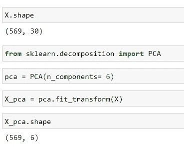
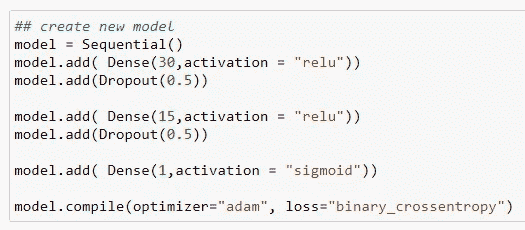
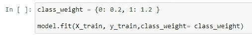
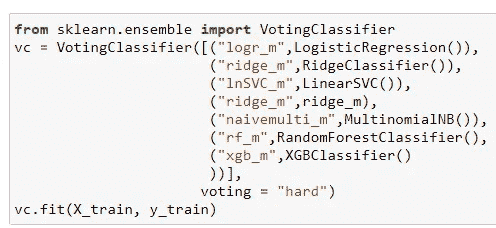
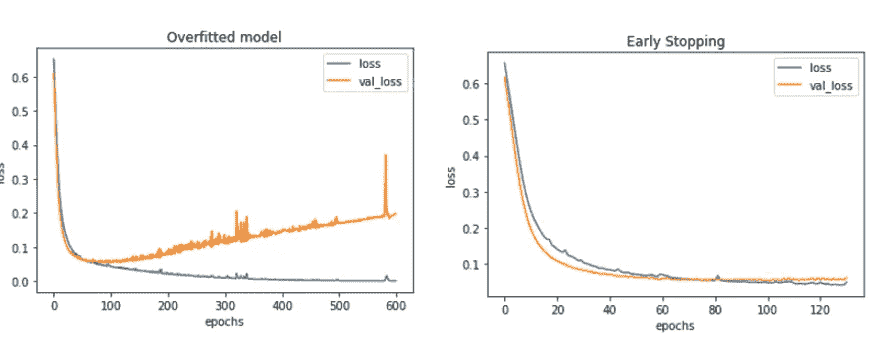
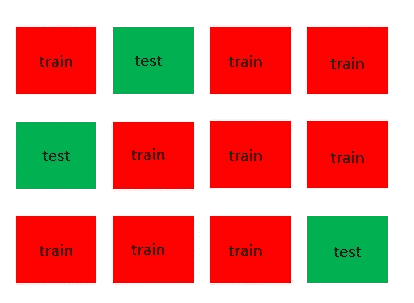
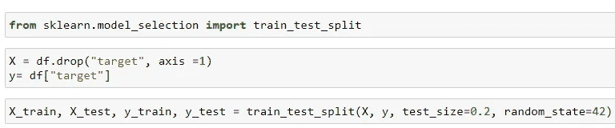

# 如何停止过度适应你的 ML 和深度学习模型

> 原文：<https://medium.com/geekculture/how-to-stop-overfitting-your-ml-and-deep-learning-models-bb8324ace80b?source=collection_archive---------18----------------------->

机器学习和深度学习中的过拟合是一个普遍问题。这是模型没有概括数据的结果，因此具有很高的方差。在本文中，我们将通过一些常见的方法来减轻过度拟合。

Creator: © Mark Evans | Credit: Mark Evans

我们将通过 sci-kit learn 和 Tensorflow 代码示例使用一些最常见的过拟合解决方案

# 过度拟合的高级解决方案

*   降低模型复杂性
*   正则化(调整权重)
*   集合模型
*   提前停止
*   更多数据
*   交互效度分析

# 降低模型复杂性

可以通过将以下内容分别应用于机器和深度学习模型来降低模型复杂度:

*   **降特征/**降维(使用 PCA)
*   丢弃神经元(使用丢弃层)

停止过度拟合模型的最有争议的方法是降低其复杂性。有几种方法可以做到这一点，但最简单的方法是简单地**删除一些功能！**！

现在你告诉我我疯了！信息越多不是越好吗？

一般来说，你是对的；与目标相关并向特征空间提供**附加**信息的特征将有助于模型的准确性或减少误差。然而，一些特征可能具有存在于另一个特征中的信息，或者它们根本不影响目标。因此，我们可以**移除冗余特征**或那些与目标**低(或零)相关性**的特征。

这可以通过反复试验，通过丢弃具有相同信息的特征或通过分析它们的相关性来手动完成，但是这需要对数据有深入的了解。

使用监督机器学习算法**主成分分析(PCA)可以完成减少维度/特征的“自动化”过程。**

The number of features are reduced to 6 (specified by n_components in PCA)

对于深度学习，我们除了上述选项之外还有其他选项，通过使用**Dropout****Layers**。顾名思义，在每次运行(epoch)中，随机丢弃%的神经元。

At layer 1 and layer 2 we drop 50% (0.5) of the neurons being used

# 正规化

正则化是操纵输入的系数或**权重**的实践。

Photo by [Gene Jeter](https://unsplash.com/@genejeter?utm_source=medium&utm_medium=referral) on [Unsplash](https://unsplash.com?utm_source=medium&utm_medium=referral)

有许多方法可以做到这一点，一些模型默认包含正则化，如回归机器学习模型；**套索** (L1 正则化)和**山脊** (L2 正则化)。

*   L1 正则化-尝试将一些权重设置为零，这将从预测过程中消除这些要素。
*   L2 正则化-尝试将要素的权重/系数限制为零(但不完全为零)。

Alpha determines the amount of restriction applied to the feature coefficients

用于正则化的附加深度学习过程使用在拟合模型时设置的 **class_weight**

Example of setting class weights for binary classification

# 全体

Photo by [Eran Menashri](https://unsplash.com/@chesnutt?utm_source=medium&utm_medium=referral) on [Unsplash](https://unsplash.com?utm_source=medium&utm_medium=referral)

克服过度拟合的一个有趣的方法是使用集成模型，它采用“弱学习者”模型，并将它们组合起来创建一个“超级”模型。这可以通过三种方式实现:

*   装袋—均质模型在**平行**运行
*   增压—均质模型在**系列**中运行
*   堆叠— **异质**机型组合

**装袋**是用多个**相似的**模型并行预测目标变量，并对各个预测值取平均值，形成最终预测值的过程。这方面的一个例子是随机森林模型，其中并行运行多个“较弱”的决策树，并对结果输出进行平均以形成预测。

**增压**类似于装袋，但是模型是线性运行的(串联)，由此串联中的下一个模型“学习”先前的模型。流行的型号，如 XGboost 和 ADAboost 都采用这种工艺。

**堆叠**使用**不同的**模型类型来预测结果。这可以通过 sci-kit learn 中的**投票回归器**或**投票分类器**实际看到。

Multiple models are fitted to the data with the “hard” voting

投票分类器的一个重要超参数是“硬投票”，它使用所有模型的**最高**概率预测，或“软投票”，它取**平均值**。

不幸的是，我们在 Tensorflow 中没有定义的包来做同样的事情，但是我们可以通过运行多个深度学习模型并平均结果来手动复制这一点。一个深入的例子可以在[这里](https://machinelearningmastery.com/train-neural-networks-with-noise-to-reduce-overfitting/)找到

# 提前停止

早期停止通常在深度学习模型中被注意到，其中当针对测试/验证数据的性能开始下降时，时期(模型的迭代)被停止。

Photo by [Possessed Photography](https://unsplash.com/@possessedphotography?utm_source=medium&utm_medium=referral) on [Unsplash](https://unsplash.com?utm_source=medium&utm_medium=referral)

我们可以看到一个在 Tensorflow 中使用 **EarlyStopping** 模块的例子，其中我们将历元的数量设置得非常高

Large number of epochs and callback parameter set to EarlyStopping

Left graph without early stopping. Right graph includes early stopping

我们可以在机器学习中通过在某些 sci-kit 学习模型中设置参数来做到这一点，如**随机森林**中的 **n_estimators** 或**线性回归**中的 **n_jobs**

# 更多数据

这总是一个很好的选择，但是我们需要小心不要包含那些信息已经存在于其他中的特征(见上面的降低模型复杂性)

Photo by [Alexander Sinn](https://unsplash.com/@swimstaralex?utm_source=medium&utm_medium=referral) on [Unsplash](https://unsplash.com?utm_source=medium&utm_medium=referral)

一种方法是获取更多的数据样本，然而这并不总是可能的。

另一种方式是通过**特征工程**，我们从其他人那里获得额外的特征。这可以在我们的 [Kaggle Titanic](https://www.kaggle.com/slythe/infamous-titanic-80-accuracy) 提交中得到最好的展示，在这里我们提取了额外的特征，例如乘客姓名的**长度**、乘客的**头衔**(先生、小姐等)。)、特征的分组/宁滨等。

# 交互效度分析

交叉验证是一个重采样过程，其中数据集被分成 k 个组，每个组的某些子集用于**训练**模型，其他子集用于验证或**测试**模型。

K-fold cross validation where k=3

然后评估模型在**测试**数据上的表现，也称为“未知数据”,因为该数据没有用于拟合/训练模型。

交叉验证的方法有很多，如 **K 折**和**留一法**等。然而，最简单也是最广为人知的方法是**保持法；**其中一部分数据留作以后测试。这最常用于 sci-kit 学习模块 **train_test_split:**

Example of using hold-out cross validation with train_test_split

# 结论

这是一些快速和肮脏的例子，以减轻过度拟合，而不是深入钻研每一步。我建议，如果您使用上述任何步骤，您应该在实现之前全面调查该过程，因为其中一些步骤可能会妨碍模型预测。

关于使用早期停止和脱落层减轻过拟合的示例，请查看我们的 [Kaggle 笔记本](https://www.kaggle.com/slythe/combat-overfitting-with-early-stopping-dropout) : **使用早期停止&脱落**对抗过拟合