# 如何阻止 Windows 10 监视你

> 原文：<https://medium.com/geekculture/how-to-stop-windows-10-from-spying-on-you-b071134a11f6?source=collection_archive---------0----------------------->

## 你买了它，但是你仍然为它付款…

Windows 10 收集的用户信息比之前任何版本的 Windows 都多，完全关闭它是不可能的。在 2015 年首次发布后，微软面临了两年多的严厉批评，指责其从欧盟和私营实体秘密收集数据。在最初的强烈反对之后，他们彻底检查了隐私设置，引入了新工具，并在博客帖子中披露了他们收集的一些数据。

欧盟数据保护监督机构警告称，微软在保护用户数据方面做得不够，而法国已经下令微软停止跟踪其 Windows 10 用户。看到用户数据变得如此有价值，围绕 Windows 10 和微软的诚实度存在不确定性。

你可以采取几个步骤来最大限度地减少 Windows 10 中的跟踪和数据泄漏。我们将从简单的隐私设置开始，然后转到更高级的组策略和注册表编辑修改。

# 禁用广告跟踪

当浏览网页或使用 Windows 10 应用程序时，Windows 会收集有关您活动的信息，而且比以前版本的 Windows 收集的信息要多得多。这些信息被用来创建广告 ID，广告 ID 被各种公司用来定向广告。

如何禁用:

1.  进入**设置**，点击**隐私**，然后点击**一般**。
2.  如图所示，禁用所有设置。
3.  *(可选)如果您有在线 Microsoft 帐户。*
    访问[https://choice.microsoft.com/en-us/opt-out](https://choice.microsoft.com/en-us/opt-out)，关闭在我使用微软账户的任何地方显示**个性化广告的选项。**

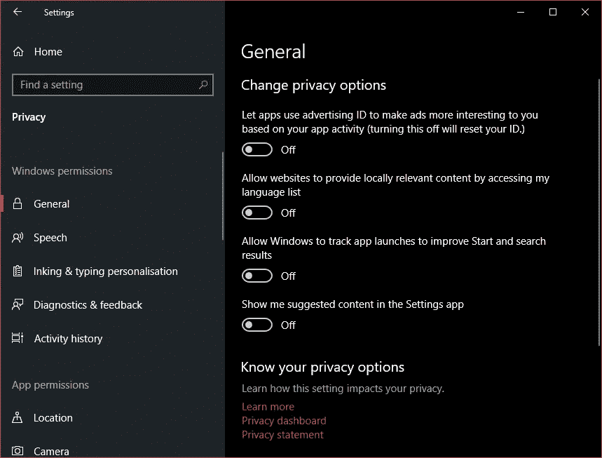

# 禁用位置跟踪

无论何时移动，Windows 都知道你在哪里，因为它跟踪你的物理位置。Windows 这样做是为了能够向您提供相关信息，如当地天气或附近的餐馆。

如何禁用:

1.  转到**设置**并点击**隐私**，然后点击**位置**。
2.  如图所示，禁用所有设置。
3.  点击**位置历史**下的**清除**，清除之前的位置数据。
4.  (可选)**允许应用程序访问您的位置**
    有些应用程序需要位置才能运行；通过启用此功能，您可以在
    **下进一步自定义哪些应用程序可以访问您的精确位置。**

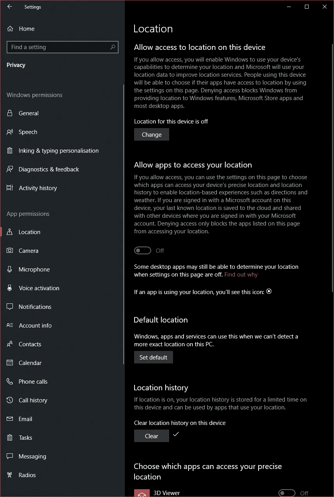

# 禁用摄像头

大多数笔记本都有内置摄像头，windows 默认启用；这可能非常危险，因为黑客用它们来记录和勒索用户的视频。在大多数情况下，您可以完全禁用摄像头，例如，如果您使用 Skype，您可以将摄像头仅限于该应用程序。

如何禁用

1.  进入设置，点击**隐私**，然后点击**摄像头**。
2.  如图所示，禁用所有设置。

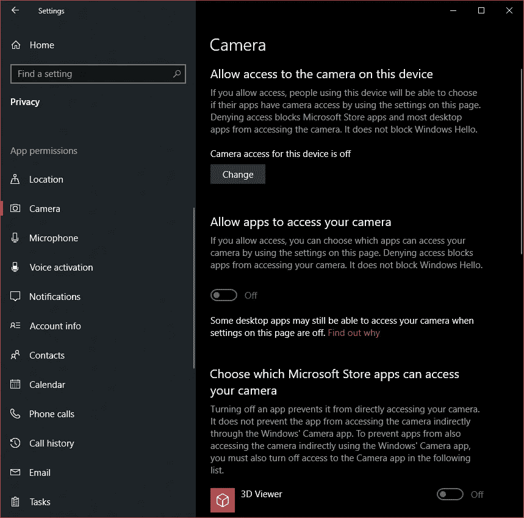

# 禁用麦克风

同样危险的是，内置麦克风在默认情况下是启用的，这使得有经验的黑客可以相当容易地监听对话。如果您在 Skype 或游戏耳机上使用麦克风，请限制使用它的应用程序。如果你不使用它的麦克风，它应该被禁用。

1.  进入设置，点击**隐私**，然后点击**麦克风**。
2.  如图所示，禁用所有设置。

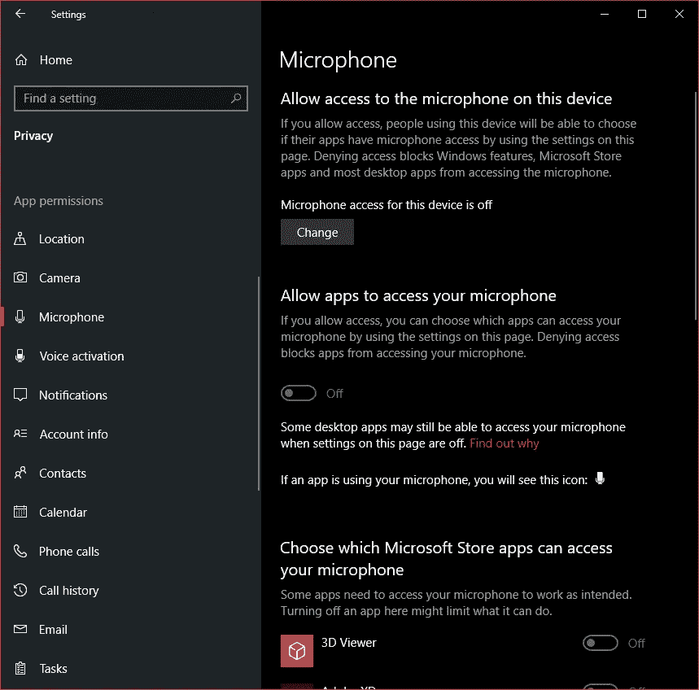

# 禁用时间线

时间线是一项功能，可让您在任何 Windows 10 设备上恢复活动和打开文件。为此，Windows 会收集您在每台机器上的活动信息，并将这些数据发送给 Microsoft。

如何禁用:

1.  进入**设置**，点击**隐私**，然后点击**活动历史**。
2.  如图所示，禁用所有设置。
3.  点击**清除活动历史**下的**清除**，清除之前的活动历史。
4.  (可选)如果您有在线 Microsoft 帐户。
    点击**管理我的微软账户活动数据**，你将被转到微软的隐私仪表板，在那里你可以清除你在 Microsoft.com 上的数据

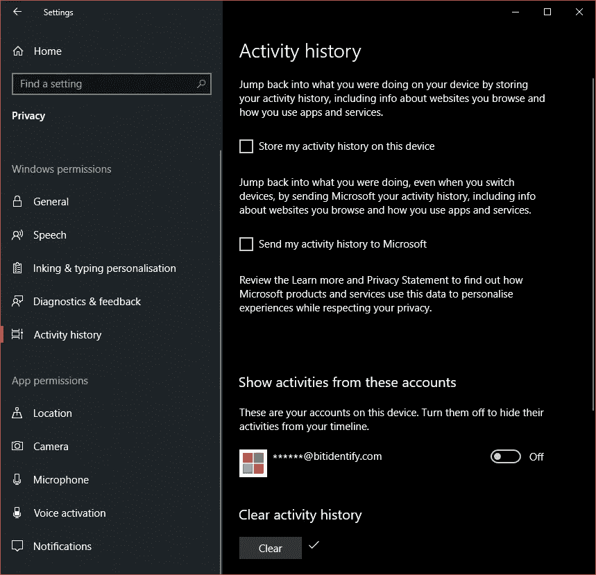

# 禁用连接共享

此功能使您的联系人无需输入密码即可访问您的 WiFi。这是一个方便的功能，但它不是一个安全的，禁用它是可取的。

如何禁用:

1.  进入设置，点击**网络&互联网**，然后点击 **WiFi** 标签。
2.  向下滚动到**相关设置**并点击**更改适配器选项**。

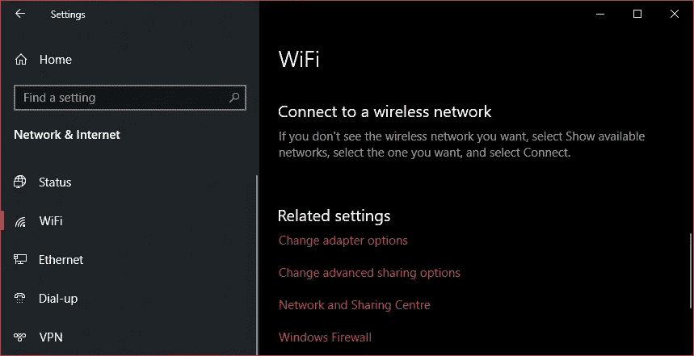

3.在弹出的新窗口中，右键单击您的 WiFi 适配器并选择菜单底部的**属性**。

4.在弹出的新窗口中点击**共享**标签。

5.禁用**允许其他网络用户通过该计算机的互联网连接**进行连接，并点击 **ok** 。

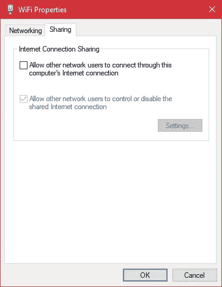

# 禁用更新共享

默认情况下，Windows 10 会与网络和互联网上的其他用户共享下载到您电脑上的更新。这是一个名为 Windows Update Delivery optimization(WUDO)的点对点系统，它减少了微软服务器的负载，但增加了你的电脑对互联网连接的需求。这会降低计算机速度，并带来潜在的安全问题。

如何禁用:

1.  进入设置，点击**更新&安全**，然后点击**交付优化**。
2.  如图所示，禁用所有设置。

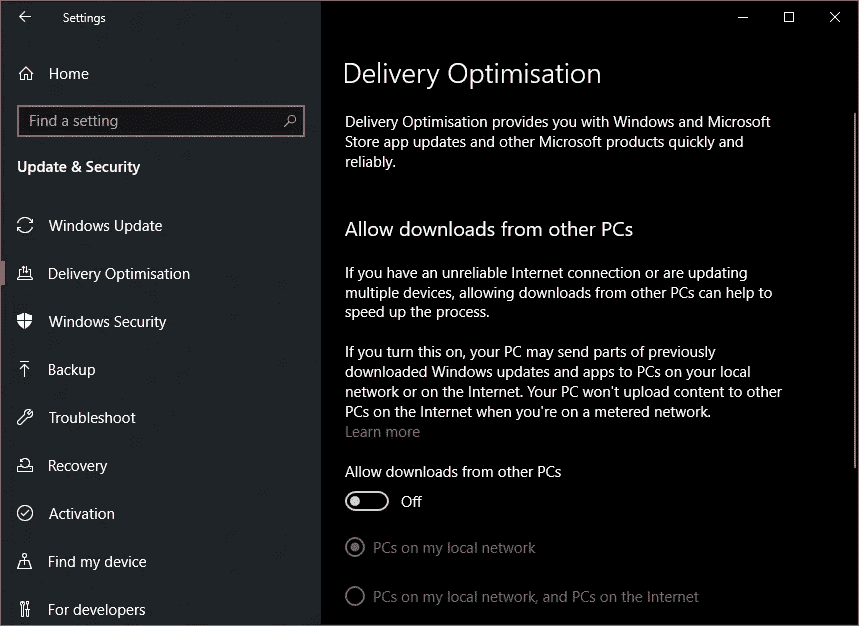

# 更改诊断和反馈选项

在使用 Windows 10 时，微软会收集有关你的硬件和你使用 Windows 时所做的事情的数据。微软官方称这样做是为了改进 Windows 和定制建议，但实际上，你并不知道他们是如何使用这些数据的。虽然不能完全禁用，但可以使用最小设置。

如何改变:

1.  进入设置，点击**隐私**，然后点击**诊断&反馈**。
2.  如图所示，禁用所有设置。

# 管理后台应用

Windows 让一些应用程序一直在后台运行，而一些是功能所需要的，大多数只是浪费资源和收集数据。虽然你可以关闭所有后台应用程序，但有些功能可能会丢失。不过，Windows 自带的大多数 Windows 10 应用都可以安全关闭，但如果你使用该功能，它应该会保持激活状态。

如何改变:

1.  进入设置，点击**隐私**，然后点击**后台应用**。
2.  禁用以下 Windows 10 应用:
    **3D Viever、闹钟&时钟、计算器、相机、电影&电视、邮件&日历、地图、消息、微软新闻、微软照片、微软纸牌收藏、微软商店、OneNote、Paint 3D、People、Snip & Sketch、便笺、录音机、Xbox 主机伴侣、Xbox 游戏吧、您的手机。**

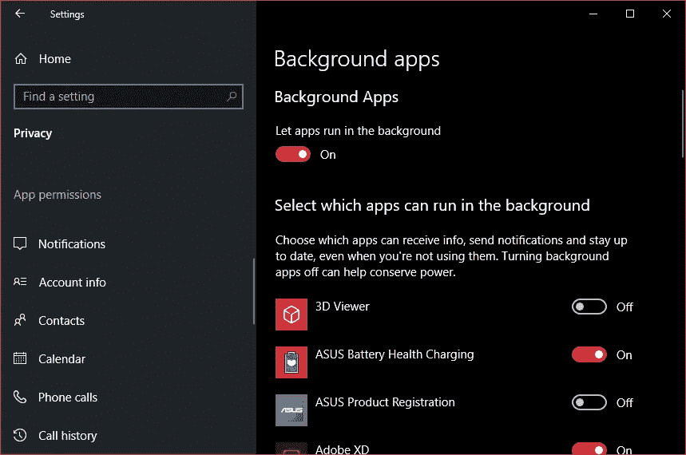

# 禁用帐户信息

您帐户的详细信息(如名称、图片和其他信息)会与电脑上的其他应用程序共享。在大多数情况下，这是没有必要的，所以完全禁用该功能是明智的。

如何禁用:

1.  进入设置，点击**隐私**，然后点击**账户信息**。
2.  如图所示，禁用所有设置。

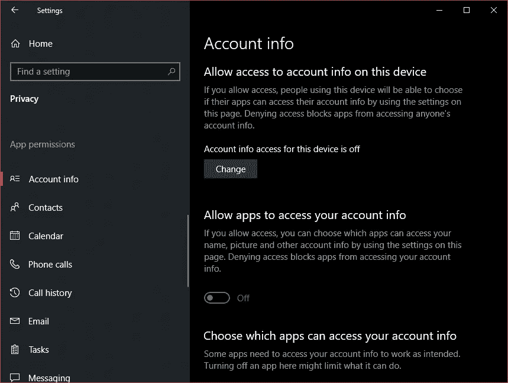

# 禁用遥测(高级)

本指南中之前的设置应该禁用数据收集(或微软所谓的“遥测”)，但为了完全确定，我们可以使用更高级的方法来永久禁用它。根据您的 Windows 10 版本，有两种方法可以做到这一点，一种用于家庭版，一种用于企业版、教育版、物联网版和服务器版。

对于 Windows 10 **家庭版** —注册表编辑器方法:

1.  按下 **WIN + R** 键启动运行对话框，在对话框中键入 **regedit** ，按回车键。注册表编辑器现在将打开。
2.  在左侧窗格中，找到以下键:
    **HKEY _ LOCAL _ MACHINE \ SOFTWARE \ Policies \ Microsoft \ Windows \**
3.  右键单击 Windows 文件夹，选择**新建**，然后选择**键**，并将其命名为**数据集合**
4.  在右侧窗格中，右键单击并创建一个新的 **DWORD (32 位)**，并将其命名为 **AllowTelemetry**
5.  双击 **AllowTelemetry** 并将**数值数据**设置为 **0**
6.  在更改生效之前，请关闭注册表编辑器并重新启动计算机。

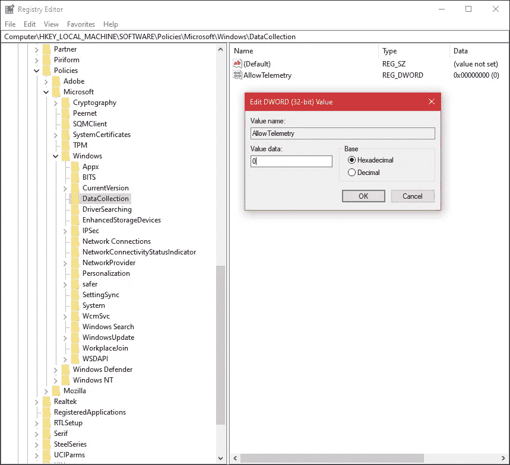

对于 Windows 10 **企业版、教育版、物联网版和服务版** —组策略编辑器:

1.  按 **WIN + R** 键启动运行对话框，在对话框中键入 **gpedit.msc** ，回车。注册表编辑器现在将打开。
2.  转到:
    **计算机配置- >管理模板- > Windows 组件- >数据收集和预览版本**
3.  在右侧窗格中，双击**允许遥测**并选择**启用选项**。
4.  现在从选项下的下拉列表中选择 **0 —安全**。
5.  在更改生效之前，关闭**组策略编辑器**并重启计算机。

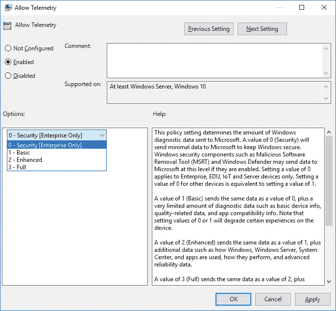

# 恭喜你！

您不再与 Microsoft 共享您的数据。

This makes [Satya Nadella](https://en.wikipedia.org/wiki/Satya_Nadella) sad.

原文可以在 Bitidentify 的博客上找到:[https://www . bit identify . com/Blog/how-to-stop-windows-10-from-spying-on-you/](https://www.bitidentify.com/blog/how-to-stop-windows-10-from-spying-on-you/)