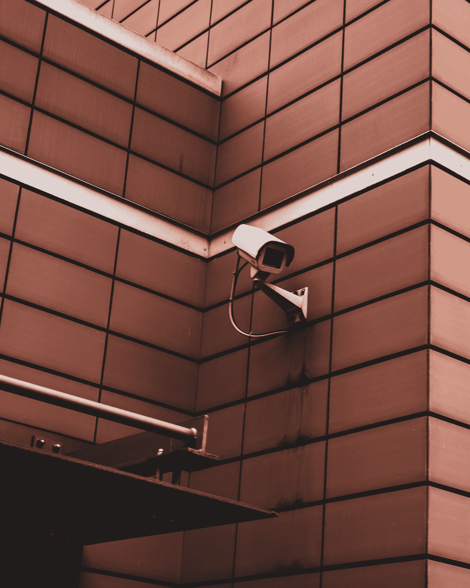

# 如何通过互联网传输您的 DVR 摄像机？

> 原文：<https://medium.com/geekculture/how-to-stream-your-dvr-cameras-over-the-internet-d841bd19af62?source=collection_archive---------12----------------------->

## 免费的自托管 DVR 到网络流媒体解决方案

Photo by [Justus Menke](https://unsplash.com/@justusmenke?utm_source=medium&utm_medium=referral) on [Unsplash](https://unsplash.com?utm_source=medium&utm_medium=referral)

大多数有物理位置的企业都有某种 IP 摄像头形式的监控硬件。这些 IP 摄像机将连接到一个被称为数字视频记录盒的中央单元。所有的 DVR 盒都可以让你在本地观看录像…