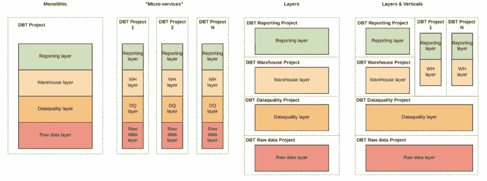
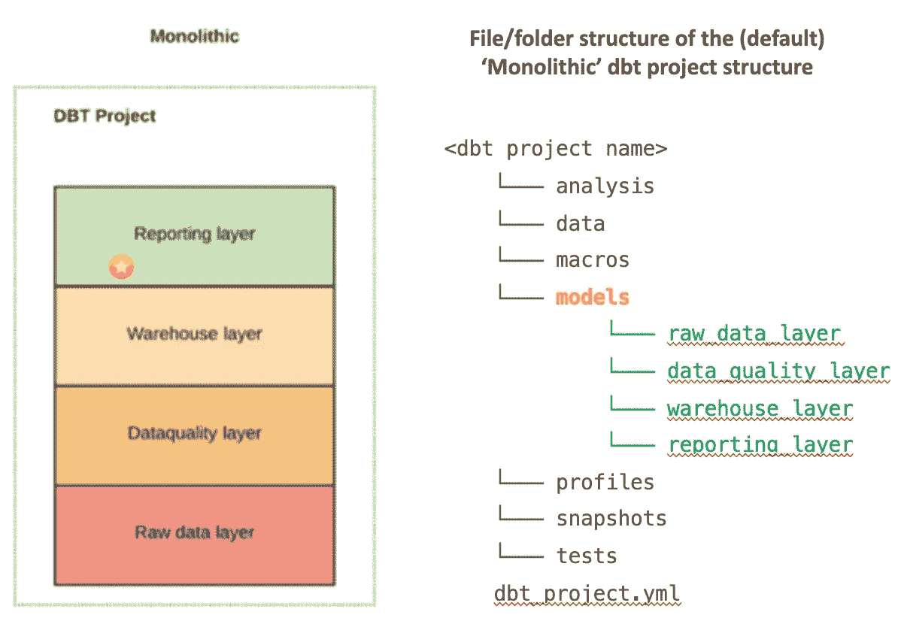
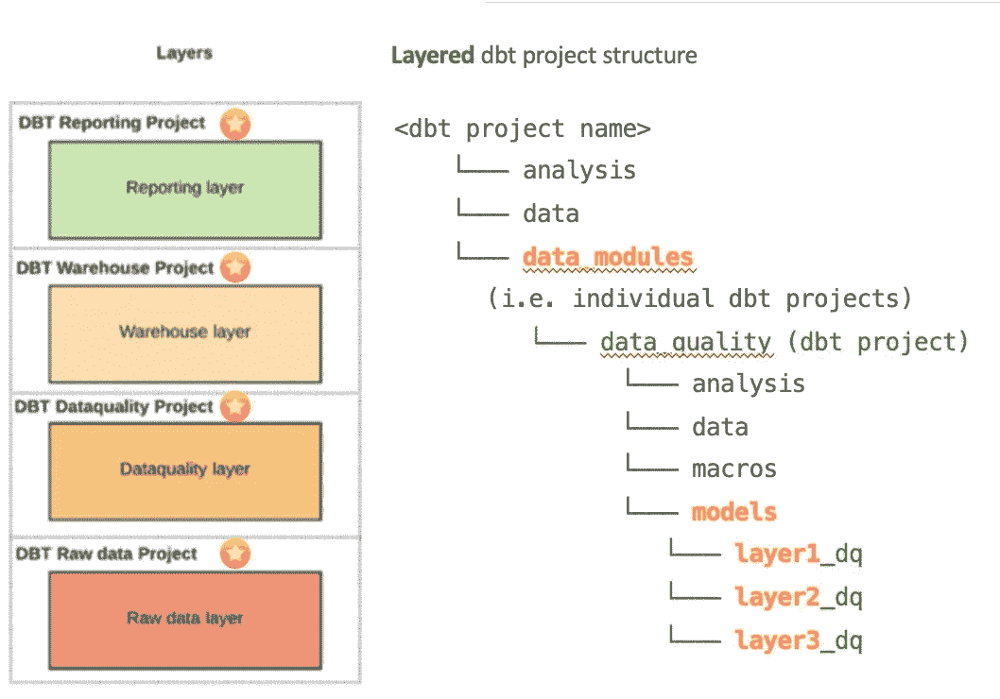
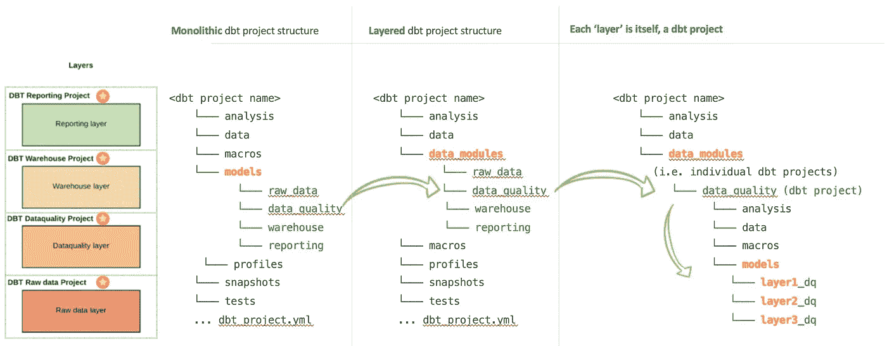
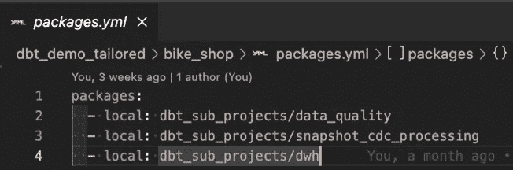
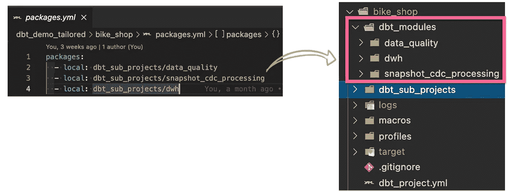
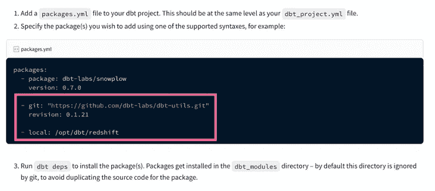
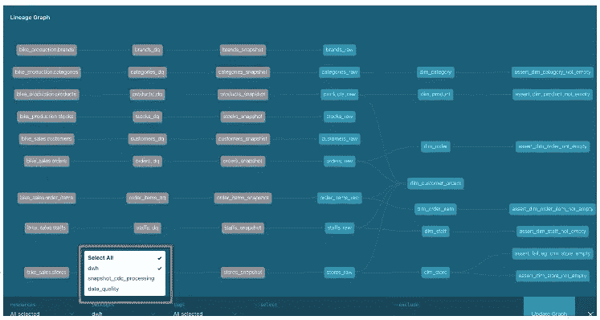
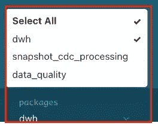
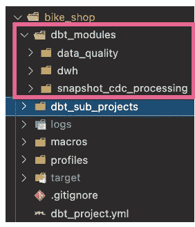

# 如何构建你的 DBT 项目

> 原文：<https://medium.com/geekculture/how-to-structure-your-dbt-project-c62103deceb4?source=collection_archive---------0----------------------->

## DBT /最佳实践

这篇文章描述了构建你的 DBT 项目的不同方法，最重要的是，它介绍了这样做的步骤。


## 议程

1.  目标受众
2.  默认 DBT 项目结构的问题
3.  候选 DBT 项目结构
4.  演示/操作方法

*   如何实现 DBT 的“分层”项目结构
*   如何在 DBT 项目之间引用对象
*   如何跨多个 DBT 项目生成 DBT 文档

5.摘要

6.进一步阅读

# 1.目标受众

这篇文章是为那些对 DBT 有所了解并希望了解 DBT 项目结构最佳实践的人准备的。

# 2.默认 DBT 项目结构的问题

## 不必要/多余的查询处理

当你默认安装 DBT 时，你使用的是“**单片**”DBT 项目结构。当您在数据仓库中进行更改时，这样做可能会产生重大影响。例如，由于 DBT 模型的依赖性，提议的变更可能会触发一系列不必要的查询。除非您在运行 DBT 命令时始终如一地标记/定位 DBT 项目中的对象，否则您的更改很可能会尝试在整个数据模型中运行一系列的查询？！

## 单个 DBT 项目中的多个复杂用例—糟糕的内务管理/开发人员体验

随着时间的推移，您很可能已经建立了一个相当成熟的数据仓库结构，以满足以下典型用例的需求:

*   源数据处理
*   数据质量处理
*   CDC 处理
*   数据模型转换
*   数据集市管理层/表示层对象

因此，在一个单一的 DBT 项目中包含支持上述内容所需的所有转换逻辑可能会导致糟糕的最终用户/开发人员体验。也就是说，你最终会得到一个非常拥挤的 git repo。另一种方法是使用**多个** DBT 项目来管理您的数据仓库转换。下面介绍了一些可用的选项。

# 3.候选 DBT 项目结构

你想如何处理和组织你的 DBT 项目文件？您是否希望每次进行更改时都构建一个完整的数据模型？您应该为您的仓库转换创建多个 DBT 项目吗？或者将相似的逻辑归入较小的 DBT 模型？

下面的图片(和描述的项目结构)来自 [Stefano Solimito 的《中邮》](/photobox-technology-product-and-design/practical-tips-to-get-the-best-out-of-data-building-tool-dbt-part-1-8cfa21ef97c5)。然而，这篇文章关注的是创建这种**非默认** DBT 项目结构的步骤，使用**分层**项目结构作为例子:



Source: [Practical tips to get the best out of Data Build Tool (DBT) | Medium.com](/photobox-technology-product-and-design/practical-tips-to-get-the-best-out-of-data-building-tool-dbt-part-1-8cfa21ef97c5)

## 默认 DBT 项目结构:“整体”(单个 DBT 项目)

如果你没有围绕如何构建你的 DBT 项目做出设计决策，你将默认遵循'**整体式**'结构。在这个项目结构中，你只使用一个**单个** DBT 项目。下面显示的是文件/文件夹结构的外观:



The default ‘monolithic’ project structure consists of a single DBT project

## DBT“分层”项目结构(多个 DBT 项目)

在一个 DBT 项目中处理各种类型的数据有其优点和缺点。拥有一个单一的整体式 DBT 项目的另一种方法是代表您的数据环境，而不是创建多个 DBT 项目。作为这种方法的一个例子，下面显示了一个**分层 DBT 项目的文件/文件夹结构:**



Using the ‘layered’ project structure, the layer is itself a DBT project

在这个项目结构中，每个“层”是一个**子** DBT 项目，它们作为 DBT 包安装在一个**父**项目上(由上面的`<dbt project name>`表示)。下面描述了分层 DBT 项目结构的文件夹结构/内容与默认**整体**项目结构的区别:



In a layered structure, the DBT projects are installed as **child** projects underneath the data modules folder

## DBT 文档呢？我可以跨多个 DBT 项目生成 DBT 文档吗？

你可以！参见' [*如何跨多个 DBT 项目生成 DBT 文档*](#ed44) *'* 。

# 4.演示/操作方法

下面描述的是支持演示/操作指南，以帮助使用“层”、“垂直”或“层和垂直”项目结构。

## 4.1.如何实现 DBT 的“分层”项目结构

1.首先，创建一个**父** dbt 项目，按照您通常创建 dbt 项目的方式:`dbt init <dbt parent project name, e.g. ‘bike_shop’>`

2.通过以下方式安装所有**子** DBT 项目:

a)列出`packages.yml`文件中的所有‘子’项目:



DBT ‘child’ projects are installed as DBT packages

b)使用 DBT CLI 命令`dbt deps`安装这些**子**项目

3.这样做可以在项目根目录下的`dbt_modules`文件夹中创建一个 DBT 文件的副本(你已经在`packages.yml`中引用过了):



**注意**:你也可以从 Git repo 安装 DBT 包(包括子项目)。为此，请遵循 DBT[包管理文档页面](https://docs.getdbt.com/docs/building-a-dbt-project/package-management)上的说明。下面的屏幕截图强调了安装本地或远程 DBT 软件包的要求:



考虑到这一点，您可以**为每个 DBT 项目/处理层创建单独的 git repos。**

## 4.2.如何跨多个 DBT 项目生成 **DBT** 文档

由于提到了 DBT **父子**项目关系，这意味着用户可以从以下两个位置查看 DBT 文档:

*   单一 DBT 项目视角(即单一“层”)
*   以及所有 DBT 项目(层)



上面的示例说明了如何选择 DBT 项目(即层)来动态更新 DBT DAG。注意灰色的表格；这些来自取消选择的`data_quality`和`snapshot_cdc_processing` DBT 项目(截图如下):



要设计允许以这种方式生成 DBT 文档的 DBT 项目，请执行以下操作:

1.  首先，创建一个**父** DBT 项目:这是我们将用来生成我们的 DBT 文档的依据
2.  然后为每个子项目创建**子** DBT 项目
3.  然后针对**父** DBT 项目，通过运行`dbt docs && dbt serve`生成您的 DBT 文档
4.  瞧啊。你有一个 DBT DAG 现在显示血统在你的仓库的所有阶段！

遵循这种方法意味着您可以将精力集中在每个 DBT 项目层所需的转换上，而不必担心这会如何影响正在生成的 DBT 文档。

## 4.3.如何在 DBT 项目之间引用对象

这是一个简单的。你需要使用 DBT `ref()`功能。但是，与通常只向 ref 函数传递一个参数不同，您可以传递两个参数:

1.  第一个指示您希望引用的 DBT 项目(包)
2.  第二个是指定您想要选择的对象

例如:

```
SELECT *FROM {{ ref(‘**snapshot_cdc_processing**’, ‘**customers_snapshot**’) }}
```

其中`snapshot_cdc_processing`是另一个 DBT 项目(包)`customers_snapshot`是项目内的对象:



# 5.摘要

这篇文章旨在描述如何实现 Stefano Solimito 的文章中描述的项目结构。以及提供将有助于以后工作的支持性考虑。

如果您是使用 DBT 的新手，最好开始使用默认的项目结构。尽管一旦你掌握了这些概念，我还是建议实施“层”、“垂直”或“层和垂直”DBT 项目结构，而不是使用默认的整体结构，因为:

1.  **对您的数据环境进行无缝的未来更改**

*   与使用单一项目结构相比，使用分层、垂直(或“层和垂直”)方法时，对您的数据环境进行未来更改非常非常容易
*   删除/解除大量依赖关系

**2。避免不必要的处理** —您可以编排处理，仅针对特定的层/垂直行业运行

**3。CI/CD 集成更加容易**

*   测试可以在单个项目中设计和管理
*   有了这个整体结构，所有的 DBT 测试将被捆绑在一个单一的项目中，这对于管理和维护来说是一个挑战

**4。数据沿袭更加用户友好—** 只有在这些架构中，才能看到每个项目或父项目级别的沿袭

# 6.进一步阅读

只是为了给上述论点提供一些额外的背景，请参见下面的链接:

*   我应该有一个组织范围的项目(monorepo)还是每个工作流都有自己的项目？| discourse.getdbt.com
*   [如何配置您的 dbt 存储库(一个或多个)？| discourse.getdbt.com](https://discourse.getdbt.com/t/how-to-configure-your-dbt-repository-one-or-many/2121)

尽情享受吧！