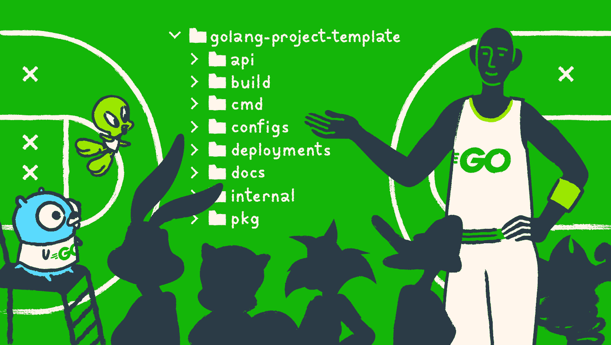
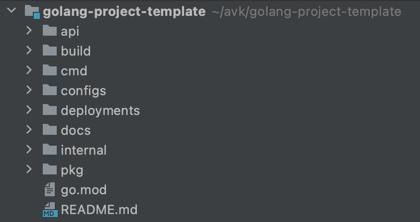
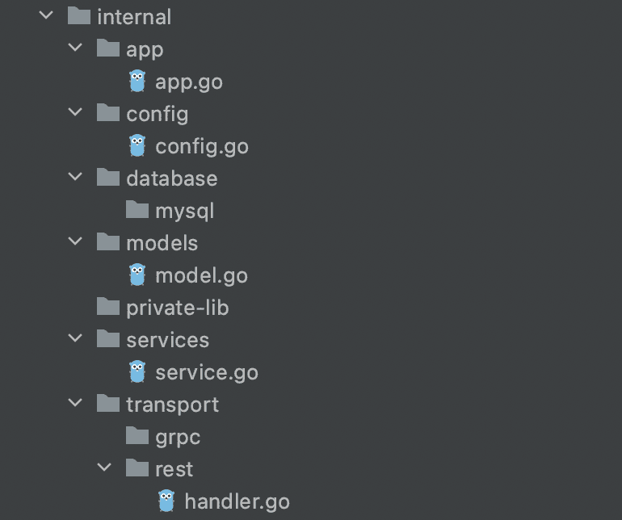

# 如何在 Golang 中构建你的项目:后端开发者指南

> 原文：<https://medium.com/geekculture/how-to-structure-your-project-in-golang-the-backend-developers-guide-31be05c6fdd9?source=collection_archive---------0----------------------->

## 每个开发新手都会遇到如何正确组织项目架构和结构的问题。毕竟，组织项目代码是一个不断发展的问题，而遵循标准结构可以保持代码的整洁并提高团队的生产力。

我叫 Avksentiy，在 inDrive 做后端开发。当我开始在 Go 中编码时，我曾经花很多时间寻找项目结构化标准。长话短说，我最终没有找到具有准确规范的官方标准:信息要么不完整，要么不是所需要的。这促使我决定根据自己的实践经验编写自己的指南。本指南是为开发新手设计的，它主要关注如何在 Golang 中构建一个项目。

# 为什么我决定写这篇文章

如果在一开始就组织得当，项目架构和结构将会促进开发和扩展，同时也使得向项目引入新的开发人员变得容易。显然，对于只有一个主文件的小型项目来说，扁平结构也是一种选择，但是对于较大的项目来说，这种结构并不实用。

在我的职业生涯中，我参与了很多项目，我从每个项目中吸取了一些东西，以供将来参考和使用。我建议你研究一下这个项目，因为很多人用它作为建立一个结构的指南。我的例子将使用更紧凑的结构，因为我们将详细研究/internal 目录。

请注意，我并不是说这种方法是处理这种情况的最佳选择或唯一选择。不过，我觉得这是个好的开始。让我们看看项目根的结构:

The root structure of the application

# 目录

## /cmd

我们应用程序的入口点。每个应用程序的目录名必须与您想要构建的可执行文件的名称相匹配。确保不要在这个目录中放太多代码。最常见的做法是使用一个小的 main 函数，它从/internal 和/pkg 目录中导入并调用所有必要的代码。

Structure of the /cmd directory

# /内部

我们应用程序的核心，也就是所有的内部逻辑，都存储在这里。/internal 不会导入到其他应用程序和库中。这里编写的代码仅供代码库内部使用。从 Go 1.4 版本开始，已经有了一个定义好的机制来防止导入这个项目之外的包，如果它们是内部的。

/internal 是我们存储项目的业务逻辑以及所有与数据库相关的工作的地方。换句话说，与这个应用程序相关的所有逻辑。根据所使用的具体架构，内部/内部结构可以以多种方式组织。我现在不打算深入探讨这个问题，但我会大致说明它是什么样子的。这是一个三层架构的示例，其中应用程序分为三层:

1.  运输。
2.  生意。
3.  数据库。

逻辑应该是这样的，各层从上到下分层地相互通信，反之亦然。没有层可以“跳过”它的中间对等体(例如，当传输层直接与数据库通信时)，并且在另一层之下的层不可以直接与上面的层通信(例如，当数据库与传输层通信时)。

A three-tiered architecture model

*传输层:*

应用程序的网络层，终端用户在此与应用程序进行交互。一旦请求得到处理，所有收集到的信息都将传送到下一层。

*业务层:*

顾名思义，这一层包含支持应用程序核心功能的业务逻辑。如果逻辑涉及数据库，我们向下移动到下一层。

*数据库层:*

这一层负责与永久保险库(如数据库)以及其他与业务无关的信息处理进行交互。例如，读取和写入数据库。

*/内部目录:*

*   /app
    收集和运行应用程序的所有依赖关系和逻辑的点。从/cmd 调用的 run 方法。
*   /config
    初始化我们在项目根目录中编写的通用应用程序配置。
*   /database(*数据库*层)
    文件包含与数据库交互的方法。
*   /models(*数据库*层)
    数据库表的结构。
*   /服务*(**业务**)* 应用程序的整个业务逻辑。
*   */transport(传输层)* 这里我们存储 http-server 设置、处理程序、端口等。

Structure of the /internal directory

## /pkg

在/internal 中，我们存储无法导入到其他应用程序中的代码，而在/pkg 中，我们存储第三方应用程序中使用的库。这使得将它们导入到不同的项目中成为可能，并且避免了从一个项目到另一个项目复制代码的需要。一般来说，这里存储的是我们的自定义或共享库。

如果项目非常小，并且添加新的嵌套级别没有实际意义，则不必使用这个目录。

## /配置

我们的应用程序的静态配置与构建应用程序的过程相关。通常，这些都是 YAML 的文件。

## /api

API 的文档。OpenAPI 或 Swagger 规范、JSON 模式文件、协议定义文件。

## /构建

项目构建、Docker 容器等的配置文件。

## /部署

包含与部署相关的文件:Ansible 剧本，Docker 编写清单，Kubernetes 清单和设置，舵图。

## /文档

记录代码是项目初始阶段的基本要素。因此，我们将所有代码和设计文档(除了 GoDoc 自动文档之外)存储在这里。

## README.md

很难想象，如果没有向任何人提供项目的一般描述，他们会想要深入研究您的代码。因此，自述文件也是必需的。

# 常用目录

我想指出一些我没有包括在我的项目中的常用目录。您可以将它们签出，如有必要，保留它们以供将来参考和使用。

## /脚本

用于构建、安装、分析和对项目进行其他操作的脚本。它们使得保持主 Makefile 小而简单成为可能。

## /testdata

用于测试的附加外部应用程序和数据。您可以按照自己的意愿组织/test 目录的结构。对于大型项目，创建一个包含测试数据的嵌套目录是有意义的。

## /工具

项目支持工具。请注意，这些工具可以从/pkg 和/internal 目录导入代码。

## /资产

这类工作所需的其他资源:例如图片和标志。

## /web

如果您正在实现一个 web 应用程序，将需要这个目录。在这里，您可以找到 web 应用程序的特定组件:静态 web 资源、服务器端模板和单页面应用程序。

## /迁移

这包含所有与数据库相关的迁移，例如 SQL 文件。

# 结论

不用说，我在这里建议的结构并不是一成不变的，你不必一成不变地遵循它。你可以选择其中的一部分，根据自己的需要和喜好进行编辑。然而，当我开始的时候，没有像这样详细的指南可以帮助我。所以，我希望这篇文章对你有帮助！

为了以防万一，我将把[链接](https://github.com/Avksenchik/golang-project-template)留在这里，链接到我在 GitHub 上的公共示例项目。欢迎在评论区提出任何问题。