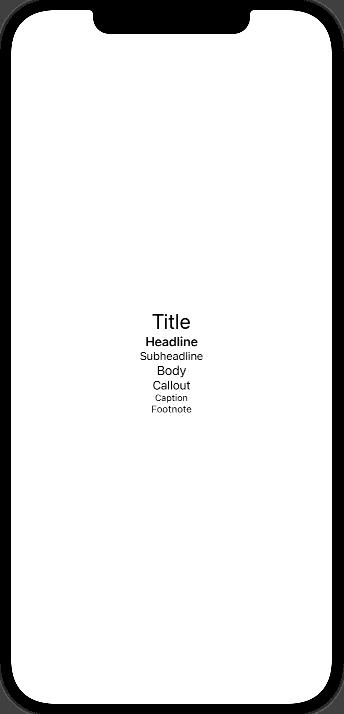
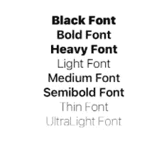
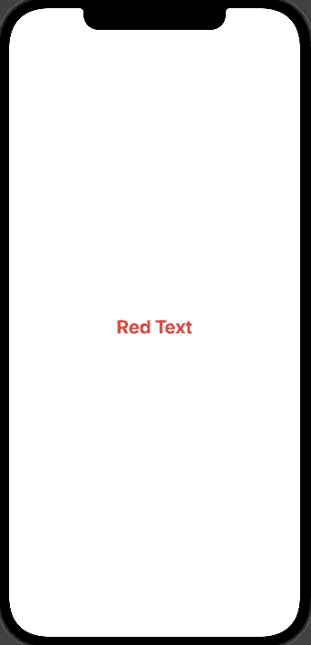

# 如何在 Swift UI 中风格化你的文本！

> 原文：<https://medium.com/geekculture/how-to-stylize-your-text-in-swift-ui-c3a437a0ed23?source=collection_archive---------12----------------------->


Photo by [Jeroen den Otter](https://unsplash.com/@jeroendenotter?utm_source=medium&utm_medium=referral) on [Unsplash](https://unsplash.com?utm_source=medium&utm_medium=referral)

当构建你的用户界面时，通常你会想要样式化你的文本对象，以获得你在应用程序中想要的外观。Swift UI 让你的字体风格化变得极其容易！我们将介绍一些不同的修改，您可以轻松地在 Swift UI 应用程序中创建美观的文本对象！

**字体类型:**

在 Swift UI 中设计字体时，您首先要做的事情之一就是选择您想要的字体类型。字体有多种不同的样式，最常用的有:标题、大标题、副标题、正文、标注、题注和脚注。

下面列出了其中的一个例子:

```
struct SomeView: View {
   var body: some View {
      VStack {
         Text("Title").font(.title)
         Text("Headline").font(.headline)
         Text("Subheadline").font(.subheadline)
         Text("Body").font(.body)
         Text("Callout").font(.callout)
         Text("Caption").font(.caption)
         Text("Footnote").font(.footnote)
      }
   }
}
```



正如你从上面的图片中所看到的，这是一个开始用 Swift UI 设计你的字体的快速简单的方法！

**进一步的字体定制:**

在你选择了你想要用于文本对象的字体类型后，你可以进一步定制字体本身的外观。例如，如果要更改字体的大小，可以使用以下语法:

```
struct SomeView: View {
   var body: some View {
      Text("Changing Font Size is Easy!").font(.system(size:90)
   }
}
```

您还可以指定字体的粗细，以满足您的设计目标。这类似于前面的语法，尽管我们将使用 fontWeight 来代替。有关用法的详细信息，请参见下面的示例:

```
struct SomeView: View {
   var body: some View {
      Text("This is a bold font now!").fontWeight(.bold)
   }
}
```

您可以在 Swift UI 中使用的不同字体粗细包括:黑色、粗体、重字体、轻字体、中字体、常规字体、半粗体、细字体和超轻字体。下面列出了每种字体粗细的示例:

```
struct SomeView: View {
   var body: some View {
      VStack {
         Text("Black Font").fontWeight(.black)
         Text("Bold Font").fontWeight(.bold)
         Text("Heavy Font").fontWeight(.heavy)
         Text("Light Font").fontWeight(.light)
         Text("Medium Font").fontWeight(.medium)
         Text("Semibold Font").fontWeight(.semibold)
         Text("Thin Font").fontWeight(.thin)
         Text("UltraLight Font").fontWeight(.ultraLight)
      }
   }
}
```



现在我们已经设置了字体的大小、粗细和类型，接下来我们可以选择字体的颜色。这是通过使用 forgroundColor，然后设置您选择的颜色来完成的。下面是一个例子:

```
struct SomeView: View {
   var body: some View {
      Text("Red Text").font(.title).bold().foregroundColor(.red)
   }
}
```



**结论:**

如您所见，在 Swift UI 应用程序中快速风格化您的文本对象非常容易，从而为您的应用程序提供独特的外观和感觉。您可以将我们今天讨论的所有内容结合起来，以获得您希望在应用程序中实现的确切字体样式。

如果你喜欢这篇文章，你可能会喜欢这些:

[](/codex/how-to-navigate-between-views-in-swift-ui-46cf62ef6df5) [## 如何在 Swift UI 中的视图间导航？

### 今天，我们将介绍使用 Swift UI 开发应用程序的一个重要流程，即如何在……

medium.com](/codex/how-to-navigate-between-views-in-swift-ui-46cf62ef6df5) [](/geekculture/understanding-spacers-and-padding-in-swift-ui-e1fb5f6efa44) [## 理解 Swift UI 中的分隔符和填充。

### 又见面了！今天的文章将关注 Swift UI 中的间隔和填充。当你开始设计你的…

medium.com](/geekculture/understanding-spacers-and-padding-in-swift-ui-e1fb5f6efa44)