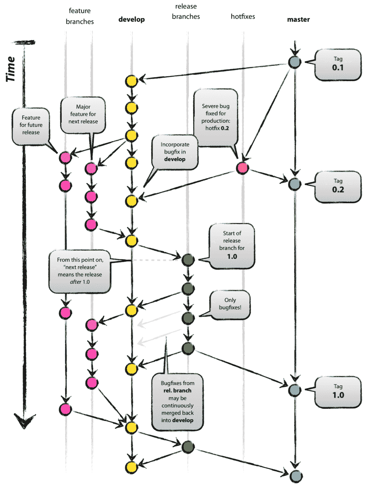
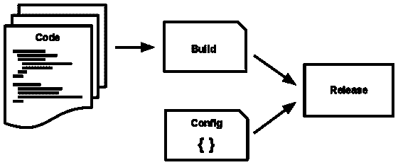
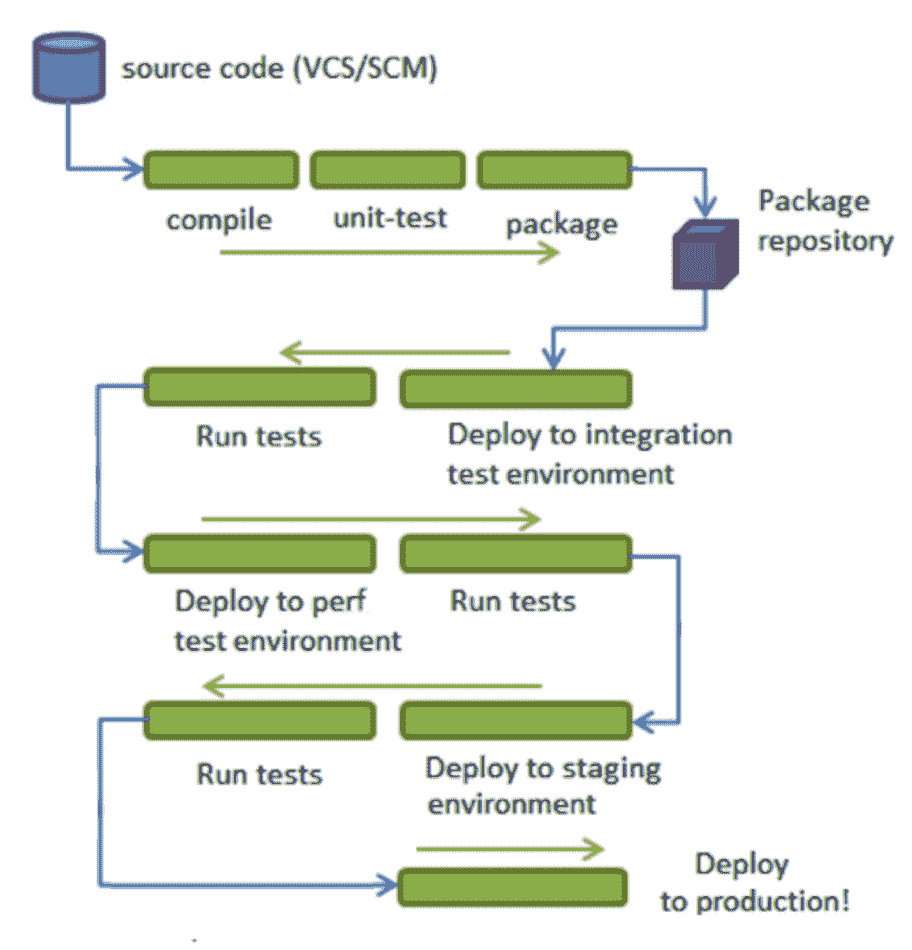
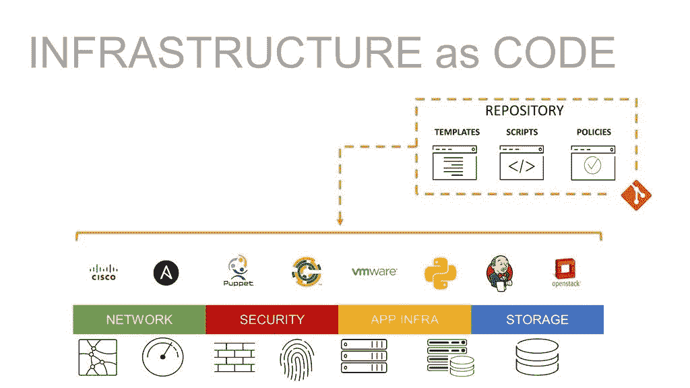

# 如何成功结合微服务、DevOps 和云

> 原文：<https://medium.com/geekculture/how-to-successfully-combine-microservices-devops-and-cloud-1e4e102d590f?source=collection_archive---------46----------------------->

快速、可靠和可持续地为最终用户提供价值的故事

微服务是一种架构模式，它使其他现代 IT 趋势，即**敏捷**、**开发运维**和**云**能够交付真正的价值。

如果他们实际上不能独立工作，那么创建许多小团队(两个比萨饼大小)又有什么意义呢？当他们都在同一个代码库上工作时，每个人都会不断地踩到对方的脚趾。这通常会阻碍没有微服务的大型项目的敏捷开发。

但是我们应该如何控制每个服务的代码库呢？我们是否应该使用**特征分支**和**发布分支**？*我建议开发微服务的时候千万不要用它们*。

我很清楚，鉴于 [GitHub Flow](https://guides.github.com/introduction/flow/index.html) 的流行，这些类型的分支如今正经历着高采用率。前者是开发人员的私人游乐场，后者持有候选版本以升级到 live。

*Source:* [*A successful Git branching model*](https://nvie.com/posts/a-successful-git-branching-model/)

我不推荐使用特征分支的原因是 [**持续集成**](https://www.martinfowler.com/articles/continuousIntegration.html) (CI)。这是一个团队的每个成员每天至少向**主干**(或**主**)提交一次的惯例。

# 连续累计

基于主干的开发 (TBD)只有当*开发人员在主干上工作*时才能实现，每天以小的增量步骤进行多次提交。*集成测试发生在主干*上，*生产发布*或者*发生在主干*上，或者发生在短期发布分支上。TBD 宣传有趣的好处，例如:

1.  代码库往往被分解成更小的模块
2.  进化(或涌现)架构
3.  功能切换的采用可用于[金丝雀发布](http://martinfowler.com/bliki/CanaryRelease.html)
4.  更好的沟通和快速的反馈回路。

被评审并合并到主干中的特性分支看起来与 CI 兼容，但是它们最终比一天更长，因为开发人员获得了更多的变更，并且评审花费了比预期更长的时间，因为每个人都很忙。开发人员异步工作得越多，构建就会变得越慢，越不完整。

我认为使用特征分支的后果是:

1.  延迟积分
2.  受阻通信
3.  开发人员倾向于一次(批量)引入更多的变更
4.  延迟的内部和外部反馈回路
5.  合并复杂性增加
6.  开发人员倾向于避免重构

简单地说，*未集成的代码是技术上的缺陷*，CI 是避免这种缺陷的最好方法。

# 持续交付/部署

如果一个应用程序不能独立发布和部署，那么将它们分成不同的代码库有什么意义呢？这将阻碍没有微服务的大型项目中的开发运维。

现在我们已经能够独立部署我们的微服务了，该怎么做呢？我们将需要一个[部署管道](https://martinfowler.com/bliki/DeploymentPipeline.html)，但是让我先定义两个概念:

*   **构建** =经过单元测试后编译和/或打包的代码
*   **发布** =构建+环境配置

*Source:* [*The Twelve-Factor App*](https://12factor.net/build-release-run)

部署管道是一系列的环境，新完成的版本必须通过这些环境，以便在投入使用之前进行大量预定义的测试。例如:

1.  集成测试
2.  性能测试
3.  用户验收测试

*Source:* [*Continuous Delivery Overview*](https://www.infoq.com/minibooks/continuous-delivery-overview/)

该版本必须通过一个环境中的所有测试，才能升级到下一个环境。代码越深入，测试集就变得越复杂和耗时。基本原理是试图平衡两个相反的目标:

*   *快速捕捉错误，同时向开发人员提供关于代码质量的反馈*
*   *通过一套全面的测试降低将缺陷引入生产的风险*

值得一提的是，一个 [**连续交付**](https://en.m.wikipedia.org/wiki/Continuous_delivery) **(CD)管道将在所有环境中完全自动化构建、测试和部署版本的工作流程**。

希望现在清楚了为什么只有当开发团队也实践 CI 时，才可能完全获得 CD 的好处。

# 为什么分离部署和发布很重要？

有必要澄清为什么*部署*和*释放*必须分开。简而言之，它们是解决不同问题的不同活动。然而，对于开发和运营团队来说，*“发布”*一词的含义略有不同，这可能会很棘手。

## 发展:

正如我们刚刚在上面看到的，

> 对于开发人员来说,“发布”意味着将软件和在某些环境下运行软件所需的任何配置打包在一起的行为。

代码在部署之前就达到了可发布的状态。*“部署”是指在某个目标环境中安装发布版本(打包软件)的行为。*

**从开发的角度来看，将两者分开使得在需要的时候重新部署代码变得容易。**

## *操作:*

> *对于操作人员来说,“发布”是指将软件部署到生产环境后，让用户可以使用的行为。*

*免费的主要策略是对用户隐藏已部署的代码，因此不发布:*

*   ***黑暗启动** —代码位于生产中用户无法访问的独立模块中*
*   ***抽象分支** —代码位于生产中运行的模块中，但在设计良好的接口后面保持不活动。对于后端代码来说非常常见。*
*   ***特性切换** —代码位于生产中运行的模块中，但通过标记/切换对用户隐藏它们而保持不活动。对于 UI 代码来说非常常见。*

**从运营的角度来看，将两者分开可以让 CI 和 CD 同时发生。**

***无论从哪个角度看，部署和发布的分离都是 DevOps 的关键促成因素。***

# *基础设施作为代码*

*我想以代码 (IaC)简短地总结一下被称为[基础设施的规程。它是指*通过代码而不是通过手动配置*或使用传统配置工具来供应和管理基础设施，包括硬件、虚拟资源、平台、容器系统和 It 服务。IaC 将配置、策略、配置文件、脚本和模板与部署它们的硬件或软件分开，这样它们就可以像代码一样被存储、共享、修改和应用。这使得运营团队能够像开发人员对源代码所做的那样，对基础设施编排应用同样的*版本控制*和*可重复性*。](https://en.m.wikipedia.org/wiki/Infrastructure_as_code)*

**

**Source:* [*What is Infrastructure as Code*](https://www.f5.com/services/resources/glossary/what-is-infrastructure-as-code)*

*IaC 通常有两种方法:**声明式** vs. **命令式**或过程式。两者的区别本质上是*‘什么’*对*‘怎么样’*。声明式方法关注的是最终的目标配置应该是什么；命令式方法关注于如何改变基础设施。*

*将*不可变版本*和*基础设施组合成代码*已经产生了一个强大的规程，称为 [**不可变基础设施**](https://www.digitalocean.com/community/tutorials/what-is-immutable-infrastructure) ，这是一种管理 IT 资源的方法，其中*服务器在被供应*之后从不被修改，即它们总是被替换而不是被改变。如果需要以任何方式更新、修复或修改某些内容，则可以提供从通用映像构建的新服务器，并进行适当的更改，以替换旧服务器。*

*这种不变性*限制了配置漂移*的可能性，降低了 IT 基础设施对攻击媒介的*脆弱性，并且通常*增加了正常运行时间*。 [Terraform](https://www.terraform.io/) 、 [Spinnaker](https://spinnaker.io/) 、 [CloudFormation](https://aws.amazon.com/cloudformation/) (可能)、 [Kubernetes](https://kubernetes.io/) 和 Cloud Foundry (via [BOSH](https://bosh.io/) )是实现不可变基础设施的工具的很好例子。**