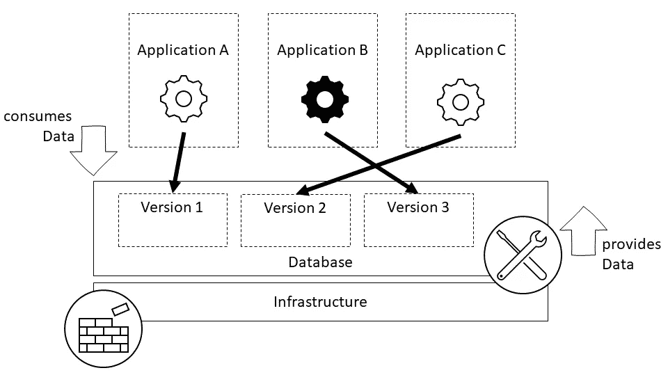
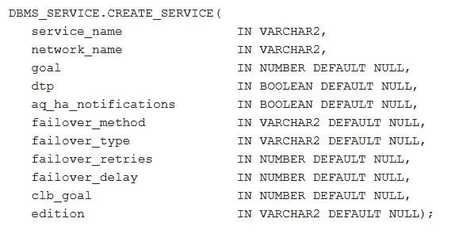

# 如何使用 JPA 数据源切换 Oracle EBR 版本

> 原文：<https://medium.com/geekculture/how-to-switch-editions-with-oracle-ebr-with-your-jpa-datasource-1a414061dfde?source=collection_archive---------11----------------------->


Versioning your data access with editions is important for achieving a decoupled release cycle for your database. 📸 Photo by [Mick Haupt](https://unsplash.com/@rocinante_11?utm_source=unsplash&utm_medium=referral&utm_content=creditCopyText) on [Unsplash](https://unsplash.com/s/photos/numbers?utm_source=unsplash&utm_medium=referral&utm_content=creditCopyText)

## 分离允许应用程序和数据库有不同的发布周期。将 Java 应用程序从 Oracle 数据库中分离出来的一种方法是使用 Oracle 的基于版本的重定义(EBR)特性。本文展示了在使用 JPA 时如何使用 EBR 和切换版本。

## **EBR 基础知识**

升级数据库应用程序可能要求很高。一个重大挑战是不能经常或在办公时间安排长时间停机。因此，此类应用程序需要在线升级，以便在工作日推出和监控更改。在线升级要求数据库和相关的应用程序支持在线升级。

Oracle 基于版本的重新定义(EBR)允许在运行时更新数据库对象，而不会造成中断。EBR 使用版本化 Oracle 数据库对象(所谓的版本)的可能性。

每次更改数据库对象时，都会创建一个新版本，然后由应用程序使用。如果你想了解更多关于 EBR 的知识，请前往[柳文欢的 EBR 博客文章系列](https://db-oriented.com/my-ebr-blog-post-series/)。

## 分离的发布周期

将数据库从应用程序中分离出来，可以在不同时重新部署的情况下推出数据库更改。因此，我们有了一个版本化的 API，它由应用程序使用，并且可以升级到新的 API 版本。



With a versioned API on the database side, applications can switch to newer versions on their own release cycle and thus aren’t coupled to database changes.

这种分离创建了独立的发布周期，并允许两个团队独立地实现特性，而不必协调调整。

## 切换版本

使用 Oracles 的 EBR，在访问数据库时有不同的方式来定义版本。我在这里介绍了四种可以单独使用或组合使用的方法。

在可以访问某个版本之前，该版本必须对用户可用— [在 Oracle 文档中了解有关该版本的更多信息](https://docs.oracle.com/en/database/oracle/oracle-database/19/adfns/editions.html#GUID-B9A89ED5-7DC8-4B49-A38D-5B8CA94E7459)。

**1️⃣默认数据库版本**

一旦在数据库中创建了一个版本，让所有应用程序都使用它的最简单的方法就是使它成为默认版本。默认版本用于所有未明确指定要访问的版本的传入数据库连接。

```
ALTER DATABASE DEFAULT EDITION = myEditionName
```

**2️⃣数据库服务**

如果需要同时访问几个版本，一种可能是用预设的版本创建不同的数据库服务。这可以通过 Oracles 的`DBMS_SERVICE.CREATE_SERVICE`过程`edition`参数来完成。



Oracle 19c Documentation — DBMS_SERVICE.CREATE_SERVICE package definition—🔗 [Source](https://docs.oracle.com/en/database/oracle/oracle-database/19/arpls/DBMS_SERVICE.html)

如果新的数据库服务是使用版本创建的，则应用程序可以使用它来建立与数据库的连接。默认情况下，它总是连接到 set edition。

**版本为**的 3️⃣ JPA 数据源

应用程序端也可以通过 JPA 数据源设置版本。版本的名称可以在属性`oracle.jdbc.editionName`中指定。这个版本将在通过 JPA 数据源建立连接时使用。

```
properties.setProperty("oracle.jdbc.editionName", "myEditionName");
```

具有 editionName 属性的数据源示例如下所示。

```
@Bean
       @Primary
       protected DataSource dataSource() {
             DriverManagerDataSource dataSource = new DriverManagerDataSource();

             dataSource.setDriverClassName(driver);
             dataSource.setUsername(user);
             dataSource.setPassword(pwd);
             dataSource.setUrl(url);

             Properties properties = new Properties();
             properties.setProperty("oracle.jdbc.editionName", edition);
             dataSource.setConnectionProperties(properties);

             log.debug("dataSource:{}", dataSource);
             return dataSource;
       }
```

该应用程序可以同时使用多个版本和多个设置了不同版本的 JPA 数据源。

**4️⃣手动设置版本**

也可以在会话期间手动设置版本。为此，在会话中发出一个`ALTER SESSION`命令。

```
ALTER SESSION SET EDITION = myEditionName
```

在 alter session 命令之后，不需要提交；新版马上就可以买到了。

## 结论

版本的应用和使用可以用许多不同的方式来设计。因此，使用与您的发布周期和工作方法最协调的方法来避免可能的障碍是很重要的。

# 资源

 [## PL/SQL 程序包和类型参考

### DBMS_SERVICE 包允许您为单个实例创建、删除、激活和停用服务。这一章…

docs.oracle.com](https://docs.oracle.com/en/database/oracle/oracle-database/19/arpls/DBMS_SERVICE.html) [](https://db-oriented.com/my-ebr-blog-post-series/) [## 我的 EBR 博文系列- @DBoriented

### 这是我写的关于基于版本的重定义的一系列文章的索引。将添加新条目…

db-oriented.com](https://db-oriented.com/my-ebr-blog-post-series/)  [## 数据库开发指南

### 数据库开发指南应用程序开发人员使用基于版本的重新定义基于版本的高级主题…

docs.oracle.com](https://docs.oracle.com/en/database/oracle/oracle-database/19/adfns/editions.html#GUID-58DE05A0-5DEF-4791-8FA8-F04D11964906)  [## OracleConnection (Oracle JDBC API 参考)

### 所有超级接口:java.sql.Connection 所有已知的实现类:OracleConnectionWrapper public…

download.oracle.com](https://download.oracle.com/otn_hosted_doc/jdeveloper/905/jdbc-javadoc/oracle/jdbc/OracleConnection.html#CONNECTION_PROPERTY_EDITION_NAME)