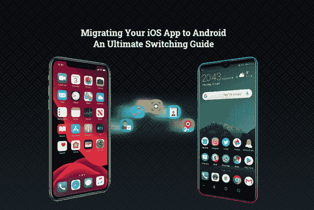
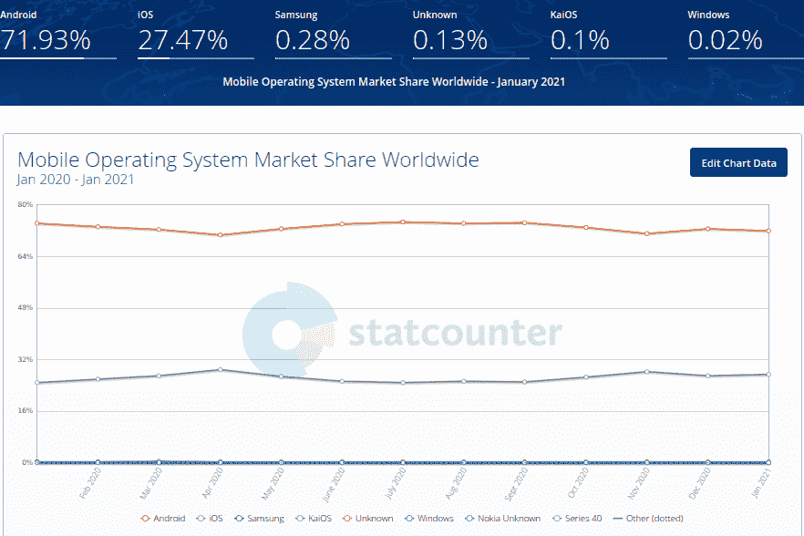
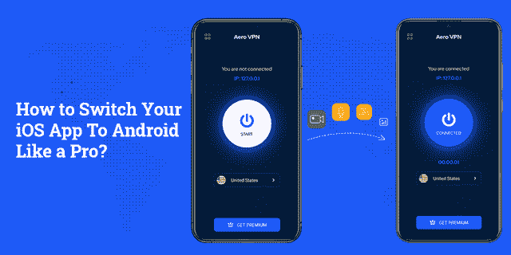
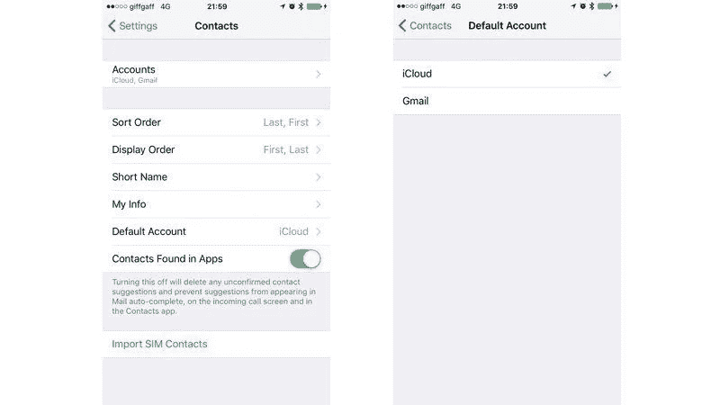
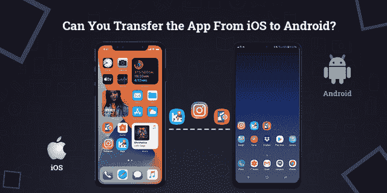

# 如何将你的 App 从 iOS 切换到 Android？可遵循的完整指南

> 原文：<https://medium.com/geekculture/how-to-switch-your-app-from-ios-to-android-a-complete-guide-to-follow-52f7b696d652?source=collection_archive---------10----------------------->

苹果应用商店一直拒绝你的应用吗？你是否厌倦了追逐苹果应用商店的高标准期望和要求？Android 的自由张开双臂欢迎你将你的应用从 iOS 迁移到 Android。

然而，从 iOS 切换到 Android 可能是一个复杂的过程，也可能很容易，这取决于你采取的步骤。因此，在这篇博客中，我们将指导你将数据从 iPhone 迁移到 Android 设备的最主要方法。为了让事情变得简单明了，首先，我们将讨论可以通过简单的步骤转移到 Android 的东西，然后我们继续讨论应用迁移所需的技术堆栈。

但是，在将您的 iOS 应用程序迁移到 Android 之前，有必要了解企业希望将其应用程序从 iOS 迁移到 Android 的原因…

## **为什么企业需要将一个 App 从 iOS 切换到 Android？**

由于新冠肺炎·疫情病毒的攻击，移动应用程序的开发受到了极大的关注，这推动了各个领域的企业快速、全面地转移到在线平台。

但是，iOS 和 Android 之间的斗争仍然没有改变，这让你陷入了一个两难的境地，即你应该在 iOS 应用商店还是 Google Play 商店推出你的第一款应用。但有了这些少量的市场分析，让我们更容易理解为什么企业会迅速将他们的应用程序从 iOS 迁移到 Android。

*   **未来前景:**根据调查报告，Android 设备占据了 [71.93%的全球市场份额](https://gs.statcounter.com/os-market-share/mobile/worldwide)，这诠释了 Android 应用开发的未来将会持续上升。

[Image Source](https://gs.statcounter.com/os-market-share/mobile/worldwide)

**市场范围:**虽然 Android 在市场份额方面是绝对的领导者，因此，这是一个更好的机会来瞄准更大的市场份额。此外，统计数据显示，如果你的目标受众主要是技术或医疗领域，为 Android 开发应用程序可能会更成功。而 iPhones 在努力跟上最新技术趋势的商务人士中更受欢迎，而且收入更高。

**用户友好:** Android 是一个开源操作系统，允许开发者访问 iOS 所限制的硬件、文件、系统和功能。此外，Android 在定制方面更加人性化。

**发布或启动你的应用:** Android 是一个相对来说更容易使用的平台。如果你坚持商店的政策方针，Google Play 商店会接受大多数提交的应用程序。店家很有可能会批准你的申请。与此同时，苹果商店在推出应用程序时相当有选择性。审查过程相当快，但苹果的应用程序拒绝率也更高。

**商店年费:**有了谷歌，开发者只需支付 25 美元的初始费用就可以在商店上发布他们的应用。另一方面，苹果开发者必须每年支付 99 美元才能继续在商店上发布他们的应用。

> **简单地说:**

总而言之，这些原因对于企业将现有的定制业务应用从 iOS 迁移到 Android 平台是有意义的。但是主要的担忧是它将会有多大的挑战性？将应用程序从一个平台换到另一个平台需要做多少工作？嗯，凡事都有前因后果。因此，在您选择雇用应用程序开发人员进行应用程序迁移之前，让我们先来了解一下与此相关的好与坏。

好消息是一旦你的应用程序写好了，大部分复杂的任务就完成了。至此，您已经定义了业务逻辑，并且很好地定义了应用程序的 UI/UX。因此，剩下的唯一工作就是获取对现有应用程序所需的改进或更改的反馈。在这里，你们中的许多人认为 iOS 到 Android 的迁移就像将工作应用从 Swift 或 Objective C 转移到 Android Java 一样简单。

> 事实是——移民远不止于此！

向下重新设计应用程序涉及到基础设施组件和架构的变化。因此，重新思考应用程序是一件大事，这意味着你需要 [**雇用技能更高的移动应用程序开发人员**](https://www.xicom.biz/offerings/hire-mobile-developers/) 来完美地完成这个大范围的项目。

> 那么，让我们来看看如何在不丢失重要数据的情况下，将应用程序从 iOS 设备转移到谷歌 Android 智能手机？

而苹果实际上并不容易将你的数据从一个平台转移到另一个平台，这使得人们转向其他方向，最终导致复杂的程序。但是，尽管如此，通过一些工具和耐心，你可以在 Android 上运行一个应用程序而不会错过任何一个节拍。

# **如何像专业人士一样把自己的 iOS 应用切换到 Android？**

因此，如果你准备好看到你的旧 iOS 应用程序来自不同的平台，比如一个闪亮的新 Android 应用程序，那么这里有一个快速的分步教程，向你推荐将所有数据从 iPhone 迁移到 Android 的最佳方法，而不会有任何损失。

> 让我们直入主题:

## **步骤 1:将联系人从 iPhone 迁移到 Android**

作为 iOS 用户，您的所有联系人都会同步到 iCloud，因为这样可以更容易地登录 iOS 设备，并随时使用您的地址簿。事实上，这也使得它更容易进入谷歌的生态系统。所以让我们来了解如何进行。

该过程的难易程度取决于同步联系人的努力程度。因此，当您将所有联系人同步到您的 Google 帐户时，您所需要做的就是正确无误地输入您的 Google 帐户信息。您所有保存的号码或联系人列表将被自动下载。

但是如果不同步联系人呢？然而，你必须更加努力。因此，最简单的方法可能是使用 iCloud 获取一个. vcf 文件，然后将其导入到您的 Android 手机中。

> 以下是下载联系人的. vcf 文件的几个简单步骤:

*   首先，移动到你的 iPhone 的 ***设置*** ，然后点击你的 ***个人资料。***
*   轻按 ***iCloud*** 并打开联系人。一旦你这么做了，你的联系人很快就会被上传到苹果的云服务上。
*   此外，您可以使用任何浏览器前往***iCloud.com***，并尝试使用您唯一的 Apple ID 和密码登录。
*   选择 ***触点*** ，然后点击屏幕左下角的 ***档位图标*** 。
*   选择全部，再次点击齿轮图标，然后选择 ***导出 vCard*** 。一旦。vcf 文件下载，你可以直接将你的联系人下载到你的手机，也可以将该文件导入到你的 ***谷歌联系人*** 。

## **第二步:如何将日历同步到 Android 设备**

如果你已经设置了谷歌或 Gmail 账户，同步日历会非常容易。进入 ***设置>账户&密码>。*** 您需要在 iPhone 上添加一个帐户，并添加您的 Gmail 帐户详细信息或从列表中选择它。完成后，打开日历同步。

如果你想把 iPhone 换成 Android 设备，但又想保留 iPad，那么 Gmail 应用程序是保持日历和联系人同步的好方法。事实上，如果需要，你可以将多个谷歌日历同步到你的 iPad 上。

您也可以下载一个应用程序，直接从 iCloud 同步您的日历。假设你在 ***设置>你的名字> iCloud*** 中打开了日历。此外，你可以尝试用一个日历将所有日历同步到一个地方，或者查看一些推荐的最佳日历应用程序。

## **第三步:移动您的照片和视频**

照片和视频库是你手机的灵魂，没有人能在切换到另一个平台时丢失这些数据。幸运的是，有多种方法可以将你的珍贵文件从 iPhone 转移到 Android 上，但我们将为你讨论一些基本而简单的方法。

首先，通过 USB 将你的 iPhone 插入你的 Windows PC，然后选择导入图片和视频自动传输到你的设备。您的照片和视频将保存在内部存储/DCIM 文件夹中，因此，如果您想单独选择或仅传输选定的内容，也可以这样做。

如果你试图通过 Mac 传输文件，那么当你将 iPhone 插入系统时，导入窗口应该会弹出。一旦窗口打开，你可以从那里选择文件，并能够立即转移它们。

你只需要通过 USB 连接你的 Android 智能手机，你就会看到一个弹出窗口，允许你选择打开设备来查看文件。从那里，你可以将文件从你的电脑拖放到你的 Android 上。

虽然也可以无线传输文件，但需要的时间会更长。您可以使用任何云服务来实现这一点。

除此之外，iOS 和 Android 上还有许多视频和图像传输选项。你可以简单地安装谷歌照片、谷歌驱动、微软 OneDrive 等等。在这种情况下，它会在你的 Android 上安装相同的应用程序并下载它们。

## **第四步:如何将你的音乐文件从 iOS 转移到 Android？**

在将文件从一个平台转移到另一个平台时，大多数人都是以同样的老式方式转移文件，即手动将每个文件从一部手机转移到另一部手机。而对你们中的一些人来说，简单地把你的音乐上传到 YouTube 音乐可能更容易。

但是如果你正在寻找一家 [**移动应用程序开发公司**](https://www.xicom.biz/offerings/mobile-app-development/) 将你的音乐从 iTunes 账户下载到 Android 设备上，那么这里有几个可行的方法。

在迁移音乐文件之前，请记住这里有三种音乐需要考虑——流媒体音乐、云音乐和本地音乐。

***流媒体音乐*** 只需在 Android 上下载一个类似的应用程序，使用相同的 id 和密码登录该应用程序，即可获得您的音乐列表。

***云音乐*** 是您已经存储在云服务中的一种音乐。比方说，如果你用的是 iTunes，那么把你的音乐收藏拷贝到云端，苹果音乐应用商店里仍然可以使用。

将音乐文件从一个设备转移到另一个设备最好是在电脑上完成。您可以将存储的音乐文件快速传输到 iCloud Drive，方法是将它们拖出 I cloud Drive 并放入 Google Drive。如果你想从你的 iTunes 库中转移音乐，你会发现在你的用户账户下的 ***音乐> iTunes*** 或个人电脑上的 ***我的音乐> iTunes*** 。

> **Rest 您可以按照以下几个简单的步骤快速传输音乐文件:**

*   首先，把你的音乐库下载到你的电脑上，不管是 Mac 还是其他系统。
*   使用任何 web 浏览器导航到 music.youtube.com。
*   登录您的 Google 帐户。
*   点击你的个人资料，然后选择上传音乐的选项。
*   选择要上传的音乐文件，并等待它完成。

而大多数人不再在本地存储音乐。因此，如果你使用任何应用程序，如 Spotify、YouTube Music、Pandora 或更多，你可以简单地在 Android 上下载适当的应用程序并登录你的帐户。最棒的是，你可以继续使用 Apple Music，它可以直接从 Google Play 商店获得。

## **第五步:如何将你的浏览器书签同步到安卓设备？**

如果你已经在使用 iOS 上的 Chrome 与台式电脑上的 Chrome 同步，那么你就不用担心这一步了。但如果你在 iOS 设备上使用 Safari 浏览器，你需要导出你的书签。

> **以下是帮助您同步书签的几个步骤:**

*   将 Safari 与桌面版本同步。
*   跳进去，选择文件>导出你的 iOS 设备的书签。
*   我们建议您将它们导入到桌面上的 Chrome 中，这样就可以进一步与 Android 设备上的 Chrome 同步。

在转移书签时，请记住这不会导出您存储的密码或自动填充条目，因此请确定您已经记下了需要保留的密码。

在出售或转让你的 iPhone 或 iPad 之前，一定要确保你已经禁用了 ***查找我的手机*** ，退出了 iCloud，并删除了你所有的数据。

虽然通过这些步骤将你的 iOS 的主要元素转移或同步到 Android 非常简单，但你不能击败一家 [**软件开发公司**](https://www.xicom.biz/) 的专业知识。他们可以像专业人士一样处理任务，并允许你通过使用正确的程序将所有数据从一个平台转移到另一个平台，并让你开始使用闪亮的 Android 应用程序。

> 但这里问题来了，不能把 iPhone 上的应用转移到 Android 上吗？

# **可以把应用从 iOS 转移到 Android 吗？**

事实上，iOS 和 Android 有着完全不同的生态系统。所以在那些平台上运行的 app 也有不同的结构。所以，你不能只按一下按钮就自动取回你的应用。虽然 Android 领域有许多流行的应用程序，但你不能将应用程序从一个驱动器转移到另一个驱动器。

你需要安装适当的应用程序，使用相同的 ID 和密码登录，以返回你的详细信息。如果你习惯于访问任何特定的 iOS 应用程序，那么在购买或将数据传输到 Android 设备之前，值得在谷歌 Play 商店上检查一下。如果你不能在你的 iPhone 上找到相同的应用程序，那么最好是寻找最好的替代品。

## **向新设备传输数据时的常见问题和解决方案**

将您的数据迁移到新平台从来都不是一件容易的事情。你可能有一些工具可以让你更顺利地从 iPhone 切换到 Android，但实际上有很多事情你需要避免。

最恼人的事情之一是，你不得不再次将你的应用程序下载到新设备上，并且不得不留下一些。此外，您将需要使用一些技巧和策略手动带回文档和文件。但是，有时，从一个平台到另一个平台的数据迁移需要开发人员的专业技能、知识和专业技能。所以为了克服这样的小问题，你需要 [**雇佣安卓应用开发者**](https://www.xicom.biz/offerings/hire-android-developers/) 来帮助你毫无麻烦地从 iOS 切换到安卓。

# **结论:你要走的路**

准备好将你的应用从 iOS 迁移到 Android 了吗？而从一个平台切换到另一个平台绝不像按一个按钮那么简单。但是，如果你知道正确的方法和技巧来进行快乐的转移，这并不困难。

虽然每个人都知道不同的方法，但我们列出了一些最简单的方法或程序来执行它。如果你的数据不能像你计划的那样顺利传输，那么用 Android 对你的所有应用进行分类将是最大的痛苦。所以这就是你需要 [**雇佣应用开发者**](https://www.xicom.biz/solutions/hire-developers/) 的地方，他会带你一步一步地完成，而且很快就能完成。