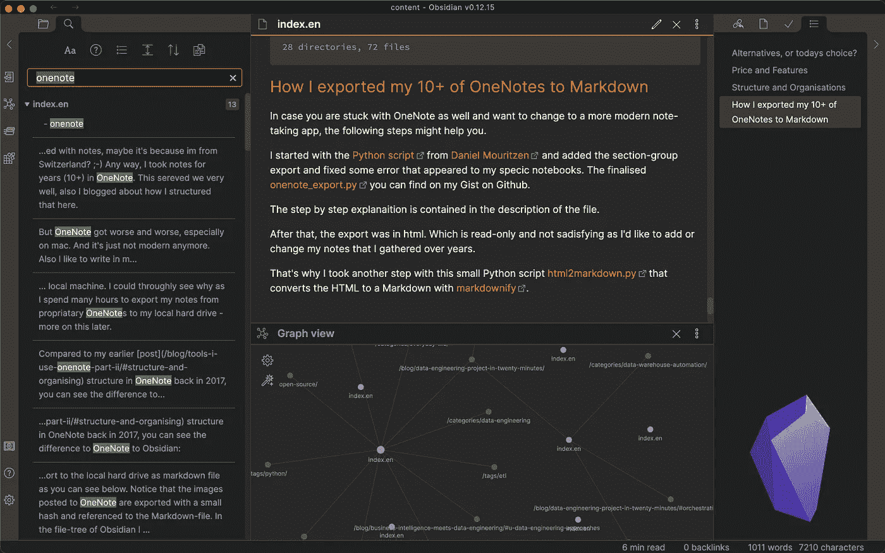

# 2021 年怎么记笔记？

> 原文：<https://medium.com/geekculture/how-to-take-notes-in-2021-338529c91693?source=collection_archive---------22----------------------->

UI of Obsidian.md

记笔记可以帮助你不忘记事情，教会你表达自己，集思广益，研究一个话题，等等。我曾经一生都在做笔记。也许是因为我是瑞士人，他们说我们组织得很好。

我曾经在 OneNote 中写了 10 多年。我为我的学士学位学习和我工作过的每个工作场所都准备了笔记本。我用我所有的商业知识策划了一个巨大的笔记本，我…