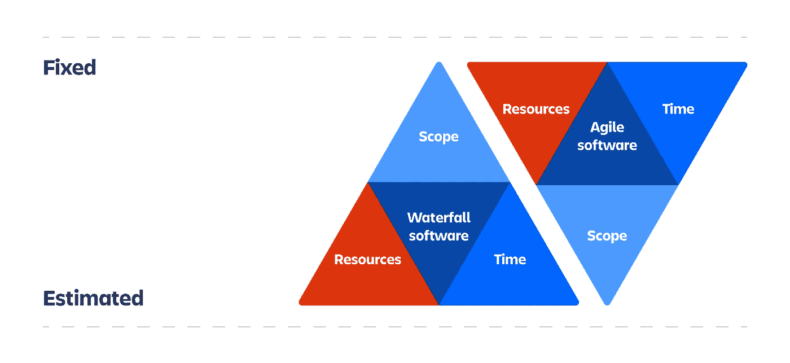
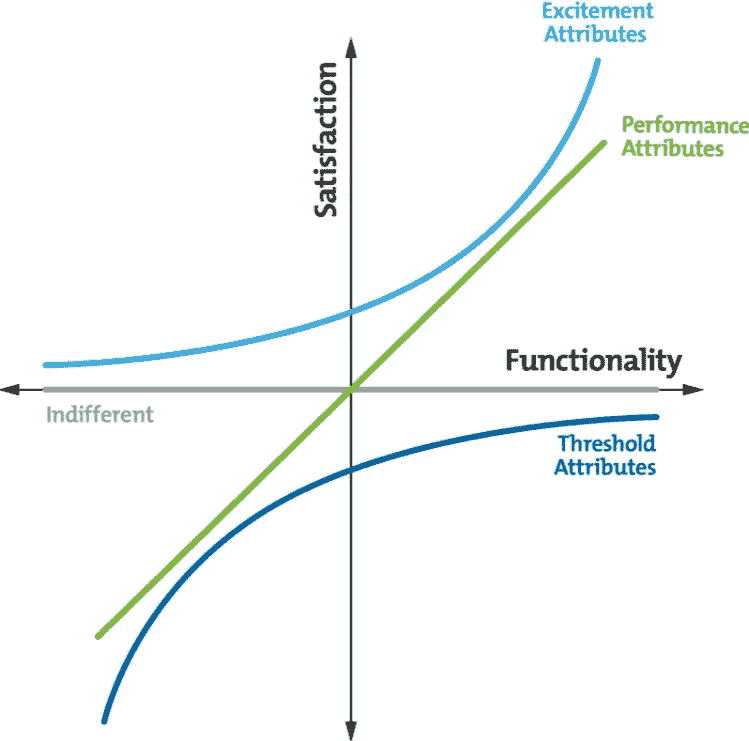

# 如何驯服软件开发项目中的复杂性

> 原文：<https://medium.com/geekculture/how-to-tame-complexity-in-software-development-projects-fd3cf7b89941?source=collection_archive---------16----------------------->

在开发过程中改进沟通、推动时间和范围的技术。

Image by [Alvaro Reyes](https://unsplash.com/photos/qWwpHwip31M)

当涉及到软件开发时，即使是一个无害的机构网站项目也会变成一个膨胀的庞然大物，每天不受控制地增长。一个简单的客户请求可能是一座冰山，隐藏着复杂的业务规则和技术问题:SEO、可用性、可访问性、基础设施等等。

当客户对需要什么没有一个清晰的定义，沟通有困难时，这种复杂性变得更加潜在，并且当团队以一种肤浅和无序的方式收到这种请求时，这种复杂性变得更加严重，并且通常[在没有提出问题或建议的情况下开始开发](https://en.wikipedia.org/wiki/Pluralistic_ignorance)。

如果这些问题已经出现在具有“较小”范围的短期项目中，您可以想象或者可能已经感觉到企业软件中的痛苦比例增加。从业务规则定义、架构、范围到团队管理，一切都变得更加复杂。

这篇文章旨在介绍一些技巧和思考来帮助你和你的团队处理复杂的项目，避免压力，增加团队的信心和交付有价值的软件。

# 沟通

沟通问题总是存在的，它们可能与远程工作的异步方面、不同的时区、语言或者客户和团队在表达想法和需求时的困难有关。

## 定义一种无处不在的语言

[确保客户和开发团队在名称、术语、流程和缩写方面保持一致](https://martinfowler.com/bliki/UbiquitousLanguage.html)，包括它们的含义，或者创建一个术语表。避免相似的单词并在必要时执行重复数据删除至关重要。

## 开放的交流渠道

[公司间接生产的项目是他们已经拥有的沟通结构的副本](https://en.wikipedia.org/wiki/Conway%27s_law)，如果是一个产品公司，团队之间有筒仓，他们将在集成和部署过程中反映出来，在交付流程中增加围墙。如果是一家财务部分和物流区不沟通的配送公司，这种壁垒和缺乏整合会传递到软件上。

在这种情况下，开发软件的团队必须帮助客户打破现状，从而识别业务的真正困难。此外，请记住，客户满意度是一个不断变化的目标，在软件投入生产之前，他们永远不会知道自己想要什么。

为了解决这个问题，团队必须在会议中提出问题和建议，这种互动，在整个开发过程中理想地保持不变，对于防止对要求什么和将交付什么的假设是很重要的。

如果你或团队中的一些人不愿意问问题，可以在为顾客梳理之前和之后填写一份匿名表格，但你应该专注于培养这种软技能。

> 像“5 个为什么”这样的技巧有助于发现真正的问题并找到可能的解决方案，而重复理解一个请求的行为，换句话说，可以确保双方之间的交流没有噪音。

# 管理范围和时间

当一个项目从一个固定的范围开始时，它的时间和资源(花费的金钱和可用的时间)将是可变的，导致与管理相关的主要问题:

*   优先级被折衷或者不存在:如果整个范围需要被满足，团队和客户对识别什么是软件的核心和重要的不感兴趣。
*   没有重点和低价值的开发会无限期地拖延下去。这导致了一个截止日期。
*   当客户和经理试图强加里程碑以实现最终日期时，团队中出现了压力。如果没有对范围进行优先排序，加班就会重复出现，质量也会下降。

这种情况可以通过固定时间和资源并在这些常量内调整范围来逆转。这种倒置使得开发流程更加符合在[敏捷软件开发宣言](https://agilemanifesto.org/)中描述的原则，避免了仅仅将项目作为一个整体来考虑，还识别出了重要的小部分。

[Agile iron triangle](https://www.atlassian.com/agile/agile-at-scale/agile-iron-triangle)

这些更小的部分促进了客户和团队之间的定义和理解，并通过更持续的反馈来指导开发。

## 并非所有需要的都是核心

要知道，可能每个 web 应用程序都需要登录，而且只要它是一个必需的功能，它就不是客户业务的核心。

当把项目作为一个整体来设想时，客户、产品所有者和项目经理需要根据业务规则来确定软件的核心是什么，哪些屏幕和功能对于向最终用户交付价值是必不可少的，优先级和焦点必须始终在它们上面。

[使用 Kano 模型提出关于系统特性的问题](https://en.wikipedia.org/wiki/Kano_model)，并确定其优先级以及在开发和交付过程中应受到的关注程度。

[The Kano model](https://en.wikipedia.org/wiki/Kano_model)

例如，当开发像优步这样的交通应用程序时，路线选择屏幕是应用程序的核心，而注册和登录屏幕不是，这一分析导致了我们的第一个优先排序:从核心开始。

使用 Kano 模型，您可以评估在应用程序的每个部分应该投入多少精力和精力。请记住，当用户使用应用程序时，他的期望已经被定义，也就是说，路线的选择和与驾驶员的匹配是期望的基础(阈值属性)，任何额外的功能都很难提高用户满意度，而这个基本流程中的失败会产生负面影响。

另一方面，以游戏化形式为用户带来折扣或某种升级的额外资源可以被视为兴奋属性，如果结构良好，它们可以进一步增强应用程序，即使它们不存在或没有功能，它们也几乎不会影响用户的最终满意度。

## 为每个里程碑定义什么是足够好的

软件中开发的每一个组件都隐藏着实际上无限的功能、微小的调整和错误修复，范围像草一样增长。客户和团队需要就项目中每个交付阶段的最低可接受需求达成一致。

例如，日期输入可以隐藏很多问题:如何在不同的操作系统上显示它，如何根据用户的语言识别区域差异，当打开日历时如何导航，使用键盘和屏幕阅读器时的可访问性如何，将应用什么规则来验证数据，等等，总是会有调整、错误修复和新功能要应用。

在开发 MVP 时，可访问性可以忽略，但是对于生产系统来说，这是一个需求。什么是足够好的指标是一个可变的尺度，必须始终定义和明确，以符合交付预期。

# 概括起来

软件开发管理过程中出现的常见问题与沟通不畅和对最终用户的核心内容缺乏优先级有关。

从改善客户和团队之间的沟通开始，在细化过程中，对于阅读本文的开发人员来说，提问和理解是令人满意的，这是非常必要的:你被雇佣来解决问题，而不仅仅是编写代码。

在管理方面，在开始开发之前，确保软件的核心需求得到很好的定义，关注核心将使客户参与早期反馈，将团队引向可持续发展周期的正确道路。