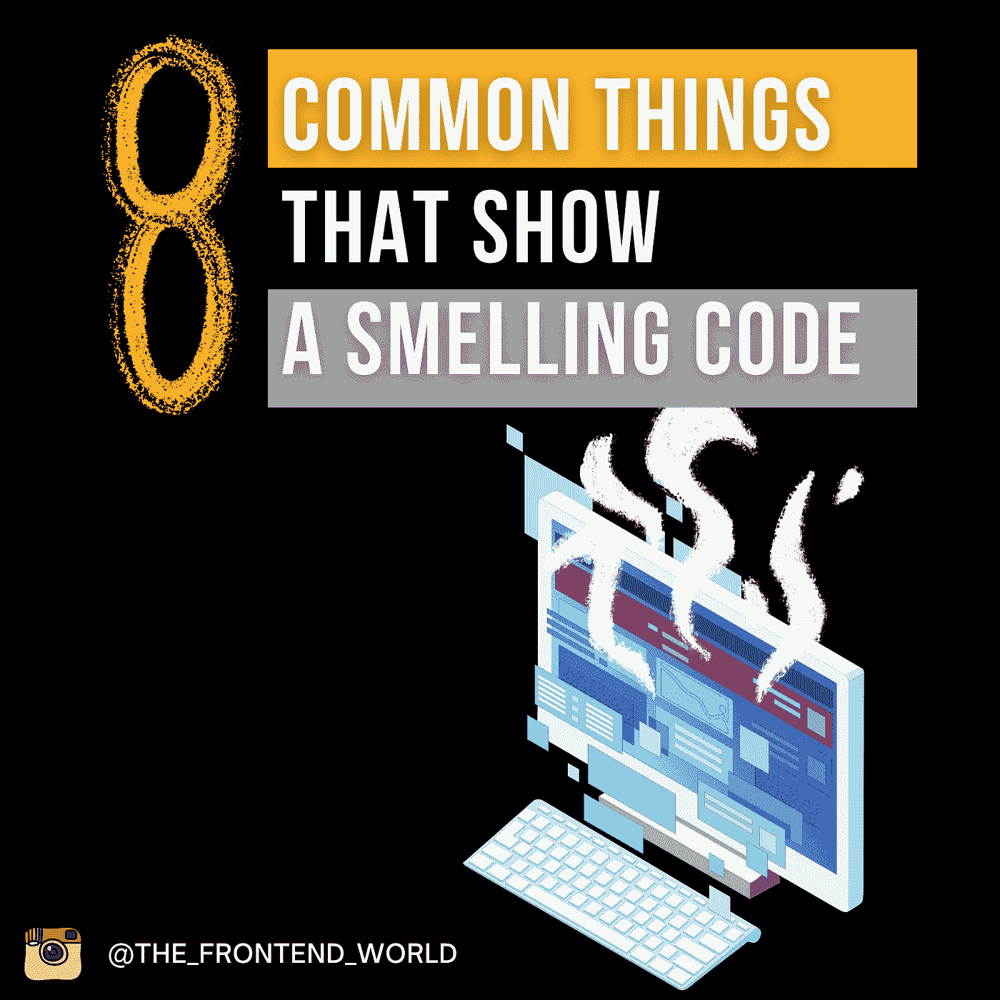

# 如何辨别一个代码是不是坏的？显示气味代码的 8 种常见事物…

> 原文：<https://medium.com/geekculture/how-to-tell-if-a-code-is-bad-8-common-things-that-show-a-smelling-code-90aec5258715?source=collection_archive---------2----------------------->

## 为了避免闻到代码的味道，你需要记住什么

By @the_frontend_world

> “在[计算机编程](https://en.wikipedia.org/wiki/Computer_programming)中，**代码气味**是一个[程序](https://en.wikipedia.org/wiki/Computer_program)的[源代码](https://en.wikipedia.org/wiki/Source_code)中的任何特征，可能预示着更深层次的问题”。