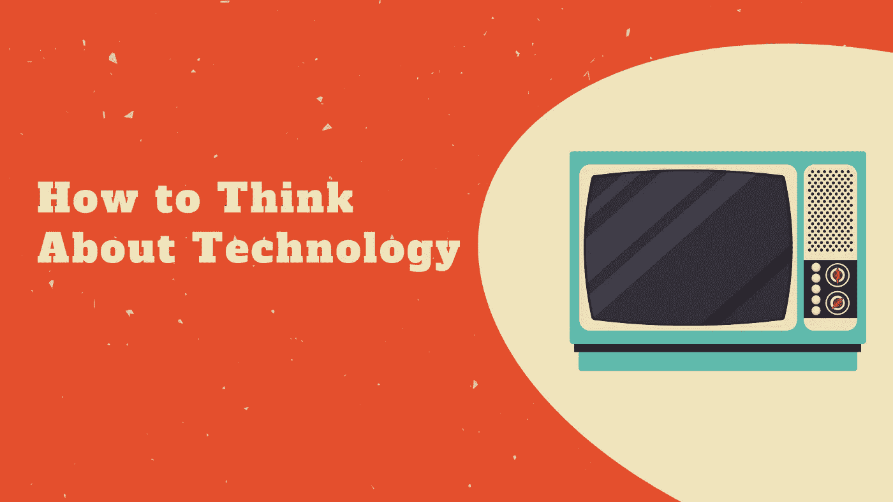

# 如何看待技术

> 原文：<https://medium.com/geekculture/how-to-think-about-technology-76a64f664f87?source=collection_archive---------22----------------------->

## 介绍马歇尔·麦克卢汉

让我说清楚这篇文章不是什么。这不是对技术作为一种普遍结构的道德判断。我不认为技术的概念有内在的道德价值。基于各种困境，某些技术可能是好的或坏的。

我从这种情绪开始，因为当人们对…的想法提出控诉时