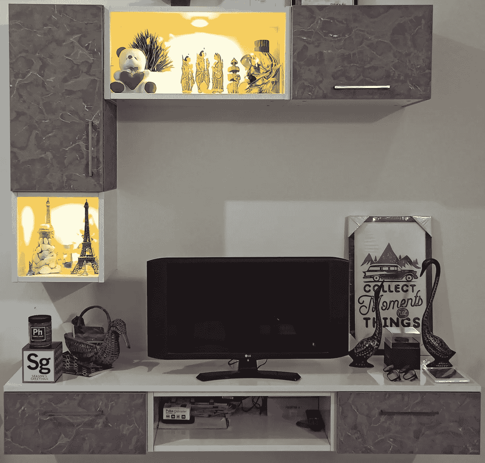
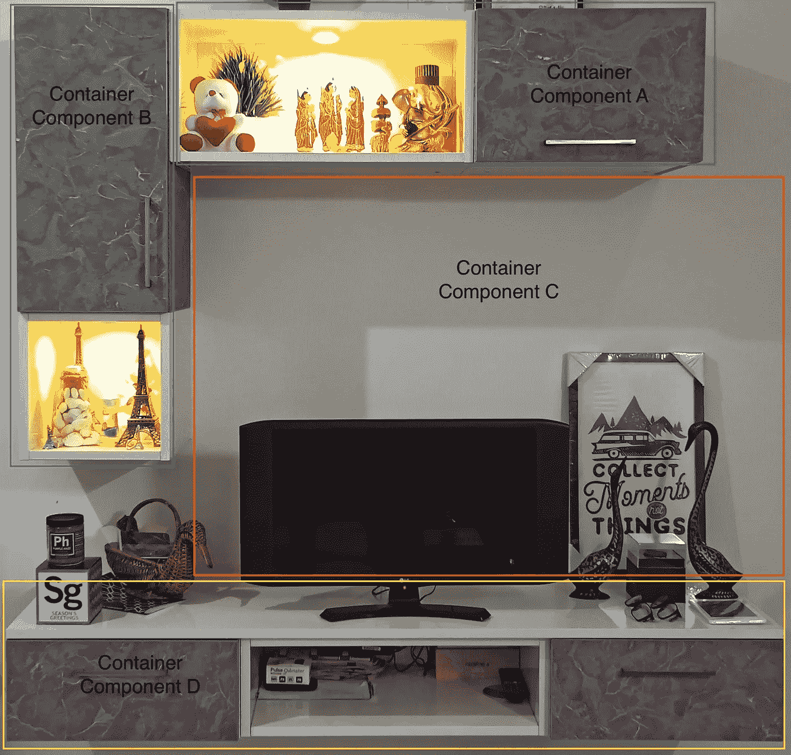
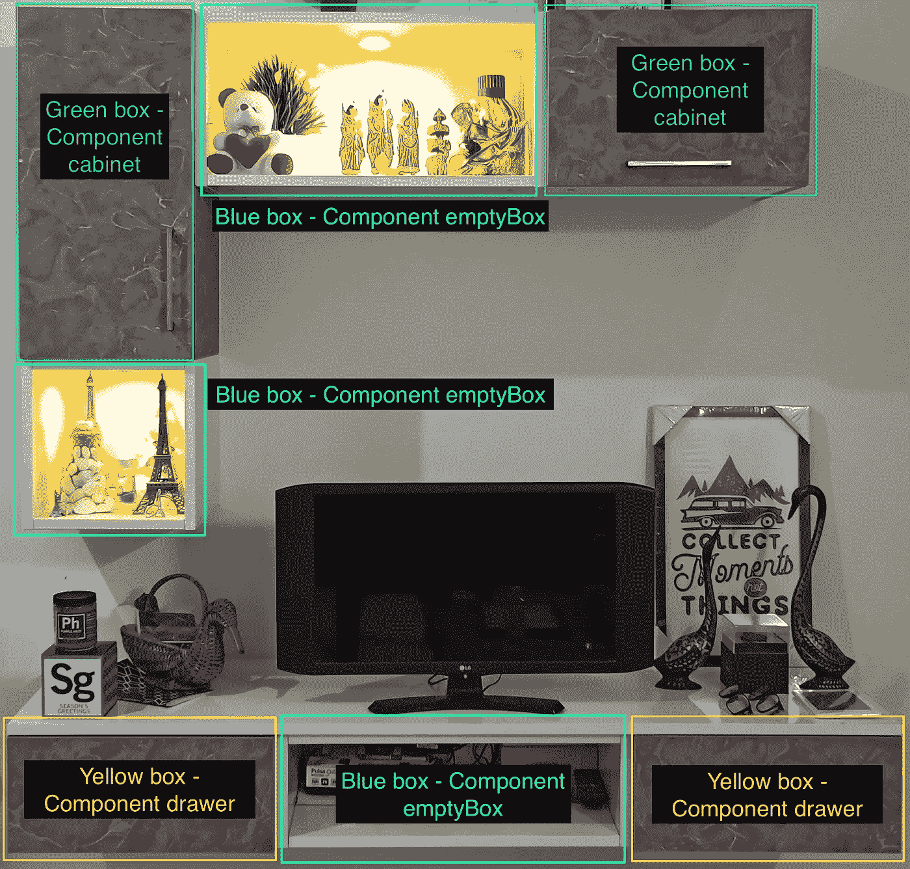
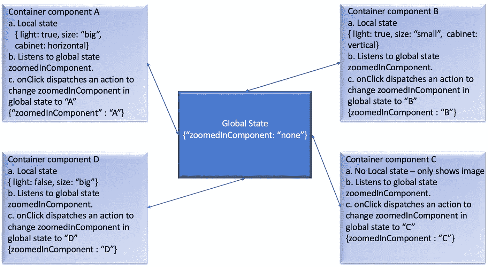

# 如何像 UI 工程师一样思考

> 原文：<https://medium.com/geekculture/how-to-think-like-a-ui-engineer-hmmm-b3aba7b64b7b?source=collection_archive---------13----------------------->

我最近和我的朋友(一位经验丰富的后端工程师)进行了一次讨论，我漫不经心地说，“*学习如何用后端编程语言编码不会花我太多时间”*😝。对此，他出人意料地回答道:“*虽然这是真的，但鉴于你已经知道如何编码，* ***需要时间的是像后端工程师一样思考*** *因为这是通过经验获得的/******数小时的调试会话*** *以及获得无数代码* ***错误*****

***这让我想到——如果这是许多刚开始 UI 开发的开发人员/工程师所面临的同样的挑战，会怎么样呢？他们可能只是不知道如何像一个 UI 工程师一样思考…
基于这一点，让我们开始这篇文章。***

***在这篇文章中，我将分享**我是如何着手**创建 UI 应用程序或特性的。我并不声称这种方法是绝对的，也不是我创造的独特的东西；这只是我设计 UI 应用程序的一种方式。
**小免责:**
1。在我的例子中，我将使用 ReactJS，但这不应该阻止您对它进行一些调整，并在您的框架或库中实现它。
2。React 中状态和道具的基本知识是先决条件。***

******

***It’s my TV unit wanted something real :P***

***让我们假设我们已经从经验丰富的设计师那里收到了这个设计。我们如何接近它？***

*****第一步:** ***创建心智模型***我们的第一个练习将是从在头脑中创建组件开始。也就是说，确定在编码时要创建的较小组件。将一起存在(在同一根下)并一起显示的组件。怎么做呢？首先把设计分成几个部分，就像这样。***

****

**Container Segregation**

**在这张图片中，我们可以看到我创建了 4 个部分，
**容器组件 A、B、C 和 d。**
想法是，当我开始编写代码时，我将首先创建 4 个容器，并将它们渲染在一起，这样我就有了完整的设计。**

**现在，有了钩子，我们不需要容器和表示组件是分开的，我们也将保持这一点，但当我们明确地将它们分开时，解释起来就变得更容易了。**

****第二步:** ***识别通用组件***
不言自明——寻找可以重用的较小组件。它们可以在你的组件文件夹中，容器会导入它们，传递道具给它们，并决定它们的外观和对用户动作的反应。让我们仔细看看。**

****

**Component visualisation**

**如图所示，我们必须创建三个组件，然后在我们的容器中重用它们。
***组件:***1。机柜:可以是**立式**或**卧式**。
2。抽屉
3。空盒:可**点亮**和**变大或变小**。**

*****容器组件:***
1。 **A** 将使用组件，**柜**即**柜**卧式**和空柜**即**柜**点燃并变大。
2。 **B** 也将使用组件，**柜**是垂直的**和空箱**是亮的和小的。
3。 **C** 将使用组件、**抽屉和大而不亮的空盒**。**

**这些组件的行为有何不同？简单，用道具。
让我们考虑组件空盒。它将接受道具****大小*** 并相应地渲染，即如果我们通过
<empty box**lights = { true } size = { " big " }**/>将渲染 **BlueBox 组件中的容器 a .** <empty box**lights = { true } size = { " small " }【T55*****

****第三步:** ***提早开始状态管理。***一旦我们有了如何构建组件的想法，那么重要的部分就来了，**状态管理**。(如果你想了解什么是状态管理，如何实现一个请 [**看看这篇文章**](https://aniketpaul1592.medium.com/state-management-of-reactjs-apps-using-usereducer-and-usecontext-e5ac85cccdaf) **)。不久前我写了这篇文章，解释了使用 useReducer 和 useContext 的 ReactJS 应用程序的状态管理。在我们开始编写代码之前，这是我们绝对需要解决的一件事，否则，随着我们的应用程序的增长，以后将不可能对它进行结构化或维护。****

**我喜欢围绕全局状态来设计组件。目的是让所有组件动作通过调度来修改全局状态，这反过来将触发重新渲染，并在这些组件上显示所需的效果。让我们考虑一个用例来更好地理解这一点。
***用例*** *:* ***点击*** *ing 组件，我们将***容器放大或者将* ***保持在*** ***缩小状态*** *。基于我们到目前为止所看到的，即单个组件的行为和用例，这是我将如何构建我的组件。****

****

**Structural design rep of components around global state**

**如上图所示，我们已经确定了什么将在本地状态，什么将从全局状态读取。
**但这如何决定呢？我遵循这条规则:只负责操纵单个或特定组件/容器行为的属性应该是本地状态的一部分。可以在所有组件之间共享的属性应该处于全局状态，这些属性决定了产品作为一个整体应该如何表现。
对于我们的例子，像**灯光**、**尺寸**和**橱柜方向(垂直和水平)**这样的道具是本地状态的一部分，因为它们决定了容器内的组件应该如何呈现。
我们只保留 **zoomedInComponent** 处于全局状态。因为这是一个可以被所有组件使用的道具。现在我们已经建立了这一点，让我们看看我们的组件将如何表现。
如上图中提到的**点 c** ， **onClick** 我们将触发一个带有 zoomedInComponent 值**的**分派。一旦修改了全局状态，订阅它的所有组件将重新呈现全局状态值的更新状态。例如，如果点击了 ComponentA，那么 zoomedInComponent 的全局状态值将变为“A ”,当 ComponentA 在下一次渲染中读取该值时，将使其 zoomIn 或 Expand。其他组件将保持现状，除非被点击。****

****第四步:*决定在哪里保存动作/效果，即函数*** 一旦你开始在一个组件或容器中处理许多链接的组件，就会出现这种情况。所发生的是，我们总是试图在根级别添加功能，并通过 props 将它们向下钻取到子组件。随着我们项目规模和功能的增加，根组件也相应膨胀，使得代码很难维护和阅读。
**我遵循的方针就是问几个问题:**
1。这个函数对要添加的组件有用吗？如果没有，我们可以把它放在组件内部实际使用的地方。
2。这个函数会是被多个组件使用的实用函数之一吗？在这种情况下，将它放在一个实用程序文件中不是很明智吗？**

**只有当我们按照上述 3 个步骤构建了代码后，才能做出这些决定。我们应该记住的一点是，由于状态管理的实现，状态和分派现在对所有组件都可用。这导致数据和操纵数据的能力在所有级别都可用。**这是巨大的**，因为它使组件更加独立，并允许我们尽可能避免支柱钻孔。**

****最后第五步:编码** 我们都知道这一步。但是我建议你只有在**理清了前三步之后才开始这一步，因为**第四步和第五步是齐头并进的。遵循编码模式，编写干净的代码，添加测试用例等。是我们都知道的一些最常见的指令，在编码时我们应该始终牢记在心。我不会对这一部分做太多的补充，因为我确信阅读这篇文章的人对这一部分非常精通，我将把这个话题留给另一篇文章😝。**

**原来如此！这就是我想分享的全部。当谈到像 UI 工程师一样思考时，这篇文章只是冰山一角。当我们真正开始编码时，还有许多其他方面需要考虑。但是本文旨在作为应用程序设计的起点。
希望你能从中发现一些价值。如果你觉得我应该添加或编辑什么，请随意在评论中发表，我很乐意接受你的反馈。**

**谢谢 n 快乐编码！！**