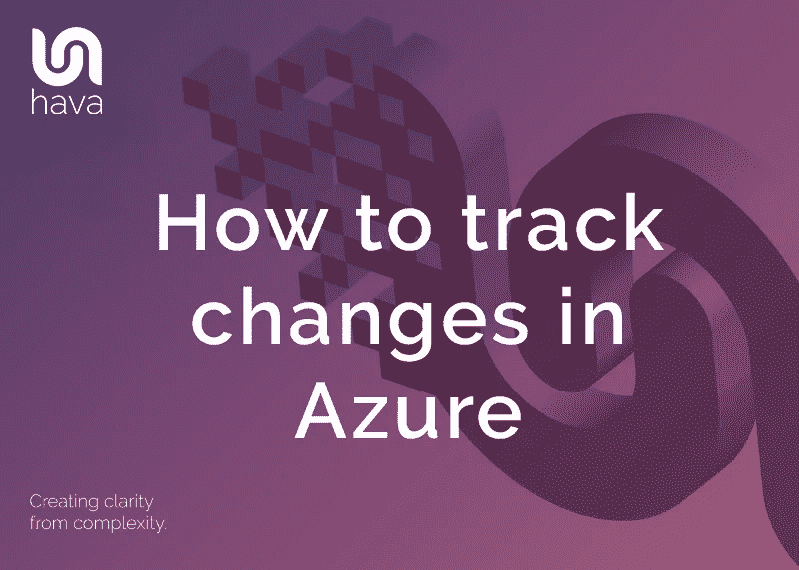
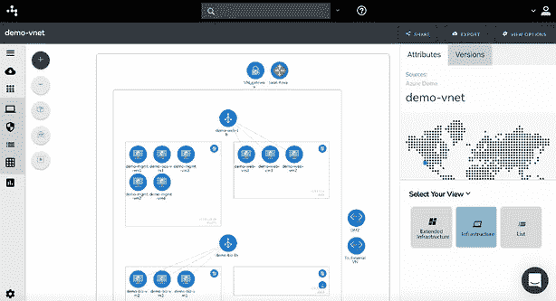
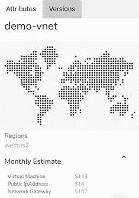
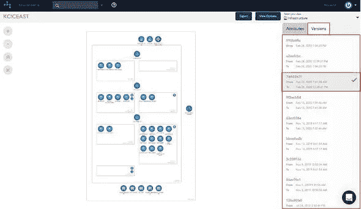
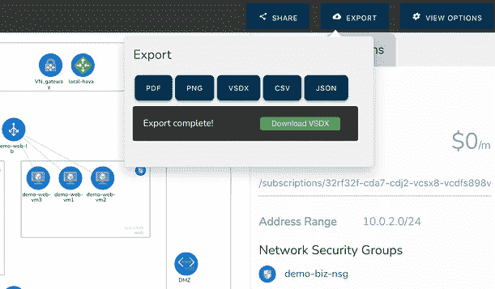
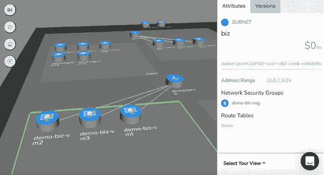
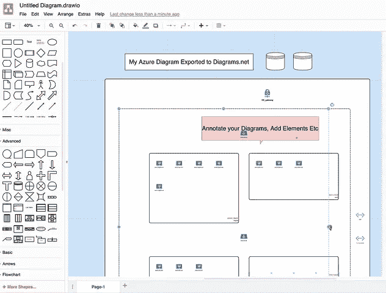

# 如何跟踪 Azure 中的变化

> 原文：<https://medium.com/geekculture/how-to-track-changes-in-azure-1581f8d27dce?source=collection_archive---------44----------------------->

当您构建或操作基于 Microsoft Azure 的应用程序时，您的主要关注点之一将是跟踪影响应用程序性能的任何更改。

无论是您手动进行的更改还是平台进行的更改，您都应该监控这些更改，以确保用户体验始终得到改善，并且不会受到网络拓扑变化的负面影响。

毫无疑问，参与云计算解决方案的任何人，从网络架构师、应用程序开发人员到 DevOps 工程师，都认识到精心设计的网络拓扑图的价值。

能够直观地展示你的人际网络有助于提高你在组织的各个层面交流人际网络的能力。您可以轻松回答以下问题:

*   配置并运行了哪些资源
*   您的数据存储在哪里
*   正在使用哪些区域或可用性区域。
*   什么是网络接入点
*   有任何负载平衡或自动伸缩吗
*   如果出现区域或可用性区域中断，是否有冗余

所有这些问题以及许多其他问题都可以通过网络拓扑图轻松得到解答。

当意想不到的问题发生时，您需要快速找出问题所在。您的团队是否发布了破坏网络的新基础架构代码。另一个项目的另一个团队破坏了你的项目吗？昨天还在的东西突然消失了还是有新的东西出现了？如果没有一个基础图来比较变化，有效地应对不利事件可能会很困难。

拥有最新的基础架构图或资源列表，可以与之前配置的快照进行比较，这为您提供了开始故障排除和解决问题的最佳位置。

如果您有自动化系统来捕获配置更改并存储以前的状态前更改图，您将总是可以随意进行可视化比较。

公平地说，预期的网络重新配置与图表和文档更新之间的延迟几乎总是比任何人预期的都要大。当然，这是假设文档得到了更新。

自动化是唯一可靠的行动方案。

当你有了代表你的 Azure 网络今天的样子和昨天的样子的坚实准确的图表时，让新的工程师或顾问快速上手就变得容易多了，尤其是在有预算压力的情况下。

拥有可视化的环境会更快、更智能、更高效，并且让新团队成员快速上手，而成本只是手动操作的一小部分。

这也适用于外部顾问。如果您引入外部云顾问来从事基础设施重新设计或安全性工作，那么他们与您的项目同步进行会产生非常明显的有形成本。任何可以减少时间的事情都有可能为你的企业节省资金，并让他们更快地推进项目。

网络性能问题和价格变化是典型的触发因素，促使人们需要了解 Azure 基础设施发生了哪些变化。如果不准确，云图是没有用的。

即使精确地创建了手动文档，它也很快会过时，尤其是在当今的动态环境中，模板化的基础架构和代码会不断地被部署，或者事件会触发自动扩展。

除了越来越动态的云网络之外，很容易错过您不知道的资源，或者包括最近被修改或删除的资源，尤其是在同一个云帐户中有多个团队在从事不同项目的情况下。

自动生成基础结构图消除了人为错误的可能性。图中的任何时间点都是正在运行的。这给了你的团队确定性。它允许您的架构师审查应用程序的构建，并确保设计的是什么，运行的是什么。它还让您的开发人员和工程师能够快速审查实施策略，以确保一切按计划进行。

当您第一次可视化您的云环境时，很可能会有您没有预料到的资源或实例。

与任何事物都无关的资源离群值。未使用的测试环境。重复的资源，或开发阶段使用的开放端口，这些端口本应被锁定，但没有被锁定。

这些异常值可能很难在管理控制台中发现，但在自动化基础架构图上可视化时会立即显现出来。如果你不知道某样东西存在，可以肯定地说你不会去寻找它。

自动化图表将揭示一切。

Hava 是一个自动化的图表解决方案，允许你跟踪 Azure 中的变化。

Azure 是许多兼容 [hava.io](https://hava.io/) 的云平台之一，hava.io 将通过只读凭证安全地连接到您的云控制台配置，以自动生成和更新如上图所示的 azure 基础架构图。

将 Hava 连接到您的 Microsoft Azure 帐户，以便您的网络拓扑图可以自动生成，这是一个相对简单的过程。

要从 Microsoft Azure 导入您的环境资源，您需要访问位于 https://portal.azure.com[的 Azure 门户网站](https://portal.azure.com)，然后创建一个新的服务原则并检索一组凭据以连接到 Hava。

一旦连接，Hava 将定期与您的 Azure 配置同步，并检测任何发现的更改。当检测到更改时，会创建一个新的图表，被取代的图表会被放入一个完全交互式的版本历史中，因此无论何时需要，您都会有一个 Azure 环境的准确的可视化表示。这就是如何跟踪 Azure 中的变化。

生成的 Microsoft Azure 图表按资源组进行布局，这些资源组通常包含在虚拟网络中运行的子网。所有的资源元数据都没有放在图表上，而是显示在图表右侧的上下文属性窗格中。

根据您的喜好，可以打开或关闭连接和资源名称。启用时，资源名称会出现在图表图标下。

这使你的 Azure 环境图保持整洁，但这允许你选择图中的交互元素，如虚拟网络、子网或单个资源，如负载平衡器、网关、虚拟机、对等连接和存储帐户。在图表上选择资源时，所有元数据和设置都显示在属性窗格中图表的右侧。元数据和设置与当前选定的元素相关。

在图表上没有选择任何内容的情况下，属性窗格显示关于整个 Azure 环境的信息，包括使用成本估计。

# 跟踪 Azure 中的变化。

版本控制是使用 Hava 作为构建管道或云工程工具包的一部分的最强大的方面之一。Hava 通过持续自动轮询您的 Azure 配置来跟踪在您的 Microsoft Azure 基础架构中检测到的更改。

一旦检测到变更，Hava 会创建一个新的图表，被取代的图表会被放入版本历史中。在任何时候，您都可以选择旧版本的网络图来查看完全交互式的网络图，而不仅仅是静态的网络图。您可以点击进入资源，检查属性和设置，并在扩展基础架构和 3D 中查看，就像您在实时图中一样。

如果您试图诊断导致应用程序失败的网络问题或更改，选择一个旧的图表集，您可以在一个单独的浏览器中打开旧版本，并排比较当前的图表，这样您就可以很容易地从视觉上发现差异。

您还可以从当前版本和旧版本中导出 CSV 或 JSON 数据，以编程方式比较图表，以显示资源或设置更改。

这就是你如何自动捕获对你的 Azure 环境所做的更改，这样你不仅可以在你需要的时候随时获得最新的图表，而且你还有一个网络更改的审计跟踪，你可以用它来跟踪 Azure 中的更改。

使用 Hava 跟踪和绘制 Azure 环境还有许多其他好处。

# AZURE 3D 图表

您的 Azure 图表也可以呈现为 3D。3D 视图具有灵活的旋转控件、倾斜控件、缩放控件和开销控件，同时图表上的元素保持交互和可选，以便图表右侧的属性窗格显示与当前所选资源或网段相关的信息。

# 你能编辑 Hava Azure 图吗？

目前在 Hava 中没有办法从头开始绘制图，或者添加或删除图元素。这是因为原生 Hava 图被设计成总是反映真相的来源。你总是可以确信你在 Hava 图上看到的准确地反映了你的 Azure 环境的真实情况。这是因为没有办法添加或删除图元素、资源和元数据，例如在安全或合规性审计期间，这些元素、资源和元数据可能会导致混淆或错误表示网络状态。

然而，我们确实理解，有时您希望使用 Hava Azure 网络图作为一些重新设计工作的起点，或者您可能希望对图表进行注释，以解释管理或销售演示中的图表元素。

为了促进这种情况，Hava 提供了:

# VISIO 的 AZURE 图表

VSDX 导出选项是使您能够以 Visio 格式导出 Microsoft Azure 基础架构图表的解决方案。然后，您可以使用 Visio 或类似 draw . io(diagrams.net)的兼容应用程序来导入图表进行操作。

这为您提供了导出的可编辑图表，同时还维护了 Hava 生态系统中保存的图表和数据的完整性，因此您在 Hava 帐户中保留了无可置疑的真实参考源，以便在 PCI 合规性、保险、安全或其他类型的审计中使用。

# MICROSOFT AZURE 网络资源列表

在标准基础设施和 3D 图表之上，还有两个 Azure 图表，只需将 Azure 帐户连接到 Hava 即可自动生成。

扩展基础架构视图与基础架构视图相同，但它向图表添加了更多信息，如完整的资源名称、IP 地址和资源大小。

最终的 Microsoft Azure 图表是“列表视图”。这个图表更像是一个报告，顾名思义，是在你的 Azure 环境中发现的所有资源的列表。

这包括在数据源配置中发现的元素，这些元素在图中没有显示出来。一些资源可能有几十个不重要的实例，如网络接口或虚拟机扩展，这对理解网络是如何构建的没有什么帮助，如果将其可视化，可能会使图表难以阅读。

列表视图是您可以找到这些资源的地方。该列表可以过滤，按名称，类型或价格排序，并导出到 CSV 格式，便于导入到可用于成本分析的电子表格中。列表视图还包括在基础设施视图上可视化的资源。

现在我们知道了，跟踪和记录 Azure 环境中的变化的最简单的方法可能是将 Hava 引入到您的云工程工具包中。

你可以在这里试用 Hava 14 天:https://www.hava.io/

*原发表于*[*https://www . hava . io*](https://www.hava.io/blog/how-to-track-changes-in-azure)*。*