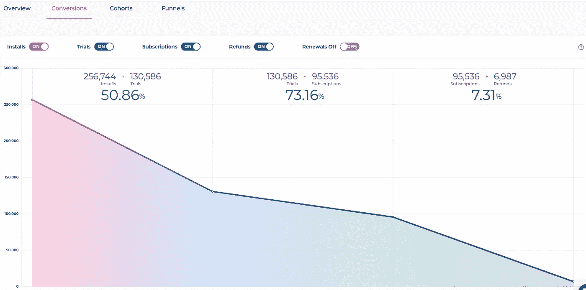

# 如何跨平台跟踪应用内订阅

> 原文：<https://medium.com/geekculture/how-to-track-in-app-subscriptions-in-cross-platforms-1f8670355f71?source=collection_archive---------18----------------------->

[Track In-app Subscriptions](https://www.appflow.ai/blog/how-to-track-in-app-subscriptions-in-cross-platforms)

# 什么是跨平台应用内订阅？

跨平台技术用于开发跨多个平台的移动应用程序。这看起来很简单，但实际上，由于不同的平台有一套独特的规则，所以有很多复杂之处。目前，部署移动应用程序有三大平台:iOS、Android 和 Web。为了实现这些平台的统一订阅流程，接口必须由[苹果的 StoreKit](https://developer.apple.com/documentation/storekit) 、 [Google Play 计费库](https://developer.android.com/google/play/billing/integrate)和一个网络支付提供商组成。通过上述平台的适当组合，跨平台订阅是可能的。

# 为什么跨平台的应用内订阅很难追踪？

我们已经看到，不同的平台被集成在一起，使这一过程成为可能，但也存在许多复杂的问题。每个平台都有自己的一套指导原则，进一步的软件更新、新功能和不断增加的订购层级将极大地增加复杂性。

不同的平台没有共同点。苹果商店工具包是用一种老化的传统技术开发的。另一方面，Google Play 计费是新的，据说更加用户友好，但 API 有限。订阅的定义没有标准化，因此不同的平台对不同的场景有不同的操作。这使得跟踪应用程序的订阅成为一项非常艰巨的任务。

# 如何跨平台追踪应用内订阅？

跟踪应用内订阅是一个非常重要的过程，但由于如上所述的不同平台的集成，跟踪这一点变得非常复杂。为了达到同样的目的，使用了以下工具和技术。

*   **归一化数据:**数据因平台而异。为了减轻跨平台所面临的各种问题和缺陷，数据需要统一。术语的定义也因平台而异。必须使用工具来确保解决所有的差异和不一致，并提供统一的数据。
*   **身份验证:**订阅和其他操作必须与正确的用户相关联。无论用户使用什么设备，这种映射都必须准确。这项功能至关重要，一旦遭到破坏，可能会给公司带来巨大的混乱和巨大的损失。
*   **权利:**权利是指用户购买的订阅、产品捆绑包和其他服务，无论是有效的还是过期的。因此，这提供了有关用户是否仍在订阅、是否已过期、是否正在续订或是否存在计费问题等信息。
*   **适应平台变化:**在跨平台的情况下，平台的变化可能会导致严重的混乱和复杂性的增加。这些变化可能会对订阅数据造成巨大影响，因此必须使用工具和技术来跟上不断发展的平台，并适应和集成新的最佳实践，从而使我们能够跟踪订阅情况。

# 内部构建应用内订阅基础设施还是使用第三方服务？

我们已经建立了跨平台订阅的概念，但我们需要了解内部方法的利弊，或者使用第三方服务，如 [Appflow.ai](https://www.appflow.ai/) 。

# 内部解决方案有各种问题，例如:

*   **开发服务器和客户端是一项持续的需求:**对于内部方法，我们只能依靠您组织中现有的资源来开发服务器和客户端引擎。与像 Appflow.ai 这样的第三方专家相比，他们缺乏专业知识和经验。
*   **需要持续的技术支持:**内部方法无法提供持续的技术支持。开发人员不能花费时间和资源来调查每个客户的需求，收集所需的数据并减少这些数据。
*   **对单个客户来说，重要性是不可估量的:**内部团队的工作是开发应用程序，而不是上面提到的客户服务，因此很少会有团队被分配去做同样的事情。由于人手严重不足，客户得不到适当的关注，因此流程缓慢且效率低下。

上述缺点说明了第三方服务的必要性，因为内部方法会使您的团队偏离对产品的关注和开发。这也有很高的违约风险。

# 使用 Appflow.ai 可以减轻上述所有缺点，如下所示:

*   **提供更好的体验:**第三方服务的方法经受住了时间的考验，并有专门的团队来分析数据和提供客户支持。
*   **Appflow.ai 确保闪电般的部署:**它拥有托管应用程序的专业知识和工具，比内部方法更快、更高效地进行部署。除此之外，集成只需要少得可怜的 1 小时。
*   **提供深度分析和开箱即用的分析:**它进行复杂的计算，并提供开发人员所需的数字。它有许多特点，如图形，图表等，提供了一个直观的图像进行比较。

Intuitive Conversions Analysis for Subscription Apps

*   **其他重要功能:**付费墙 A/B 测试、推送通知、集成和订户管理都在 Appflow.ai 的大旗下提供，使其成为跨平台跟踪和改善应用内订阅的必备应用。

# 结论

应用程序开发已经变得非常流行，并且其在多个平台中的部署已经成为高度关注的话题。仅仅在 Appstore 或 Playstore 中的个人存在已经不够了。[应用内订阅分析](https://www.appflow.ai/analytics)跨平台订阅管理平台非常复杂，但回报也很高。特别是对于移动业务中的小型创业公司，Appflow.ai 订阅管理平台将订阅分析、直观的图表、收入增长建议、快速运行实验&轻松聚集在一个地方。