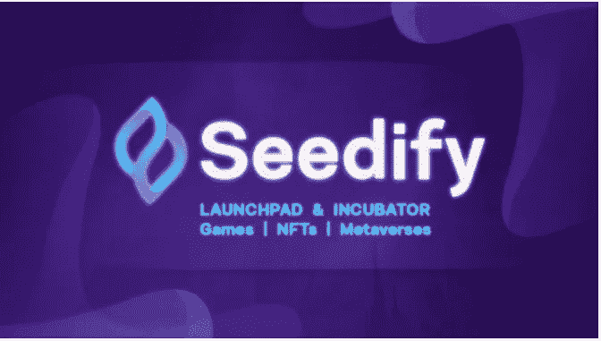
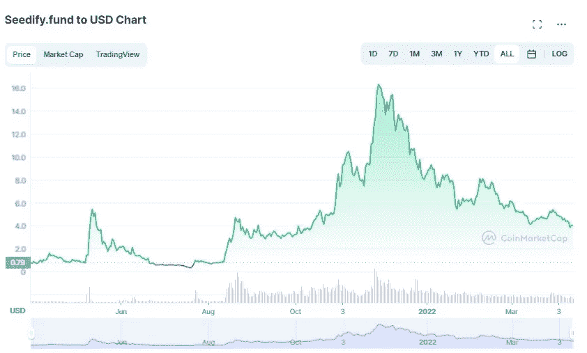
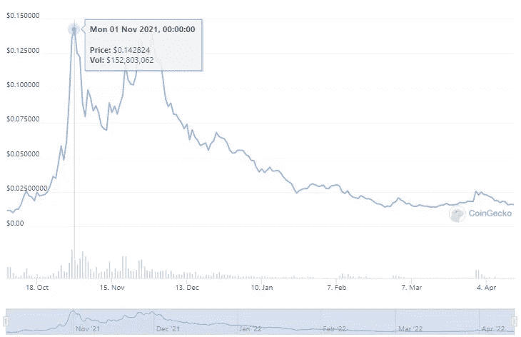

# 如何将 20 美元变成 10，000 美元投资于加密

> 原文：<https://medium.com/geekculture/how-to-turn-20-into-10-000-investing-in-crypto-c71dc67ba38f?source=collection_archive---------14----------------------->

**Image by** [**Kanchanara**](https://unsplash.com/@kanchanara) **on** [**Unsplash**](https://unsplash.com/photos/OqEPgkdX3RA)

在当前的市场环境下，很难找到一个你可以信任的项目，尤其是那些不时出现的迷因符号。

总有一天你会发现那颗未经雕琢的钻石，你就会知道是时候投资了。

当我偶然发现 Seedify 时，这正是我的遭遇。基金

一件绝对珍贵的纪念品

让我告诉你为什么…

# 什么是种子化。基金(SFUND)？

**Screenshot taken from** [**CoinMarketCap.com**](https://coinmarketcap.com/headlines/news/seedify-announces-new-ecosystem-features-and-utilities-for-its-token/)

Seedify 是一家区块链公司，致力于成为游戏的发射台和孵化器。他们的平台为新项目提供了获得资金、社区访问和全面支持的机会，以帮助推动他们的项目向前发展。

Seedify 允许投资者在新游戏首次推出时，通过分层分配系统获得新游戏。持有 SFUND 代币的人可以获得高达 90% APY 的赌注奖励、参与私人销售以及进入令人惊叹的在线社区。

Seedify 于 2021 年 3 月推出，价格为 0.71 美元，2021 年 11 月飙升至 16 美元的历史高点。Seedify 使用 BSC(币安智能链)网络来驱动其 launchpad，但此后又引入了 Solana、Eth、Avax 和 Polygon。

**Screenshot taken from** [**CoinMarketCap.com**](https://coinmarketcap.com/currencies/seedify-fund/)

# $ s 基金赌注

目前为开发商和投资者提供如此多机会的项目并不多。有这么多项目已经启动，但距离完全开发甚至投入使用还有几个月的时间。

Seedify 成功地为每个参与者提供了一个绝佳的机会。

$SFUND 代币的持有者有机会通过他们的网站下注。Seedify 目前提供多达 6 种不同的赌注选项，从 7 天到 180 天不等。

在你下注的时间内，每次下注的当前回报都会增加，

7 天— 5% APY

14 天— 11% APY

30 天— 25% APY

60 天— 55% APY

90 天— 75% APY

180 天— 90% APY

举例来说，如果你在 90 天内下注 1000 美元，那么你将获得 185 美元的回报。

按照现在 4 美元的价格，你会得到 740 美元的回报…

如果价格回到 16 美元的历史高点，那就是 3000 美元左右的回报！

# SEEDIFY 发射台

Seedify 的 launchpad 使用分层分配系统，允许 SFUND 持有者有机会购买每个 IGO。为了确保您有保证的访问权限，您必须拥有 1000 个令牌。你拥有的代币越多，你就可以在每个项目上投入越多。

迄今为止，Seedify 自推出以来已经推出了 45 个 IGO，几乎每次推出都有惊人的投资回报率。

Blocktopia 在 Seedify 的 launchpad 上推出，价格为 0.00025 美元。

在 2021 年 10 月的 ATH 上，BLOK 的价格达到了 0.14 美元。

**Screenshot taken from** [**CoinGecko.com**](https://www.coingecko.com/en/coins/bloktopia)

这意味着投资 20 美元的投资回报率将超过 10，000 美元

还有什么项目能提供这样的回报？

# 让社区团结起来

Seedify 在网上建立了一个令人惊叹的社区，在 Telegram 上也建立了一个非常活跃的社区。我喜欢每天与持有者和粉丝互动的项目，Seedify 就是这样做的。

这个项目一直在寻找反馈，以帮助改善 Seedify 的流程。这给社区一种感觉，他们是旅程的一部分，并且这个项目将会长期存在。

看到 Seedify 在他们的 IGO 日历中推出多少新的游戏项目总是令人兴奋的。它让我相信这个项目想要大规模地交付高质量的项目。

# 最后的想法

Seedify 只会继续长期增长，并有助于为加密游戏市场带来大规模采用。

还有其他像 Seedify 这样的启动平台，但我相信有了他们背后令人惊叹的团队，Seedify 将继续成为领先的孵化器。

重要的是不要看这个令牌的当前价格，因为它没有反映它提供的效用。代币的价格会随着市场的变化而上下浮动。

美元成本平均和赌注将使您能够为未来的 IGO 获得更高层次的分配，从而获得更大的投资回报潜力。

问候，

欧文