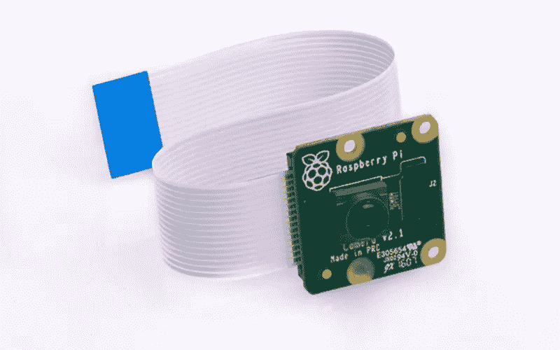

# 如何将你的树莓派变成网络摄像头

> 原文：<https://medium.com/geekculture/how-to-turn-your-raspberry-pi-into-a-webcam-a8bf775edfb6?source=collection_archive---------11----------------------->

## 带有摄像头模块的树莓派可能是一个很好的网络摄像头替代品

The Raspberry Pi camera module, image from [raspberrypi.org](https://www.raspberrypi.org/products/camera-module-v2/)

视频会议已经成为我们许多人的日常活动。在疫情的逼迫下，大多数公司、教育机构和组织不得不将会议从一个星期转移到另一个星期。正因为如此，对网络摄像头的需求增加了…