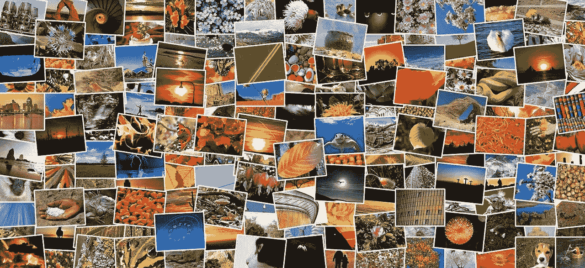

# 如何单元测试自动生成的图像

> 原文：<https://medium.com/geekculture/how-to-unit-test-automatically-generated-images-e8cd1fb668a8?source=collection_archive---------15----------------------->

## 通过匹配它们的校验和，可以很容易地比较两个图像

L et me 向你展示如何 TDD 一个惊人的新特性，这个特性不久前被添加到 [PHP Chess](https://php-chess.readthedocs.io/en/latest/) 库中。我指的是一组`[Chess\Image](https://php-chess.readthedocs.io/en/latest/image-board-to-png/)`类，其主要目的是从一个特定的`[Chess\Board](https://php-chess.readthedocs.io/en/latest/board/)`对象创建令人惊叹的图像。这样棋手可以下载和…