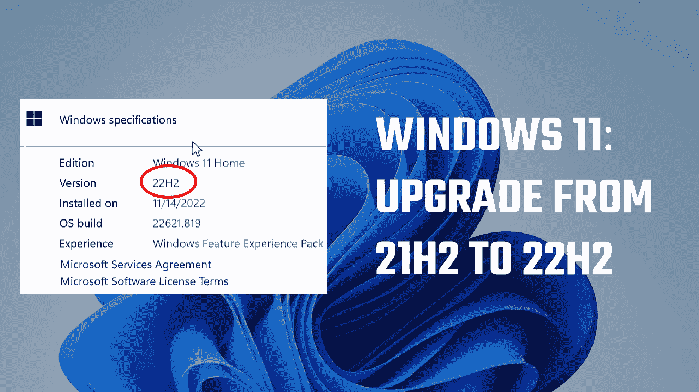

# 如何手动将 windows 11 从 21H2 更新到 22H2？

> 原文：<https://medium.com/geekculture/how-to-update-windows-11-from-21h2-to-22h2-manually-375a51edada1?source=collection_archive---------3----------------------->

升级过程中不会丢失任何文件或应用程序

在本文中，您将了解如何将您的 Windows 11 版本升级到最新版本，即从 21H2 升级到 22H2。由于某种原因，windows 并没有给出 Win 11 最新版本的更新，尽管 PC 支持 Windows 11。因此，对于那些没有收到 Windows 更新通知的用户，我们将了解…