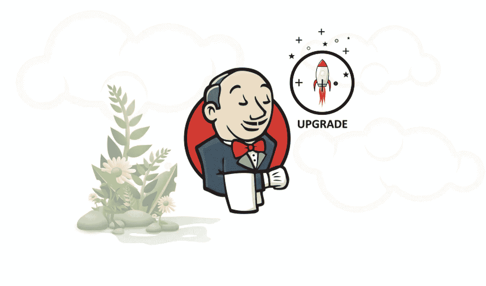

# 如何在 Windows/Linux 服务器上升级 Jenkins

> 原文：<https://medium.com/geekculture/how-to-upgrade-jenkins-on-windows-linux-server-b7d4526abc31?source=collection_archive---------0----------------------->

Jenkins CI 工具简介

> 快速介绍

Jenkins 是一个开源自动化服务器，也称为持续集成工具。它有助于自动化与构建、测试和部署相关的软件开发部分，促进持续集成和持续交付。

如果您不熟悉持续集成、交付或部署背后的概念；我推荐你阅读我写的关于如何建立持续集成交付(CI/CD)的文章。

## 提示和建议

> ****为了生命周期管理的最佳实践，我建议每年或每季度将您的 Jenkins 实例升级到最新的 LTS 版本 4 次。*** 长期支持(LTS)发布基线每 12 周从定期发布流中选择一次。每隔 4 周，我们发布稳定的版本，其中包括错误和安全修复。
> 
> ****从 Jenkins 2.357(2022 年 6 月 28 日发布)和即将到来的 9 月 LTS 发布开始，Jenkins 需要 Java 11。***
> 
> ****此外，从詹金斯 2.355(2022 年 6 月 14 日发布)和詹金斯 2 . 346 . 1 LTS(2022 年 6 月 22 日发布)开始，詹金斯支持 Java 17。***
> 
> ****插件已经在 JENKINS-68446 中准备好了。使用插件管理器升级到 Jenkins 2.357 前后的所有插件。***

# 下载詹金斯

Jenkins 作为 WAR 文件、本地包、安装程序和 Docker 映像分发。在本文中，我将分享我关于如何使用 WAR 文件升级 Jenkins 实例的意见。这个[詹金斯战争档案可以在这里找到](https://www.jenkins.io/download/)。

1.  下载前，请花点时间回顾一下[硬件和软件要求](https://www.jenkins.io/doc/book/installing/#prerequisites)。
2.  选择一个最新的 LTS 版本的 WAR 包，并按照下载说明进行操作。
3.  下载完 Jenkins 包后，继续安装 Jenkins

# 升级 Jenkins

本文中的过程用于使用 WAR 包升级现有的 Jenkins 实例。



**image source:** [**digitalvarys.com**](https://digitalvarys.com/upgrading-jenkins-post-upgrade-activities/)

*   Jenkins 通常作为一个独立的应用程序在它自己的进程中运行，带有内置的 [Java servlet](https://stackoverflow.com/questions/7213541/what-is-java-servlet) 容器/应用服务器( [Jetty](https://www.eclipse.org/jetty/) )。
*   Jenkins 也可以在不同的 Java servlet 容器中作为 servlet 运行，如 [Apache Tomcat](https://tomcat.apache.org/) 或 [GlassFish](https://javaee.github.io/glassfish/) 。

但是，本文不包含设置这些类型的安装的说明。

# Windows 上的升级实施步骤

升级运行在 Windows 服务器上的 Jenkins 实例的过程非常简单:

1.  转到服务并停止 Jenkins 服务
2.  转到安装 Jenkins 实例的位置
3.  →将 ***war*** 文件夹重命名为 ***war.old***
4.  →将 ***jenkins.war*** 文件重命名为***Jenkins . war . old***
5.  将你下载的***new jenkins . war***复制到你的 Jenkins 安装目录下
6.  启动 Jenkins 服务
7.  →观察新的 war 目录的创建，该目录现在将包含新的 jenkins.war 档案的内容

导航到 Jenkins 的主页，此时您将被告知 Jenkins 正在准备您的安装。完成后，测试现有作业以验证兼容性

# Linux 上的升级实施步骤

**1。停止詹金斯服务**

```
#Stop running Jenkins service using the following command:sudo su -
service jenkins stop
```

**2。将 Jenkins 实例备份作为恢复选项**

```
#Take backup of Jenkins home directory. In my case my Jenkins home directory is /var/lib/jenkins.cd /var/lib
tar -cvzf jenkins_date.tar.gz jenkins/
mv jenkins_date.tar.gz $HOME
```

**3。备份当前 Jenkins 版本的二进制文件**

```
#Take the backup of Jenkins current version binary using following commands:cd /usr/share/jenkins
mv jenkins.war jenkins.war.old
```

**4。下载新的 LTS 詹金斯版本**

```
#Download the new version of Jenkins WAR file using the following commands:wget [https://updates.jenkins-ci.org/latest/jenkins.war](https://updates.jenkins-ci.org/latest/jenkins.war)
```

**5。启动詹金斯服务**

```
#Start the Jenkins service using the following command:

service jenkins start
```

# 插件问题疑难解答

Jenkins 可能会启动，但在 Jenkins 网页上出现多个异常错误。

*   从查看**詹金斯日志文件**开始

在大多数情况下，要解决这个问题:

1.  停止詹金斯服务
2.  →将 ***config.xml*** 文件重命名为***config . XML . old***——这将禁用认证和其他配置。
3.  启动 Jenkins 服务→将创建一个新的配置文件
4.  Jenkins 将在没有登录页面的情况下启动→转到管理插件并更新所有插件
5.  回到服务器→停止 Jenkins 服务
6.  →将当前创建的 ***config.xml*** 文件重命名为***config . XML . new***
7.  →将您最初定制的***config . XML . old***文件重命名为 ***config.xml***
8.  启动 Jenkins 服务——这应该会打开 Jenkins 页面，一切都按预期运行

# 升级后任务

*   升级后，登录到 Jenkins UI，确认在右下角看到新的版本号。
*   通过菜单导航至“管理 Jenkins ”,并对显示的任何通知采取行动——插件、数据格式转换等。
*   几天后一切都按预期运行→删除 ***jenkins.war.bak*** 文件和 ***war.bak*** 文件夹

> *如果您喜欢这篇文章，您可能也会喜欢；*如何在 Jenkins 上安装/更新 open JDK

> 干杯！！