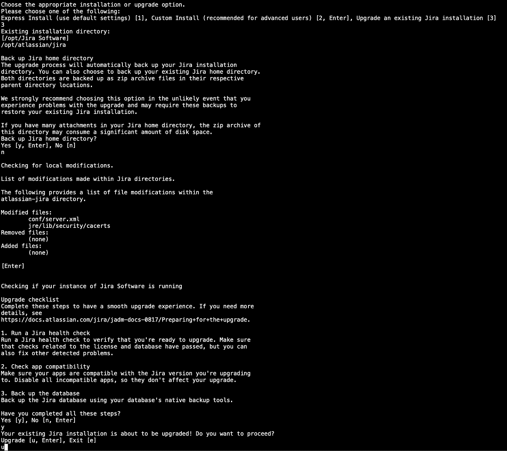
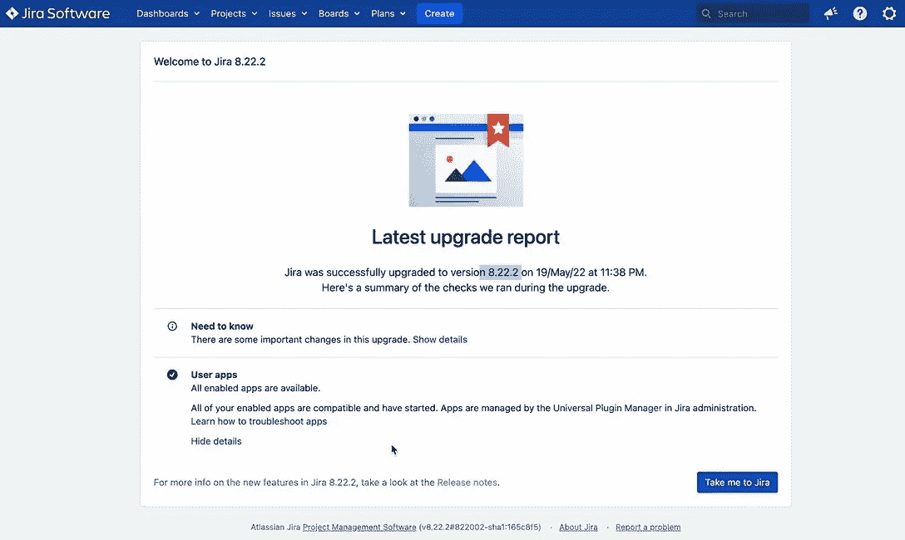

# 如何在 Windows 和 Linux 服务器上升级吉拉

> 原文：<https://medium.com/geekculture/how-to-upgrade-jira-on-windows-linux-server-2ab10fbb3196?source=collection_archive---------10----------------------->

Atlassian 应用程序入门|吉拉| Linux 服务器

让我们先快速回顾一下，Atlassian 是一家软件公司，它开发了多种工具和产品，广泛应用于 IT 行业。IT 团队/组织使用的一些受欢迎的产品有:

*   吉拉→用于项目管理和问题跟踪。
*   Bitbucket →使用 Git 版本控制的源代码管理。
*   汇流→用于文档
*   Bamboo →一个 CI/CD 工具，与 Bitbucket 很好地集成在一起
*   ops genie→IT 运营团队的事件警报工具
*   Trello →协作工具
*   人群→单一登录和身份管理工具

要了解更多信息，请查看他们的[软件产品](https://www.atlassian.com/software)，他们正在开发一些好东西。

因此，在本文中，我将一步一步地分享如何升级吉拉应用程序，无论您是在 Windows 还是 Linux 服务器上运行您的实例。

# 假设和建议

在大多数组织中，这些工具由 IT 运营团队维护，无论是基础设施、开发运维还是站点可靠性工程团队。

*   请务必将吉拉升级至其最新的 LTS 版本，以获取最新的安全补丁和更新的功能。基于 Atlassian 的新版本发布频率和适当的生命周期管理，这些 Atlassian 应用程序。我建议每季度升级一次吉拉，或者一年升级 4 次
*   出于本文的目的，我假设您熟悉这些应用程序的安装、设置和配置。

# Linux 服务器上的吉拉升级


Image source: [praecipio.com](https://www.praecipio.com/resources/blog/why-upgrade-your-atlassian-stack)

## 准备升级的步骤

1.  下载你要升级到的 LTS 版 JIRA:【https://www.atlassian.com/software/jira/download-archives】T2

*   将 Linux 安装程序文件移动到服务器上的主目录中:

```
scp ./atlassian-jira-software-X.X.X-x64.bin root@yourServer:/home/xx
```

*   将文件从您的主目录移动到 Atlassian 安装文件夹→运行以下命令检查吉拉安装文件夹(默认的吉拉安装文件夹是:/opt/Atlassian/jira) →

```
# get jira installation folder
ps -ef | grep -i jira# move the new installer file to the jira installation folder
mv /home/yourHomeFolder/atlassian-jira-software-X.X.X-x64.bin /opt/Atlassian/
```

*   确保文件是可执行的，如果不是，运行以下命令:

```
chmod +x /opt/atlassian/atlassian-jira-software-X.X.X-x64.bin
```

2.验证所有插件都是最新的

*   登录吉拉管理菜单→进入管理应用程序→查看它们是否是需要更新的插件

3.Vefiry 插件与您正在升级的版本兼容。

*   管理应用程序→插件列表下→转到吉拉更新检查
*   按照 Atlassian 的建议运行“规划您的升级”,以验证我们当前使用的吉拉版本不会出现任何错误。

4.完成运行状况检查，以确保当前许可证或数据库没有问题。

*   管理菜单→系统→故障排除和支持工具

更多关于这次准备的信息可以在这里找到:[准备升级](https://confluence.atlassian.com/adminjiraserver/preparing-for-the-upgrade-966063325.html#:~:text=Go%20to%20Administration%20(%20)%20%3E%20Manage,upgrade%20to%2C%20and%20click%20Check)。一旦你完成了所有这些，你的应用程序就可以升级了。

## 升级实施步骤

1.  拍摄 Linux 虚拟机服务器的快照。
2.  对吉拉数据库做个完整备份。
3.  进入插件管理并更新所有需要更新的插件→大多数情况下，更新插件需要重新索引，根据需要执行重新索引

*   根据您在准备阶段所做的更新检查建议，更新可以更新的插件，并禁用其他插件。
*   吉拉管理菜单→系统→索引→并执行完全重新索引

> **以上步骤非常重要，如果您需要恢复物品，应正确执行。**
> 
> **注意:吉拉主目录和吉拉安装目录是两个不同的文件夹。确保您已经查看了这两个文件夹的内容**

4.制作以下当前文件的副本:

```
# this is for your JVM settings and configs
setenv.sh → located here: /opt/atlassian/jira/bin/setenv.sh# this is a for your server configs 
server.xml → located here: /opt/atlassian/jira/conf/server.xml
```

*   通常，在安装过程中，只会修改吉拉安装目录的内容，而不会修改吉拉主目录的内容。但是最好是安全的，然后抱歉，所以只需要做这两个文件的副本

```
# this is for your app Database configs
dbconfig.xml → located here: /yourJiraHomeDirectory/dbconfig.xmllimits.conf → located here: /etc/security/limits.conf
```

5.吉拉站→服务吉拉站

7.通过运行以下命令，制作当前吉拉的副本:

```
cd /opt/atlassian/cp -Rp ./jira ./jira.old
```

## 安装新的吉拉版本

8.运行新的安装程序文件→确保文件所有权是 root:

```
# chnaging file ownership to root
chown root:root ./atlassian-jira-software-X.X.X-x64.bin# run the new installer
./atlassian-jira-software-X.X.X-x64.bin
```

*   按照如下所示的提示进行操作:



9. ***成功完成安装后，暂时不要启动吉拉***

*   验证配置。如果 xml 文件发生了更改，则在升级后不会更改。还原(db config . XML—limits . conf—setenv . sh—server . XML)

**然后启动吉拉，等待仪表盘可用→** service jira start

# 解决纷争

如果遇到一些错误，请在退出前尝试排除故障。遇到任何问题时检查日志:

*   tail-30f/opt/atlassian/jira/logs/catalina . out
*   查看*。可能已经更改的 xml 文件
*   如果你遇到插件问题，而吉拉没有启动→启动吉拉，禁用所有插件

```
/opt/atlassian/bin/start-jira.sh --disable-all-addons
```

*   打开`***setenv.sh***`文件，确保相对于您的 RAM 分配了合适的或推荐的 JVM 内存

# 退出升级

如果吉拉升级失败，所有故障排除工作都将失败，您将无法正常运行新版本。您可以使用我们在第 7 步中创建的吉拉文件夹副本来恢复之前的版本，该版本可以正常工作。

请执行以下操作:

*   吉拉站→服务吉拉站

```
cd /opt/Atlassian# rename the current new jira folder
mv ./jira ./jira.new# rename the older jira folder
mv /jira.old ./jira
```

*   启动吉拉→服务吉拉启动

如果您仍然遇到问题，只需从您在步骤 1 中拍摄的快照将您的 Linux server VM 恢复到升级前的状态，检查一下，准备好再次尝试时再试一次。如果一切顺利，您将得到如下所示的页面:



Jira Upgrade successfully page

> 如果您在 windows 服务器上运行吉拉实例，请查看如何在 Windows 服务器上升级吉拉的第二部分。

> 干杯！！