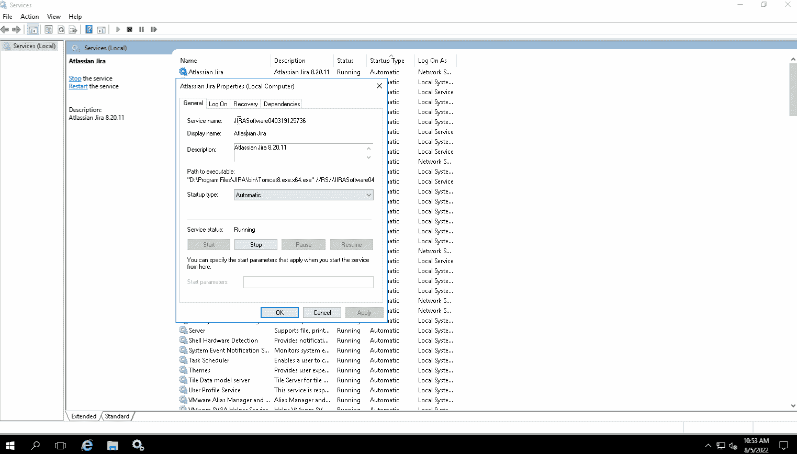
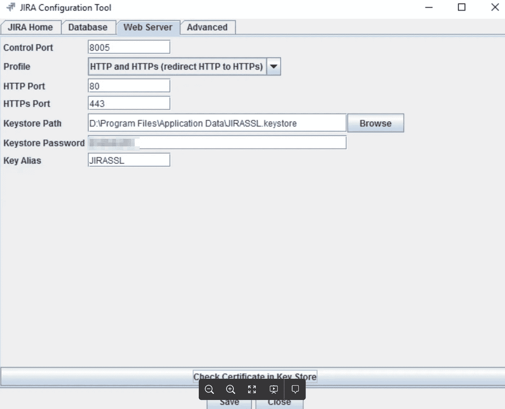

# 如何在 Windows 和 Linux 服务器上升级吉拉|第二部分

> 原文：<https://medium.com/geekculture/how-to-upgrade-jira-on-windows-linux-server-part-ii-a3c9e4b73b96?source=collection_archive---------12----------------------->

Atlassian 应用程序入门|吉拉| Windows Server

所以在上一篇文章中，我们经历了在 Linux 服务器上升级吉拉的过程。接下来，我们将探讨如何升级运行在 windows 服务器上的吉拉实例。

# 假设和建议

在大多数组织中，这些工具由 IT 运营团队维护，无论是基础设施、开发运维还是站点可靠性工程团队。

*   请务必将吉拉升级至其最新的 LTS 版本，以获取最新的安全补丁和更新的功能。基于 Atlassian 的新版本发布频率和适当的生命周期管理，这些 Atlassian 应用程序。我建议每季度升级一次吉拉，或者一年升级 4 次
*   出于本文的目的，我假设您熟悉这些应用程序的安装、设置和配置。

# Windows Server 上的吉拉升级


Image source: Jira

## 准备升级的步骤

1.  在你的吉拉服务器上，下载你要升级到的 LTS 版 Jira 软件:[https://www.atlassian.com/software/jira/download](https://www.atlassian.com/software/jira/download)

2.验证所有插件都是最新的

*   登录吉拉管理菜单→进入管理应用程序→查看它们是否是需要更新的插件

3.Vefiry 插件与您正在升级的版本兼容。

*   管理应用程序→插件列表下→转到吉拉更新检查
*   按照 Atlassian 的建议运行“规划您的升级”,以验证我们当前使用的吉拉版本不会出现任何错误。

4.完成运行状况检查，以确保当前许可证或数据库没有问题。

*   管理菜单→系统→故障排除和支持工具

更多关于这次准备的信息可以在这里找到:[准备升级](https://confluence.atlassian.com/adminjiraserver/preparing-for-the-upgrade-966063325.html#:~:text=Go%20to%20Administration%20(%20)%20%3E%20Manage,upgrade%20to%2C%20and%20click%20Check)。一旦你完成了所有这些，你的应用程序就可以升级了。

## 升级实施步骤

1.  拍摄 Linux 虚拟机服务器的快照。
2.  对吉拉数据库做个完整备份。
3.  进入插件管理并更新所有需要更新的插件→大多数情况下，更新插件需要重新索引，根据需要执行重新索引

*   根据您在准备阶段所做的更新检查建议，更新可以更新的插件，并禁用其他插件。
*   吉拉管理菜单→系统→索引→并执行完全重新索引

> **以上步骤非常重要，如果你需要恢复东西，应该正确执行。**
> 
> **注意:吉拉主目录和吉拉安装目录是两个不同的文件夹。确保您已经查看了这两个文件夹的内容**

4.查看您的 JVM 配置和设置并拍摄截图:

```
# Go to your Jira installation directory. In my case, 
# Jira is running on my D dire -- D:\Program Files\JIRA             # Open cmd, go to the bin folfer and run the following command:Cd D:\Program Files\JIRA\bin
tomcat8w //ES//JIRA_service_name
```



Review JVM configs

5.停止 JIRA 的服务

6.从安装目录中复制以下文件:

```
# this is for your application settings and configsserver.xml → located here: D:\Program Files\JIRA\conf       
cacerts → located here: D:\Program Files\JIRA\jre\lib\security         
web.xml → located here: D:\Program Files\JIRA\atlassian-jia\WEB-INF
```

*   通常，在安装过程中，只会修改吉拉安装目录的内容，而不会修改吉拉主目录的内容。但是安全总比后悔好，所以也只需要复制这两个文件:

```
# this is for your application DB and SSL configs, for me both those
# files and located in my Jira Home directory 
# -- D:\Program Files\Application Datadbconfig.xml → located here: D:\Program Files\Application Data
JIRASSL.keystore → located here: D:\Program Files\Application Data
```

7.以管理员身份运行新的安装程序，并按照提示进行操作。

*   ***安装成功后，暂时不要启动吉拉***

8.查看步骤 4 中的配置 JVM 内存设置

9.在吉拉配置工具上查看您的 Web 服务器设置

*   转到 D:\程序文件\ JIRA \斌和运行配置.蝙蝠打开和审查吉拉配置工具。看起来像这样:



10.比较并验证。您在步骤 6 中备份的 XML 文件( ***server.xml 特指*** )没有改变，或者只是用以下文件替换它们:

*   server . XML-web . XML-cacerts

**然后启动吉拉，等待仪表盘可用**

# 解决纷争

如果遇到一些错误，请在退出前尝试排除故障。要在遇到任何问题时检查日志，请以管理员身份打开***PowerShell ISE***:

*   转到您的吉拉主目录并检查日志
*   在我的情况下→ cd。\程序文件\应用程序数据\日志'
*   运行: ***获取-内容。\ atlassian-jira . log-Wait-Tail 30***

升级后，验证项目是否出现问题:

*   如果您确实运行了新的重新索引→验证项目有活动的问题，并且项目板正在显示
*   返回“管理应用”—验证没有其他插件需要更新。

# 清除插件缓存

请执行以下操作:

*   关闭 JIRA
*   删除以下隐藏的插件缓存目录:

```
* Stop Jira
* Delete the following hidden plugin cache directories:
  - JIRA_HOME/plugins/.bundled-plugins 
  - JIRA_HOME/plugins/.osgi-plugins
* Start Jira
(These directories will be recreated on JIRA reboot with a new plugin cache)
```

# 退出升级

如果吉拉升级失败，所有故障排除工作都将失败，并且您无法让新版本正常运行:

*   只需从您在步骤 1 中拍摄的快照，将 Windows server 虚拟机从升级前的状态恢复即可
*   回顾事情，当你准备好再试一次的时候再试一次。

如果一切顺利，您将得到如下所示的页面:


> 如果你在 Linux 服务器上运行你的吉拉实例，看看第一部分 [**如何在 Windows 服务器上升级吉拉**](/geekculture/how-to-upgrade-jira-on-windows-linux-server-2ab10fbb3196) 。

> 干杯！！