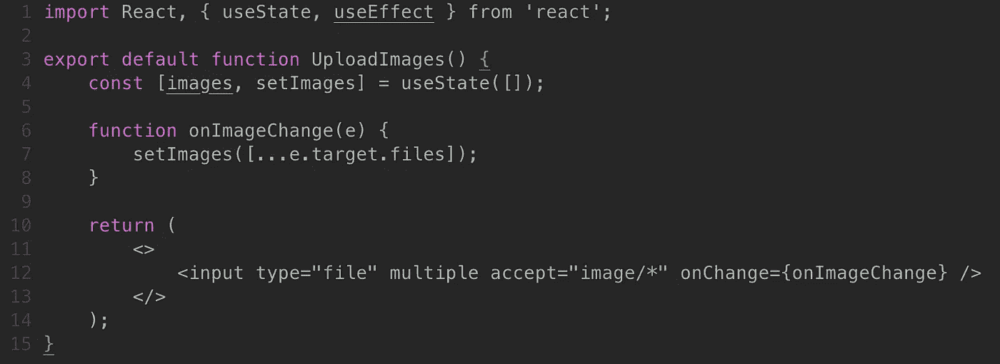
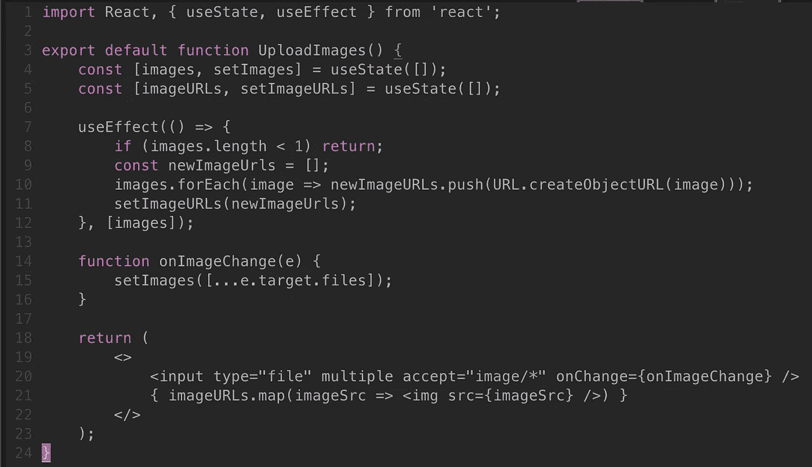

# 如何在 React 中上传和预览图片？射流研究…

> 原文：<https://medium.com/geekculture/how-to-upload-and-preview-images-in-react-js-4e22a903f3db?source=collection_archive---------0----------------------->


在这篇文章中，我们将讨论如何允许用户上传图片到你的应用程序中，然后我们如何在你的应用程序中预览这些图片。这个基础也将允许你做更复杂的任务，因为你将可以访问图像，并可以将它们发送到你的后端服务，或在前端操作它们。

*注意:我不会在本教程中重复造型，纯粹是逻辑上的*

# 首先，让我们为我们的用户创建一个上传图像的方式



## 上面片段的分解

所以上面的代码看起来应该很熟悉，但是在进入下一步之前，让我们先浏览一下。

在我们的渲染函数中，我们需要为用户设置一个标签进行交互。

```
<input type="file" multiple accept="image/*" onChange={onImageChange} />
```

我们设置一个文件类型的输入，多接受设置为任何图像类型，所以一个用户可以上传多个图像。在上传时，它将运行我们称为 onImageChange 的处理函数。

最后，我们的处理函数 **onImageChange** 非常简单，我们通过事件对象访问文件，然后将它们存储在我们的状态中。

# 现在让我们创建一种方法来将这些图像呈现到我们的应用程序中



## 上面片段的分解

因此，在上面的代码片段中，我们保留了上一个代码片段中的相同代码，并添加到它上面。你可以把这个逻辑分离成它自己的组件，主要的事情是应该利用 **useEffect 钩子**来改变**图像**。

因此，通过这一点，它应该再次是最熟悉的一个例外。

```
URL.createObjectURL(image);
```

URL 是 Javascript 中的一个标准对象，它有一个很棒的方法叫做 **createObjectURL** 。该方法接收一个图像对象，然后返回该图像的临时本地源的字符串。*请注意，在页面重新加载或重新呈现时，必须重新构建这些字符串*

> [**正式文档为 URL.createObjectURL()**](https://developer.mozilla.org/en-US/docs/Web/API/URL/createObjectURL)

好了，现在我们已经清除了这个可怕的方法，剩下的代码就很简单了。

我们使用 useEffect 钩子来查找 images 数组中的变化，当它检测到变化时，我们首先想看看是否有图像要转换成字符串。

```
// You can have dynamic bounds, for instance if you have a cap
if (images.length < 1 || images.length > yourCap) return; 
```

然后，如果你的边界内有图像，我们将开始把它们添加到一个临时数组中，以收集这些 URL 字符串。

```
images.forEach(image => newImageURLs.push(URL.createObjectURL(image)));
```

最后，我们只需使用一个简单的地图功能来呈现给用户！

```
{ imageURLs.map(imageSrc => ) }
```

这真的是它的全部！感谢您的阅读，我希望这能让您在 React.JS 中使用用户上传的图片有一个好的开始。