# 如何从抖音上传数据到谷歌大查询

> 原文：<https://medium.com/geekculture/how-to-upload-data-from-tiktok-to-google-bigquery-fc44604ffa67?source=collection_archive---------12----------------------->

## 本文介绍了如何将数据从抖音上传到数据存储，哪个选项是最好的，以及专家推荐的方法。

在数字广告领域，脸书、Instagram 和 Twitter 是众所周知的市场巨头。尽管抖音几年前才上市，但它已经和这些老牌公司不相上下了。抖音社交网络发展迅速，当然，其庞大的受众吸引了广告商。对于营销人员来说，从抖音导出数据可以比较抖音广告与其他渠道的效果，从而轻松找出哪些活动带来更多收入，以及如何分配广告预算。

今天的抖音不仅仅是一个娱乐平台，还是一个成熟的推广业务的广告渠道。它是全球第六大最受欢迎的社交网络，拥有大约 10 亿月活跃用户。公司(主要是 B2C)利用抖音来吸引顾客，提高品牌知名度，促进销售，建立观众忠诚度。

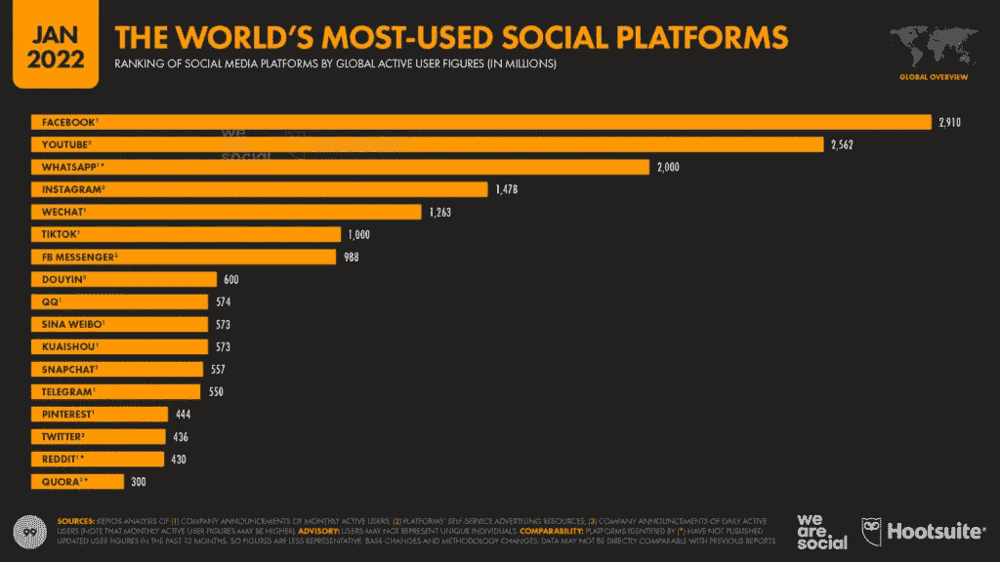

Source: [wearesocial](https://wearesocial.com/uk/blog/2022/01/digital-2022/)

该平台的广告覆盖面也继续大幅增长。根据字节跳动发布的数据，抖音的广告覆盖范围在短短 90 天内增加了 6000 万用户(+7.3%)，到 2022 年初，在全球范围内达到大约[8.85 亿用户](https://datareportal.com/reports/digital-2022-tiktok-headlines)。此外，这个数字还不包括 18 岁以下的用户，他们在抖音活跃用户总数中占了很大一部分。营销人员可以将广告瞄准 13 岁及以上的抖音用户。

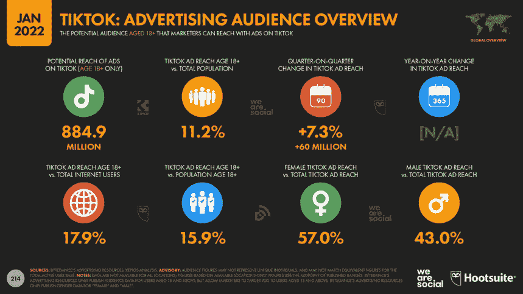

Source: [wearesocial](https://wearesocial.com/uk/blog/2022/01/digital-2022/)

抖音受欢迎的主要原因包括:

*   竞争相对较低(这个社交网络比竞争对手年轻得多)
*   广泛的推广机会(通过博客公关，廉价的推广服务，社交网络的流量等。)
*   在用户中迅速增长的受欢迎程度
*   抖音用户的主要年龄范围是大约 65%是 18-36 岁，这意味着抖音有一个有偿付能力的成年观众。

# 在哪里可以看到抖音广告统计数据

你可以在抖音应用程序本身和你的[抖音广告经理](https://ads.tiktok.com/i18n/signup)账户中查看抖音广告的统计数据。如果你的目标是促进销售而不是用户活动，最好在广告管理器中运行和分析广告。在广告账户中，有更多的技术能力和指标用于建立活动和处理数据。

默认情况下，抖音广告管理器会提供覆盖范围、浏览量、点击量、广告支出等数据。如果你在你的网站上安装一个抖音像素，并配置事件跟踪，你可以发现用户在点击应用程序中的广告后，他们在网站上的行为。

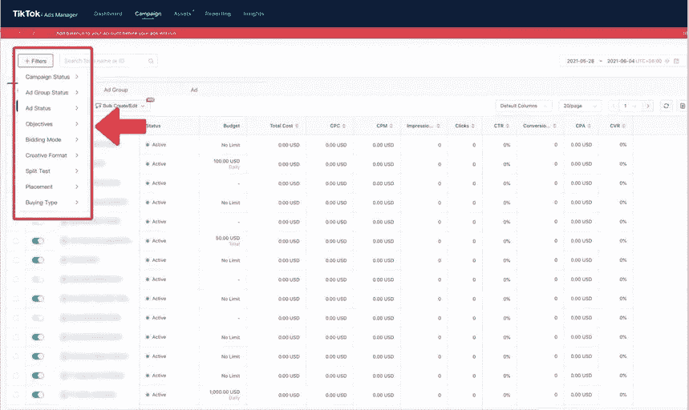

Image by Author

存储在广告管理器中的信息只告诉你抖音源的有效性。但是，如果用户从有机流量中找到你，回到你的网站，点击抖音的链接，并在收到电子邮件后进行购买，会怎么样呢？在这种情况下，你如何评估抖音渠道的有效性？在合并营销数据之前，您不会知道它如何与其他营销来源交互，以及它们如何相互影响您的业务。

许多公司的营销不仅限于抖音，销售可以在网上和网下进行。因此，有必要将来自抖音广告管理器的数据与来自网站、其他广告服务和 CRM 系统的数据合并。对于营销人员来说，要了解全局，了解在广告上花了多少钱，并确定哪些广告渠道是最有效的，他们需要应用像 OWOX BI 这样的 ETL 工具。

[OWOX BI](https://www.owox.com/) 是一个 ETL 平台，从抖音广告中导出数据，监控数据质量，转换和清理数据，并上传到 Google BigQuery。因此，您拥有一个自动化的数据流，来自所有营销广告来源的现成数据集被转换为一个整体结构。

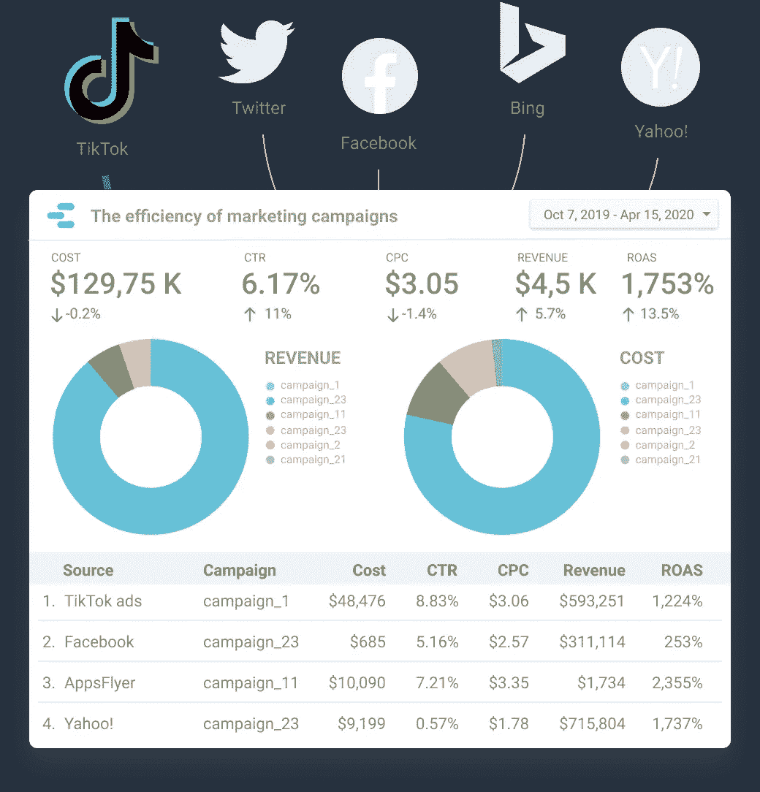

Image by Author

借助 OWOX BI，您可以在不浪费时间和资源的情况下加快决策速度:

*   只需点击几下鼠标，即可从抖音导出数据。
*   自动合并来自您使用的营销来源的数据(OWOX BI 提供 135 个以上的数据连接器)。
*   从抖音直接获取数据到你的谷歌大查询项目。
*   在任何可视化服务中可视化数据，并获得强大的洞察力。

# 为什么要在数据仓库中收集来自抖音的原始数据？

通过将广告服务的成本数据上传到一个数据仓库，您可以将它与网站上的用户操作、电子邮件中的链接点击以及 CRM 系统中的购买订单相关联。这有助于您建立高级分析，并评估所有营销工作对业务指标的影响，无论是在线还是离线。

上传到存储库的来自营销服务的数据可用于根据属性模型执行计算，并且结果可用于自动投标管理。您还可以根据合并的数据和属性计算的结果创建用户受众，然后自动将这些受众发送给广告服务。最后，您可以根据数据仓库中收集的数据，不受任何限制地构建任何您需要的报告。

## 为什么谷歌大查询，而不是另一个数据存储？

最受欢迎的云平台是亚马逊红移、谷歌 BigQuery 和微软 Azure。与传统数据存储相比，它们有着共同的优势:

*   当负载增加时，不需要安装服务器和连接新的服务器。云存储会自动扩展。
*   云平台运行速度比传统存储更快，并自动重新分配负载。
*   要进入云存储，不需要在电脑上安装服务器。打开浏览器进入云端就够了。

[我们选择 Google BigQuery](https://www.owox.com/blog/articles/why-gbq-perfect-data-lake/) 的原因如下:

*   谷歌是营销人员数据来源数量的领导者:广告、分析、搜索控制台和 YouTube。所有这些服务都与 BigQuery 无缝集成。
*   BigQuery 高速处理大型数据阵列。
*   不需要数据库管理员的帮助，很容易上手 BigQuery。在 Google Cloud 里创建一个账号就够了。
*   您只需为您使用的服务付费。
*   有现成的服务和解决方案可以在不需要开发者帮助的情况下将数据上传到 Google BigQuery。

## 从抖音向 Google BigQuery 导入数据的方法

谷歌 BigQuery 没有内置的从抖音广告管理器导入数据的工具。您可以通过手动上传数据、编写自己的脚本或使用 OWOX BI 等专门服务来解决这个问题。让我们来看看这些方法。

## 1.手动导入数据或创建自己的解决方案

你可以从抖音广告账户下载费用数据到单独的文件，并通过 BigQuery 界面手动上传。这种方法的缺点是显而易见的:大量的额外工作，没有自动化。

您也可以编写自己的脚本，从抖音上传您需要的数据。缺点是这些脚本的工作必须不断地被监控和支持。你需要花费开发人员的资源来合并来自不同账户和不同日期的数据，检查其质量，并快速响应广告服务 API 中可能的变化。此外，如果抖音广告中的数据发生变化，则必须进行追溯更新，必须将所有广告来源的费用转换为单一货币，等等。如果没有做到这一点，质量差的数据可能会导致错误的决策，使企业付出高昂的代价。

## 2.将广告账户的费用数据直接导入 Google BigQuery

OWOX BI 有一条来自抖音的直接数据管道。您可以将所有抖音营销活动的原始数据上传到 BigQuery，为您的报告提供高数据粒度。

将抖音与 Google BigQuery 直接整合有什么优势？OWOX BI 提供了现成的解决方案，因此您不必手动执行任何操作。数据按原样上传，即尽可能原始，这允许您进一步将其转换为任何方便的外观。

如果抖音 Ads 中的数据在过去一段时间内发生了变化，OWOX BI 会更新上传到 BigQuery 的数据。此外，如果需要，您可以上传 API 中任何可用期间的历史数据。这将有助于您长期评估活动。

## 如何使用 OWOX BI 设置从抖音到 Google BigQuery 的成本数据导入

1.确保你的广告链接有 UTM 标签。

2.打开 [OWOX BI](https://bi.owox.com/ui/projects/trial/) ，在管道段点击新建管道 **:**

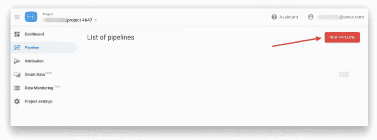

Image by Author

3.选择 TikTok 作为您的数据源 **:**

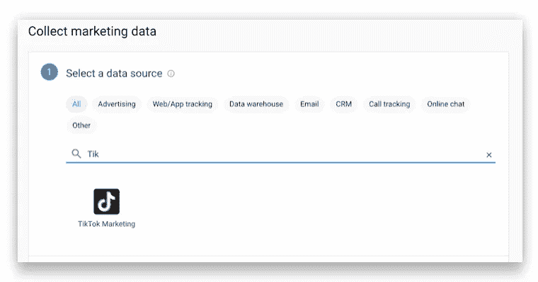

Image by Author

4.选择 **Google BigQuery** 作为数据导入的目的服务:

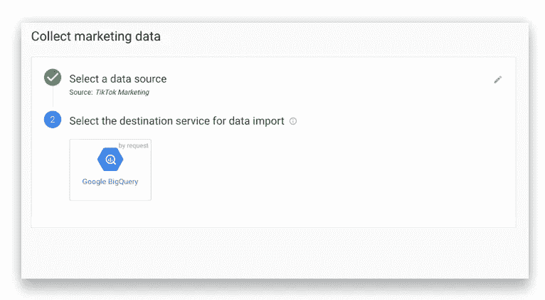

Image by Author

*如果你在 Google BigQuery 中没有项目，在本文* *中学习如何入门云存储并创建数据集* [*。*](https://www.owox.com/blog/use-cases/bigquery-schema/)

5.提交配置数据导入的请求，OWOX 团队将与您联系。如果您有任何问题，请写在申请表的备注部分。

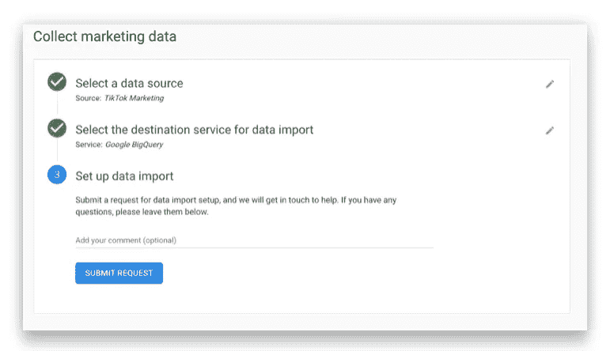

Image by Author

OWOX 专家建立管道后，前一天的数据将在每天 00:00 (UTC)开始出现在您指定的表中。根据数据量和广告服务 API 的特性，导入数据可能需要 24 小时。

如果广告账户中的数据发生追溯性变化，OWOX BI 将在已建立的[更新窗口](https://support.owox.com/hc/en-us/articles/360056770692)内更新上传至 BigQuery 的所有数据。

输出将是 Google BigQuery 中包含来自抖音 API 的数据的表列表:

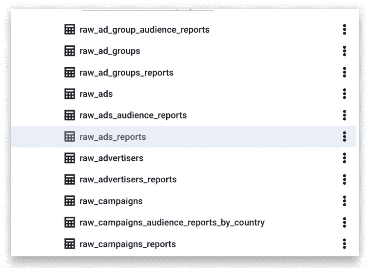

Image by Author

包含抖音原始数据的表格示例:

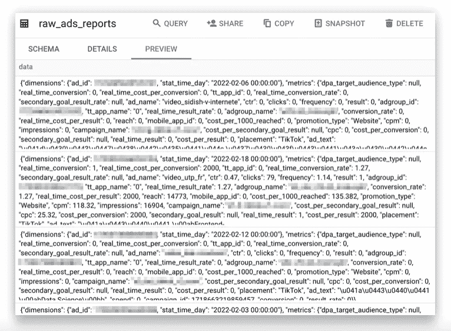

Image by Author

使用 SQL 查询，您可以使用所需的参数和指标从原始数据构建任何表:

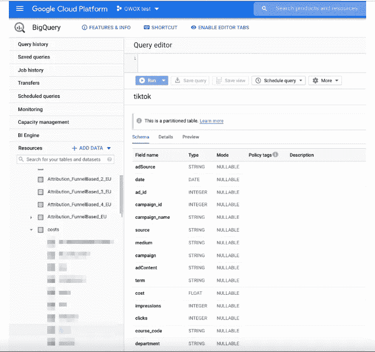

Image by Author

# 关键要点

抖音广告管理和网络分析系统可以分析抖音广告的主要性能指标:点击率，点击费，注册会计师，CR，会话，观看深度，跳出率，RPC，ROAS。对于广告渠道不多的小企业来说，这就足够了。

如果您有许多客户接触点或线下商店，并且您希望看到整个客户购买路径，那么值得考虑设置高级分析并创建一个自动更新的仪表板，其中包含您感兴趣的所有指标。它可以让你随时掌握最新的数据，对你的广告效果进行全面评估，并迅速做出关键决定。