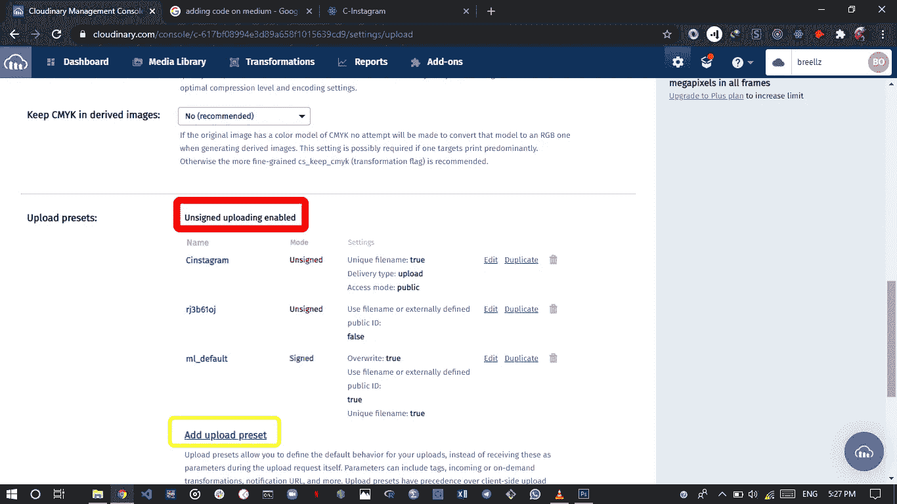
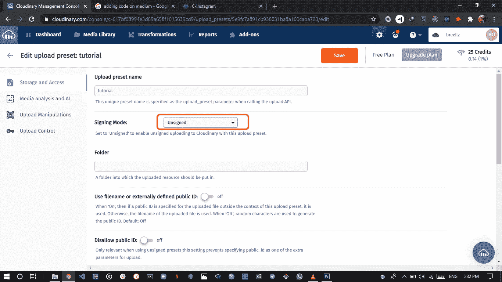
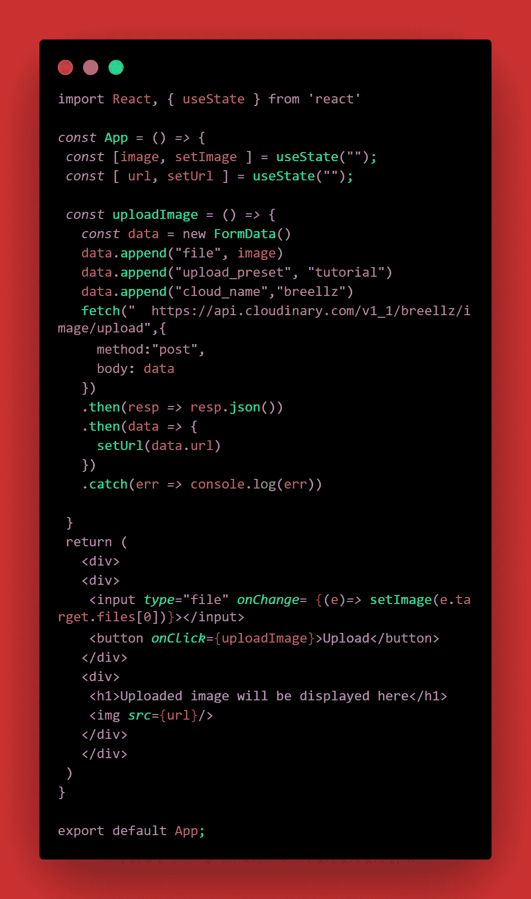
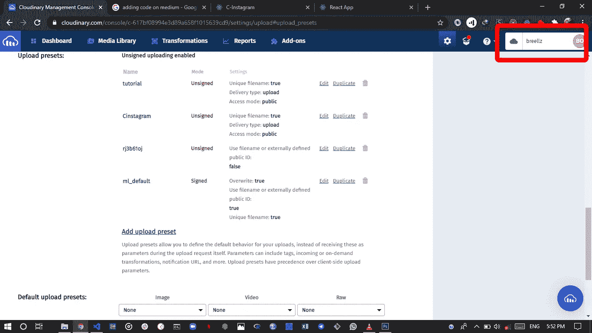
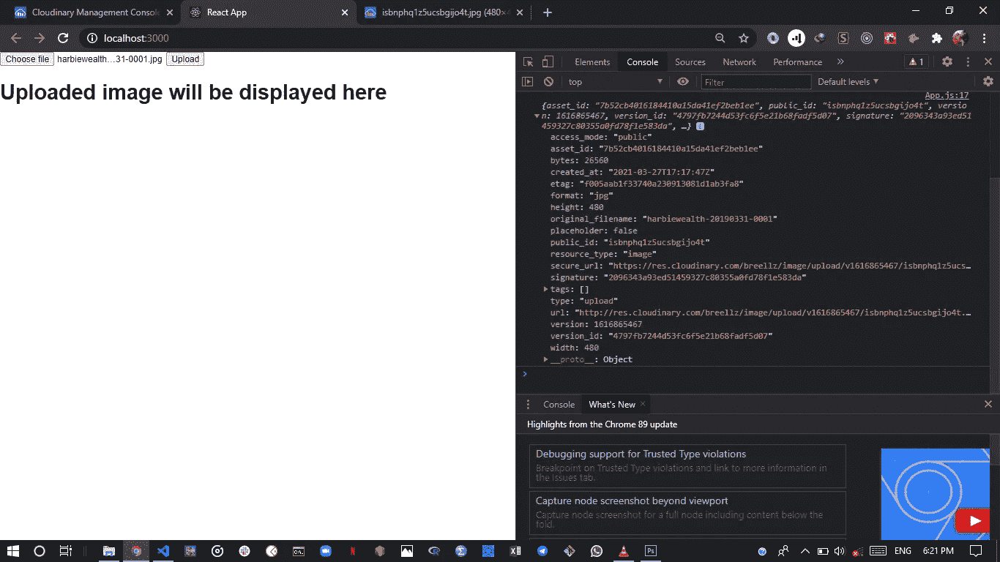

# 如何使用 React 应用程序将图像上传到 Cloudinary

> 原文：<https://medium.com/geekculture/how-to-upload-images-to-cloudinary-with-a-react-app-f0dcc357999c?source=collection_archive---------0----------------------->


# 介绍

有时，在处理需要使用图像的应用程序时，将图像上传到服务器这样的简单过程会变得非常困难。Cloudinary 使这一点非常容易实现。我们可以直接从前端上传和管理图像。在本文中，我将向您展示如何为图片上传过程创建和设置您的 cloudinary 帐户以及如何从 react web 应用程序上传图片的一步一步的过程。

# 先决条件

*   对 javascript 的基本理解
*   React 的基础知识
*   您机器上安装的最新版本的 nodejs
*   React 的最新版本
*   含糊不清的叙述

## 1.创建和设置您的 cloudinary 帐户

前往 [Cloudinary](https://cloudinary.com) 。创建一个新帐户或登录帐户(如果您已经有一个)。登录后，你的主页应该如下图所示。继续点击**上传**


向下滚动到**启用未签名上传**的位置，点击启用。你会注意到我已经启用了我的。



点击**添加上传预设。**这有助于您定义上传的默认行为。



在**上传预设名称**中填入您选择的任何名称，然后将签名模式更改为**未签名。**这允许您在未经授权的情况下上传。

单击“保存”,我们现在就完成了。记下您的上传预设名称，因为稍后会用到它。

**2。设置反应**

运行以下命令，使用您选择的终端在几秒钟内创建您的 react 应用程序

```
npx create-react-app react-image-app
```

运行此命令将目录更改到您刚刚创建的文件夹中，并启动它

```
cd react-image-app && npm start
```

现在我们已经设置好了 react，用下面的代码替换您的 app.js 文件



```
import React, { useState } from 'react'*const* App = () *=>* {*const* [image, setImage ] = useState("");*const* [ url, setUrl ] = useState(""); *const* uploadImage = () *=>* {*const* data = new FormData()data.append("file", image)data.append("upload_preset", "tutorial")data.append("cloud_name","breellz") fetch("  https://api.cloudinary.com/v1_1/breellz/image/upload",{method:"post",body: data}).then(resp *=>* resp.json()).then(data *=>* {setUrl(data.url)}).catch(err *=>* console.log(err))}return (<div><div><input *type*="file" *onChange*= {(e)*=>* setImage(e.target.files[0])}></input><button *onClick*={uploadImage}>Upload</button></div><div><h1>Uploaded image will be displayed here</h1></div></div>)}export default App;
```

我不会把重点放在造型上，原谅我，因为最终产品看起来真的很可笑。所以你可以随心所欲地设计风格。

**下面是代码解释**

```
import React, { useState } from 'react'*const* App = () *=>* {*const* [image, setImage ] = useState("");*const* [ url, setUrl ] = useState("");
```

useState 是一个 react 挂钩，允许您向函数组件添加 react 状态。这里有两种使用状态，一种用于保存要上传的图像，另一种用于保存上传到 cloudinary 后的图像 url。

```
*const* uploadImage = () *=>* {*const* data = new FormData()data.append("file", image)data.append("upload_preset", "tutorial")data.append("cloud_name","breellz")
```

单击上传按钮后，将调用 uploadImage 函数。`**FormData**`接口提供了一种方法，可以很容易地构造一组表示表单字段及其值的键/值对，然后可以很容易地将它们发送到服务器。你可以在这里阅读更多关于那个[的内容。](https://developer.mozilla.org/en-US/docs/Web/API/FormData)

我在 formData 上使用 append 方法创建了一个键/值对。指向**图像的文件。****upload _ preset**值是我在设置您的 cloudinary 帐户时要求您记录的上传预置名称。您的云名称可以在您的 cloudinary 仪表盘上找到。请查看以下说明。



```
fetch(" https://api.cloudinary.com/v1_1/breellz/image/upload",{method:"post",body: data}).then(resp *=>* resp.json()).then(data *=>* {setUrl(data.url)}).catch(err *=>* console.log(err))}
```

然后，我们向 cloudinary endpoint 发出一个 post 请求，请求体是数据。前往你的 cloudinary 主页，在账户详情下点击**更多**


找到您的 Api 基本 url，复制它，因为这是我们将向其发出请求的 cloudinary 端点。然后你添加'/image/upload '，就像我在上面的代码中做的那样。


发出请求后，我们将响应转换为 json，然后将 url 设置为 data.url

```
console.log(data)
```

这将向您显示响应对象，您将看到图像 url 位于 url 属性中，如下所示。您可以使用 url 或 secure_url 属性。



然后，如果有任何错误，我们会将其记录到控制台。

```
return (<div><div><input *type*="file" *onChange*= {(e)*=>* setImage(e.target.files[0])}></input><button *onClick*={uploadImage}>Upload</button></div><div><h1>Uploaded image will be displayed here</h1></div></div>)}export default App;
```

我为文件上传创建了一个输入标签，并从我们的 useState 钩子中将 onChange 属性设置为 **setImage** 。这确保了每当有一个文件被选择时，我们的状态被更新，并且 **image(从 useState 析构)**保存在 **e.target.files[0]** 中找到的新文件。

每当单击按钮并且图像上传过程开始时，按钮上的 onclick 属性就调用该函数。

# 结论

如您所见，这是一种非常简单直接的方式来处理上传到服务器的图像。

如果你觉得这有用，请鼓掌，如果你有任何问题或建议，请随意发表评论

感谢阅读。