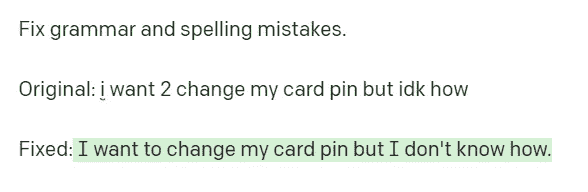
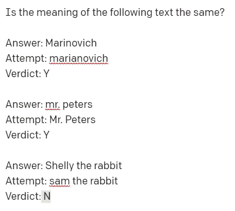

# 如何在银行业使用 AI

> 原文：<https://medium.com/geekculture/how-to-use-ai-in-the-banking-industry-edc440a47475?source=collection_archive---------7----------------------->

## 银行业到处都是唾手可得的果实。你可以永远改变它——通过人工智能的聪明、有目的的应用。以下是方法。

人工智能正在改变游戏规则。软件现在可以比普通人快几千倍的速度[写](https://1secondcopy.com/)、[画](https://1secondpainting.com/)、 [*工作*、](http://nicksaraev.com)，并且质量与人类不可区分——但是大多数人还没有完全处理这种影响。

**这代表着一个机会**。大企业和监管机构将需要数年时间来解决这个问题，而你可以利用市场的空白来改善你的业务，赚更多的钱，并让你的生活变得轻松。

在这个系列中([，我也将把它变成一个时事通讯](https://nicksaraev.com/))，目标是用简单、真实的方式将人工智能应用到各种行业。我列举了一些例子，并向你展示了一些具体的步骤，你可以通过这些步骤来提高你的效率。我也接受请求。本周的行业是**银行业**。

所以，不再废话:让我们进入一些人工智能商业想法。

# 银行业中的人工智能

银行业充满了运用现代人工智能的机会。目前，遗留系统陈旧、效率低下，并且经常需要大量的周转时间(如 ACH 转账),这些系统已经不再适用。

以下是你可以在银行业使用人工智能的一些方式，无论你是出纳员、管理员、程序员、抵押贷款保险商还是高管:

# 1.用一个(实际上很好的)人工智能聊天机器人消除 80%的简单冗余查询

我们越来越多的网上银行系统的一个巨大的低效点是当客户需要额外的帮助时会发生什么。很自然地，你会求助于亲临银行或电话银行。

## 老办法

如果是在现场，你需要亲自出马，可能需要一个小时或更长时间，只是为了排队等候，并与出纳员或代表交谈，使用你已经尝试过的相同系统来解决你的问题。

如果是通过电话，那么你通常要等上一个小时或更长时间，等待工业化程度较低的国家的代表来讨论如何解决你的问题，顺便说一下，价格非常便宜。这在不同程度上起作用。

## 新的改进方法

不要误解我:这些问题中的一些确实需要人类的帮助。我估计在 20%左右。然而，这些查询中的大部分非常简单，以至于针对常见查询训练的定制文本生成算法可以以定制的、真实的方式做出响应，成功率超过 90%。

类似于“我如何做*【在此插入简单的在线任务】*”这样的问题或者“为什么我的余额显示 *x* ？”非常简单，使用灵活的人工智能而不是大多数银行目前使用的严格、程序化的聊天机器人是如此微不足道，以至于我很惊讶大多数公司还没有这样做。在银行业使用人工智能可能是最容易实现的。

这将提供:

1.  一定程度的定制可能会提高客户满意度得分，
2.  能够灵活应对可能措辞不当或包含大量拼写/语法错误的问题

这很容易做到:使用像 [AI21Labs](https://www.ai21.com/) 或 [OpenAI](https://beta.openai.com/) 这样的公司已经提供的功能来微调定制模型，并将程序聊天机器人当前使用的所有查询发送给这些 AI APIs。为了进行培训，您需要以 JSON 格式准备一些常见问题和答案的列表(即使是最普通的行政助理也可能需要几个小时)。

为了进一步提高这种方法的质量，您可以通过自然语言的“更正”提示来传递传入的查询，如下所示:

然后，将结果(我想更改我的卡 pin 但不知道如何更改)输入到您的定制模型中。我认为一个开发者可以在几个小时内集成这样的东西。

# 2.个性化推广银行外联

没有什么比一封模板化的、大量发送的电子邮件或来自银行的信件更让我头疼的了。他们显然*试图*突出情感，使用“尊贵的顾客”、“忠诚的客户”之类的词语，我不得不称赞他们——他们*确实在任何交流的开头插入了我的名字(“你好，尼克！”).*

但是这是可以做到的*所以*要好得多。我马上想到:

*   让出纳员、贷款顾问或抵押贷款专家写*一句*关于你正在使用的古老银行系统的“关系”字段中的个人重要信息。
*   例:*喜欢足球*，*开了个温哥华天气的玩笑*，*担心儿子的婚事*。任何简短、随意或重要的东西都可以。
*   然后，通过 AI 文本生成 API 使用如下提示来传输结果:
*   当然，它并不完美——你可以做大量的即时工程来使它变得更好——但添加一个提醒他们现实生活联系的个人句子已经使它超越了。这是在银行业中使用人工智能的一种肯定有效的简单方法。

顺便说一句，你显然可以为几十个不同的行业这样做——电子邮件无疑将成为这份和未来简讯的一大块。

# 3.用人工智能简化银行安全问题

你母亲的娘家姓是什么？你在哪条街上长大的？

如果你不记得每一个字母——包括标点、大写和语法不一致——你要到下周才能看到你的钱。

这种方法显然不够灵活，需要改进，*特别是*考虑到在解决这种性质的问题时占用了多少人力和客户服务支持时间。我估计安全问题至少占所有客户服务查询的 10%(如果错了，很乐意被银行高管纠正)。

这是你如何使用人工智能的:

*   当然是保留问题。像以前一样，将他们的结果存储在数据库中。
*   下次需要身份验证时(即通常会问这些问题的地方)，通过“正常化”提示传递客户的输入。这样的提示看起来像这样
*   当然，你可以训练一个定制的模型，也许有一百个规范化实例，而不仅仅是我上面提供的两个。这里的目的是捕捉所提供答案的“含义”,而不是精确匹配每个字符。
*   现在，您拥有了一个灵活的系统，能够立即处理大部分安全问题客户支持请求:拼写错误或语法错误。

注意:这自然会增加欺诈成功的次数。这就是当你让*的任何*安检程序变得更加宽松时会发生的事情。

但是，银行是资本家。也许是最好的资本家。他们可以轻松地做出以下成本/收益决策:客户服务请求减少 10%带来的财务收益是否超过每周欺诈案件的轻微增加？我个人的观点是肯定的(但是，我也很想听听银行家的观点)。

# 银行业的人工智能:结论

**人工智能在银行业还有数百种其他用途。**

事实上，大银行已经在运营中雇佣了相当数量的人工智能；例如，他们使用经过严格审核的算法来验证信用卡交易，并利用统计数据来模拟投资表现。

但是到了 2022 年，我们的工具箱里会有更多的技术。使用我上面描述的灵活的 NLP 方法，银行可以很容易地节省 10%或更多的营销和客户支持费用。

简而言之，这三种方法是:

1.  **使用在定制知识库上训练的大型语言模型( [GPT-3](https://beta.openai.com/) 、 [AI21labs](https://nicksaraev.com/ai-business-use-cases-banking/ai21.com) )消除大量聊天查询**。这使您可以灵活地响应常见的查询，并提供人工协助的感觉，同时节省实际的客户支持服务成本。
2.  **通过添加一个简单的一句话的 CRM 字段，如“关系”,个性化电子邮件营销推广**。这将描述客户或客户的独特之处，然后您可以使用大型语言模型来定制所有的通信。
3.  **通过提供灵活的安全问题来捕捉客户答案中的*含义*，而不是拘泥于每个字符的精确匹配，从而消除大量不必要的客户支持请求**。这将节省您的客户支持团队的时间，也将(显然)节省您的资金。

喜欢学习如何在银行业使用人工智能吗？想学习如何在*你的*行业应用 AI？我每周向我的订户发布一次(或更多)这样的帖子，而且完全免费。没有垃圾信息，不喜欢可以瞬间退订。[点击这里查看](https://nicksaraev.com/)。