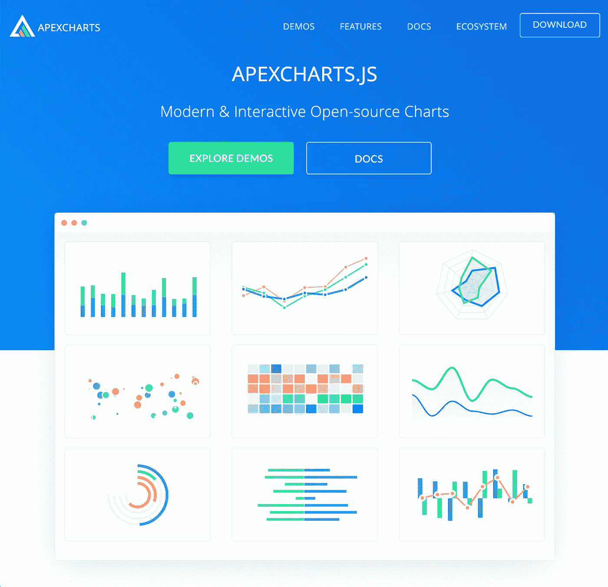
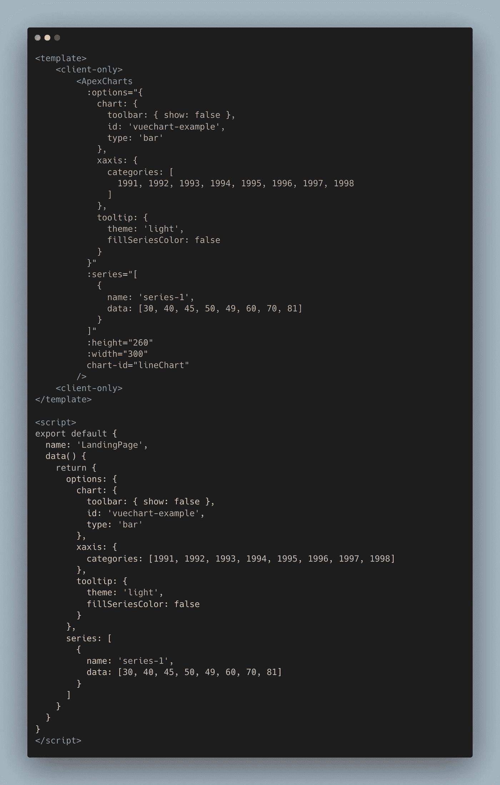
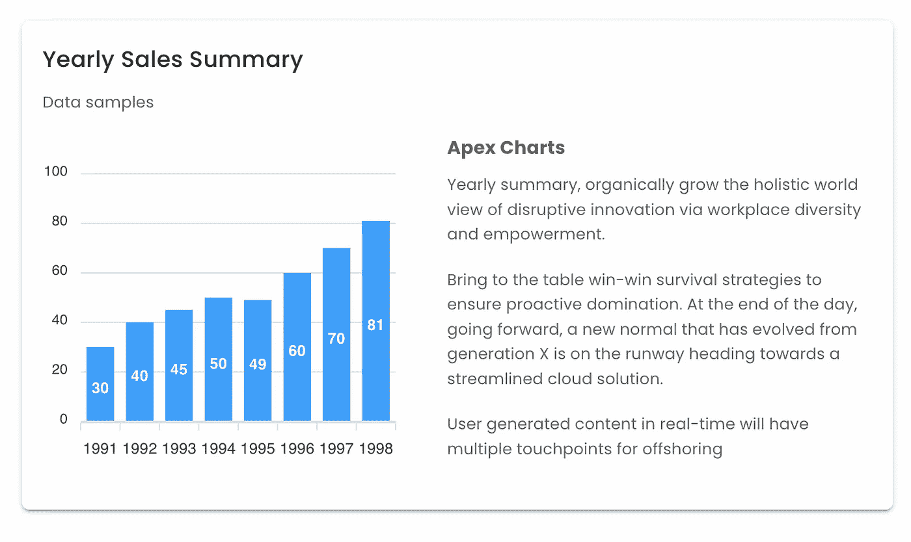

# 如何在 Nuxt.js Web 应用程序仪表板中使用 Apex 图表

> 原文：<https://medium.com/geekculture/how-to-use-apex-chart-in-nuxt-js-web-application-dashboard-e922c09e5b5?source=collection_archive---------5----------------------->

## 如何使用 Nuxt.js 管理仪表板 Web 应用程序启动 Apex 图表



Apex Charts Official Website

***Apex Charts*** 是一个面向 web 应用的图形图表库，可用于流行的 JavaScript 框架，如 ***React*** 、 ***Angular*** 或 ***Vue*** 。

Apex 图表中有很多很棒的特性，你可以利用它们从你的 ***Nuxt.js*** 中制作一个很棒的图表管理仪表板。您可以设置 ***主题*** 明暗， ***颜色*** 或 ***渐变*** ， ***工具栏*** ，甚至 ***放大*** 或 ***缩小*** 功能。

Apex Charts 是一个开源项目，拥有 16 种图表类型，MIT 许可证，每月 100 万次下载，无需注册，React、Vue、Angular 和 JavaScript 的所有示例中都包含 100 多个示例和很棒的文档。

# 入门指南

在您的 Nuxt.js web 应用程序项目根中，在终端和依赖项上安装或添加 Apex 图表。这将为您的 Apex 图表添加和下载节点模块，以便在 Nuxt.js 生态系统中使用。

**从纱线开始:**

```
yarn add apexcharts vue-apexcharts --dev
```

**或与 NPM:**

```
npm install --save apexcharts
npm install --save vue-apexcharts
```

# 配置

打开您的`nuxt.config.js`,将 Apex 图表添加为插件，以便可以在 Nuxt.js 生态系统中的组件和页面之间访问它。

在你的 Nuxt.js 目录下为 Apex 图表插件`./plugins/apex-chart.js`创建一个插件文件，并为客户端渲染添加`client`模式:

```
export default {
  ...
  // Plugins to run before rendering page: https://go.nuxtjs.dev/config-plugins
  plugins: [
    { src: '~/plugins/apex-chart.js', mode: 'client' },
    { src: '~/plugins/chart.js', mode: 'client' },
    { src: '~/plugins/axios.js' }
  ],
  ...
}
```

将 Apex Charts 插件记为 Nuxt.js 生态系统中的 Vue 组件插件。

```
import Vue from 'vue'
import VueApexCharts from 'vue-apexcharts'

Vue.component('ApexCharts', {
  extends: VueApexCharts
})
```

# 在 Nuxt.js 中使用 Apex 图表

完成设置和配置后，现在您可以将 Apex 图表中的图表用作 Vue 组件或 Nuxt.js web 应用程序生态系统中的页面。您可以在页面或组件中以`<ApexCharts/>`的名称调用和使用它。



[Using Apex Charts](https://carbon.now.sh/?bg=rgba%28171%2C+184%2C+195%2C+1%29&t=vscode&wt=none&l=vue&width=1024&ds=true&dsyoff=20px&dsblur=68px&wc=true&wa=false&pv=56px&ph=56px&ln=false&fl=1&fm=Hack&fs=17.5px&lh=133%25&si=false&es=2x&wm=false&code=%253Ctemplate%253E%250A%2520%2520%2509%253Cclient-only%253E%250A%2520%2520%2520%2520%2520%2520%2520%2520%253CApexCharts%250A%2520%2520%2520%2520%2520%2520%2520%2520%2520%2520%253Aoptions%253D%2522%257B%250A%2520%2520%2520%2520%2520%2520%2520%2520%2520%2520%2520%2520chart%253A%2520%257B%250A%2520%2520%2520%2520%2520%2520%2520%2520%2520%2520%2520%2520%2520%2520toolbar%253A%2520%257B%2520show%253A%2520false%2520%257D%252C%250A%2520%2520%2520%2520%2520%2520%2520%2520%2520%2520%2520%2520%2520%2520id%253A%2520%27vuechart-example%27%252C%250A%2520%2520%2520%2520%2520%2520%2520%2520%2520%2520%2520%2520%2520%2520type%253A%2520%27bar%27%250A%2520%2520%2520%2520%2520%2520%2520%2520%2520%2520%2520%2520%257D%252C%250A%2520%2520%2520%2520%2520%2520%2520%2520%2520%2520%2520%2520xaxis%253A%2520%257B%250A%2520%2520%2520%2520%2520%2520%2520%2520%2520%2520%2520%2520%2520%2520categories%253A%2520%255B%250A%2520%2520%2520%2520%2520%2520%2520%2520%2520%2520%2520%2520%2520%2520%2520%25201991%252C%25201992%252C%25201993%252C%25201994%252C%25201995%252C%25201996%252C%25201997%252C%25201998%250A%2520%2520%2520%2520%2520%2520%2520%2520%2520%2520%2520%2520%2520%2520%255D%250A%2520%2520%2520%2520%2520%2520%2520%2520%2520%2520%2520%2520%257D%252C%250A%2520%2520%2520%2520%2520%2520%2520%2520%2520%2520%2520%2520tooltip%253A%2520%257B%250A%2520%2520%2520%2520%2520%2520%2520%2520%2520%2520%2520%2520%2520%2520theme%253A%2520%27light%27%252C%250A%2520%2520%2520%2520%2520%2520%2520%2520%2520%2520%2520%2520%2520%2520fillSeriesColor%253A%2520false%250A%2520%2520%2520%2520%2520%2520%2520%2520%2520%2520%2520%2520%257D%250A%2520%2520%2520%2520%2520%2520%2520%2520%2520%2520%257D%2522%250A%2520%2520%2520%2520%2520%2520%2520%2520%2520%2520%253Aseries%253D%2522%255B%250A%2520%2520%2520%2520%2520%2520%2520%2520%2520%2520%2520%2520%257B%250A%2520%2520%2520%2520%2520%2520%2520%2520%2520%2520%2520%2520%2520%2520name%253A%2520%27series-1%27%252C%250A%2520%2520%2520%2520%2520%2520%2520%2520%2520%2520%2520%2520%2520%2520data%253A%2520%255B30%252C%252040%252C%252045%252C%252050%252C%252049%252C%252060%252C%252070%252C%252081%255D%250A%2520%2520%2520%2520%2520%2520%2520%2520%2520%2520%2520%2520%257D%250A%2520%2520%2520%2520%2520%2520%2520%2520%2520%2520%255D%2522%250A%2520%2520%2520%2520%2520%2520%2520%2520%2520%2520%253Aheight%253D%2522260%2522%250A%2520%2520%2520%2520%2520%2520%2520%2520%2520%2520%253Awidth%253D%2522300%2522%250A%2520%2520%2520%2520%2520%2520%2520%2520%2520%2520chart-id%253D%2522lineChart%2522%250A%2520%2520%2520%2520%2520%2520%2520%2520%252F%253E%250A%2520%2520%2520%2520%253Cclient-only%253E%250A%253C%252Ftemplate%253E%250A%250A%253Cscript%253E%250Aexport%2520default%2520%257B%250A%2520%2520name%253A%2520%27LandingPage%27%252C%250A%2520%2520data%28%29%2520%257B%250A%2520%2520%2520%2520return%2520%257B%250A%2520%2520%2520%2520%2520%2520options%253A%2520%257B%250A%2520%2520%2520%2520%2520%2520%2520%2520chart%253A%2520%257B%250A%2520%2520%2520%2520%2520%2520%2520%2520%2520%2520toolbar%253A%2520%257B%2520show%253A%2520false%2520%257D%252C%250A%2520%2520%2520%2520%2520%2520%2520%2520%2520%2520id%253A%2520%27vuechart-example%27%252C%250A%2520%2520%2520%2520%2520%2520%2520%2520%2520%2520type%253A%2520%27bar%27%250A%2520%2520%2520%2520%2520%2520%2520%2520%257D%252C%250A%2520%2520%2520%2520%2520%2520%2520%2520xaxis%253A%2520%257B%250A%2520%2520%2520%2520%2520%2520%2520%2520%2520%2520categories%253A%2520%255B1991%252C%25201992%252C%25201993%252C%25201994%252C%25201995%252C%25201996%252C%25201997%252C%25201998%255D%250A%2520%2520%2520%2520%2520%2520%2520%2520%257D%252C%250A%2520%2520%2520%2520%2520%2520%2520%2520tooltip%253A%2520%257B%250A%2520%2520%2520%2520%2520%2520%2520%2520%2520%2520theme%253A%2520%27light%27%252C%250A%2520%2520%2520%2520%2520%2520%2520%2520%2520%2520fillSeriesColor%253A%2520false%250A%2520%2520%2520%2520%2520%2520%2520%2520%257D%250A%2520%2520%2520%2520%2520%2520%257D%252C%250A%2520%2520%2520%2520%2520%2520series%253A%2520%255B%250A%2520%2520%2520%2520%2520%2520%2520%2520%257B%250A%2520%2520%2520%2520%2520%2520%2520%2520%2520%2520name%253A%2520%27series-1%27%252C%250A%2520%2520%2520%2520%2520%2520%2520%2520%2520%2520data%253A%2520%255B30%252C%252040%252C%252045%252C%252050%252C%252049%252C%252060%252C%252070%252C%252081%255D%250A%2520%2520%2520%2520%2520%2520%2520%2520%257D%250A%2520%2520%2520%2520%2520%2520%255D%250A%2520%2520%2520%2520%257D%250A%2520%2520%257D%250A%257D%250A%253C%252Fscript%253E) in Nuxt.js Web Application Admin Dashboard

`client-only`组件是一个告诉 Nuxt.js 只在客户端呈现图表的组件，否则你会在控制台得到一些警告消息。



Sample of Apex Charts uses in Nuxt.js Web Application Dashboard

请看这个 [***演示***](https://nuxtjs-vuetify-dashboard.netlify.app/landing) 这里是这篇关于在 Nuxt.js 中使用 Apex 图表的文章的 [***源代码***](https://github.com/devcoderoad/nuxtjs-vuetify-dashboard)

[](https://nuxtjs-vuetify-dashboard.netlify.app/) [## Nuxtify 管理仪表板模板

### Lorem ipsum dolor，这是肥胖精英的共识。排斥，nisi inventore，aperiam 的智慧 quod dolores…

nux tjs-vue tify-dashboard . net lify . app](https://nuxtjs-vuetify-dashboard.netlify.app/) 

## 另请阅读:

[](https://code-road.medium.com/online-and-offline-detection-web-navigator-api-using-vuejs-5b7262ae016c) [## 使用 VueJS 的在线和离线检测 Web navigator API

### Web 浏览器导航 API，表示使用 VueJS 的用户代理的当前 internet 连接状态。

code-road.medium.com](https://code-road.medium.com/online-and-offline-detection-web-navigator-api-using-vuejs-5b7262ae016c) [](/geekculture/11-handy-nuxt-modules-for-your-nuxt-js-21c686485e08) [## 在你的 Nuxt.js 中考虑这 11 个有用的模块

### Nuxt.js 是一个引人注目的 Vue.js 框架，得到了社区的大力支持。

medium.com](/geekculture/11-handy-nuxt-modules-for-your-nuxt-js-21c686485e08) [](https://betterprogramming.pub/how-to-change-node-js-version-between-projects-using-nvm-3ad2416bda7e) [## 如何使用 NVM 在项目之间更改 Node.js 版本

### 在您的机器上管理具有不同版本的节点的多个项目

better 编程. pub](https://betterprogramming.pub/how-to-change-node-js-version-between-projects-using-nvm-3ad2416bda7e) 

# 结论

有许多图形图表库，如[***chart . js***](/geekculture/chart-js-in-nuxt-js-how-to-implement-c255a2657b02)或 Apex 图表，我们可以在管理仪表板 web 开发项目中使用和组合它们，尤其是使用 Nuxt.js。

# 关闭

希望这将激励您在 Nuxt.js web 应用程序仪表板中使用 Apex 图表，并准备开始构建一些令人敬畏的图表仪表板。感谢你的来访和阅读。

> 请[关注我](https://code-road.medium.com/membership)以获得更多 web 开发的技巧和诀窍，谢谢！

[](https://code-road.medium.com/membership) [## 用我的推荐链接加入媒体—代码之路

### 阅读 Code Road 的每一个故事(以及 Medium 上成千上万的其他作者)。你的会员费直接支持代码…

code-road.medium.com](https://code-road.medium.com/membership)