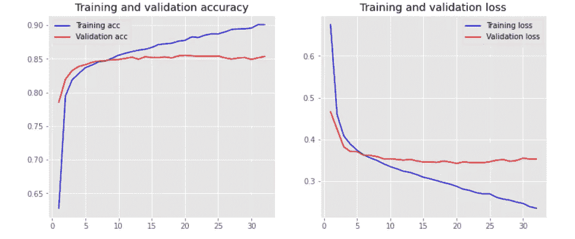

# 如何在 Google Colab 上使用 Bert-as-service

> 原文：<https://medium.com/geekculture/how-to-use-bert-as-service-on-google-colab-c6a6c32f434a?source=collection_archive---------12----------------------->

## 本文将带您完成完整的步骤，了解如何在 Bert 即服务的帮助下，使用预先训练好的 Bert 模型来使用迁移学习。


Photo by [Element5 Digital](https://unsplash.com/@element5digital?utm_source=medium&utm_medium=referral) on [Unsplash](https://unsplash.com?utm_source=medium&utm_medium=referral)

变形金刚在最近几年变得非常流行，并广泛用于各种 NLP 任务，如语言建模、语言翻译和问题回答。变形金刚可以理解句子中重要单词的上下文，从而给出最先进的结果。可以参考这篇 [**文章**](https://jalammar.github.io/illustrated-transformer/) 看看变压器是怎么工作的。

变形金刚擅长的领域之一是**转移学习。**人们可以使用预先训练好的变形金刚，如谷歌的 Bert，并对其进行微调，以执行 NLP 任务。一个这样的任务是生成单词嵌入/句子嵌入，这是大多数 NLP 应用中的上游任务。这些嵌入保留了每个单词的上下文。例如，考虑这个句子:

**“这本书真牛逼。它会告诉你能以令人难以置信的低价预订的最佳旅游目的地。”**

使用转换器的单词嵌入在三个方面优于其他单词嵌入，如 **ELMo** 、 **Word2vec** 等。

a)理解给定句子中每个单词与所有其他单词的关系。

Transformer 使用自我注意机制在给定句子中的两个或多个单词之间建立关系。例如在句子中，单词**“it”**“in”…..它会告诉……”指作者所说的**书**。

**b)为在句子中具有不同上下文的相同单词生成不同的单词嵌入。**

**书**这个词根据上下文有两种不同的意思。一个代表一个**名词**，另一个代表一个**动词**。转换器能够理解这一点，并为每个单词生成不同的单词嵌入。

与 Elmo 不同，变压器可以并行处理单词，而 Elmo 是以顺序方式处理单词，从而提高了效率。

现在让我们看看如何在 google colab 中生成这些嵌入，好吗？！


Photo by [Adi Goldstein](https://unsplash.com/@adigold1?utm_source=medium&utm_medium=referral) on [Unsplash](https://unsplash.com?utm_source=medium&utm_medium=referral)

首先，让我们从安装 google drive 开始，您将在那里存储您的文件。

然后，我们加载我们的 IMDB 电影评论数据集，并预处理评论。这是一个二元分类数据集，带有正面或负面的评论。所以这是一个二元分类问题。

首先，我们将数据分成训练集和验证集:X_train、X_test、y_train 和 y_test。一旦我们完成了这些，我们的数据就可以使用 bert-as-service 生成句子嵌入了。我们将为 X_train 和 X_test 生成句子嵌入。

**可选** : **为了更好的性能和准确性，训练和测试句子嵌入可以被标准化和缩放。**

现在是时候测试我们使用 bert-as-service 生成的句子嵌入了。为此，我们使用 Keras 创建了一个简单的神经网络，有四个隐藏层。并且我们在最终输出层使用了一个 **sigmoid** 激活函数，损耗为**“二元交叉熵”。**输入的维度是句子嵌入向量的长度。

```
**def** create_model(X_train):
    input_dim = X_train.shape[1]  *# Number of features*

    model = Sequential()
    model.add(layers.Dense(512, input_dim=input_dim, activation='relu'))
    model.add(layers.Dropout(0.5))
    model.add(layers.Dense(512, input_dim=input_dim, activation='relu'))
    model.add(layers.Dropout(0.5))
    model.add(layers.Dense(256, input_dim=input_dim, activation='relu'))
    model.add(layers.Dropout(0.5))
    model.add(layers.Dense(64, input_dim=input_dim, activation='relu'))
    model.add(layers.Dense(1, activation='sigmoid')) *# activation = {sigmoid (for multi-label) ; softmax (for multi-class)}* 

    *# use binary_crossentropy for multi-label classification (classify more than one topics per document)*
    *# use categorical_crossentropy for multi-class classification (classify one topic per document)*
    model.compile(loss='binary_crossentropy', optimizer='adam', 
                  metrics=['accuracy'])

    **return** model
```

在我们创建了模型之后，是时候训练模型了。我们将在验证集上保存具有最佳准确度分数的模型。

准确率达到了 86%左右，相当不错。



**结论:**

转换器在处理作为 NLP 应用程序基础的上下文文本数据方面非常出色。Bert-as-service 是一种非常简单而有效的方法，使用 Bert 作为服务，只需几行代码就可以生成预训练的句子和单词嵌入。

**在这个 github repo 中找到完整的代码**:[https://github.com/Sougotadayglo/Bert-serving-client.git](https://github.com/Sougotadayglo/Bert-serving-client.git)

**参考文献:**

https://github.com/hanxiao/bert-as-service

https://arxiv.org/abs/1706.03762

https://github.com/google-research/bert

[[https://ai . Google blog . com/2017/08/transformer-novel-neural-network . html](https://ai.googleblog.com/2017/08/transformer-novel-neural-network.html)]